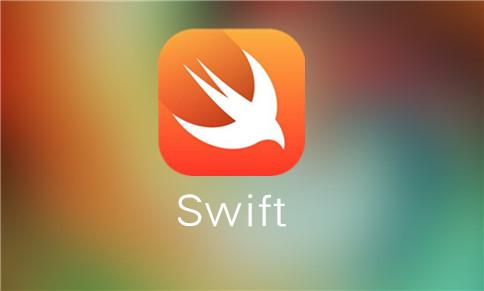

## Assignment of Unit 1

[View the Document of Swift](https://swiftdoc.org)

[Return to README](master/README.md)



[swiftImage](http://img.swift51.com/upimg/201704/1491040755830_83.jpg)

#### CodeBlock：

```swift
let str = "Hello Github"
print(str)
```

> This is a simple example of swift.

- Types
  - Int
  - String
- Functions


1. Chapter1
   1. Page1
   2. Page2
   3. Page3
2. Chapter2
3. Chapter3

|   Swift   |  C   |
| :-------: | :--: |
|    Int    | Int  |
| Character | Char |

There are some *differences* between **C** and **Swift**.

~~strikethrough text~~

----

Enjoy It!

----

