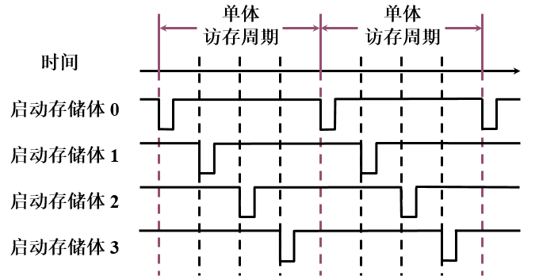
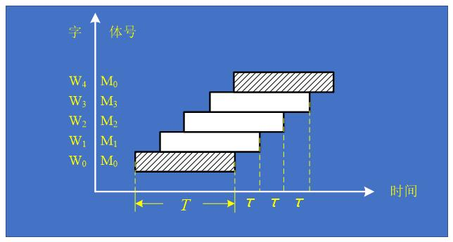

[toc]

##### 1.简述计算机系统的结构层次（从计算机语言的角度）

L6:应用语言计算机

L5:高级语言计算机

L4:汇编语言计算机

L3:操作系统计算机

> 以上为软件级

L2:机器语言（传统机器级）

L1:微程序机器级

> 以上为硬件级

##### 2.什么是虚拟机？为什么要使用虚拟机？

虚拟机是指由软件实现的机器，以区别于由固件/硬件实现的物理机器。

##### 3.什么是翻译？什么是解释？

> 翻译和解释是语言实现的两种基本技术，其共同点都是以执行一串L级指令来实现L+1级指令。

翻译技术：先把L+1级程序全部变换成L级程序后，再去执行新产生的L级程序，在执行过程中L+1级程序不再被访问。

解释技术：每当一条L+1级指令被译码后，就直接去执行一串等效的L级指令，依次重复进行。

> 一般来说，解释执行比编译后再执行所花的时间更多，但占用的存储空间比较少。

##### 4.计算机系统结构、计算机组成和计算机实现三者之间的关系，并举例说明。

计算机系统结构是程序员所看到的计算机属性，即概念性结构与功能特性。

计算机组成指的是***计算机系统结构的逻辑实现***，包含物理机器级中的数据流和控制流的组成以及逻辑设计等，他***着眼于物理机器级内部各事件的排序方式与控制方式、各部件的功能以及各部件之间的联系***。

计算机实现指的是***计算机组成的物理实现***，包括处理机和主存等部件的物理结构，器件的集成度和速度，模块、插件、底板的划分与连接，信号传输，电源、冷却及整机装配技术等。它***着眼于器件技术和微组装技术***。

> 举例说明：
>
> 确定指令集中是否有乘法指令属于计算机系统结构的内容，但乘法指令是用专门的乘法器实现，还是利用加法器经多步操作来实现，属于计算机组成。而乘法器、加法器的物理实现，如器件的选定及所用的微组装技术等，属于计算机实现。

##### 5.什么是软件的可移植性？实现软件可移植性的常用方法有哪三种？

可移植性是指一个软件不经修改或者只需要少量修改就可以由一台计算机移植到另一台计算机上运行。

三种方法：系列机、模拟与仿真、统一高级语言。

##### 6.什么是模拟？什么是仿真？

模拟是指用软件的方法在一台现有的计算机（称为宿主机host）上实现另一台计算机（称为虚拟机）的指令集。

> 模拟通常用解释的方法来实现，即虚拟机的每一条指令都用宿主机的一段程序进行解释执行。为了使虚拟机的应用程序能在宿主机上运行，除了模拟虚拟机的指令集外，还要模拟其存储系统、I/O系统和操作系统等。由于模拟是采用纯软件解释执行的方法，因此运行速度较慢，性能较差。

仿真是指用一台现有计算机（称为宿主机）上的微程序去解释实现另一台计算机（称为目标机）的指令集。

> 这个微程序是专门为实现目标机指令集而设计的，称为仿真微程序。同样，除了仿真目标机的指令集外，还需要仿真其存储系统、I/O系统和控制台操作等。

7.Flynn分类法将计算机分为哪四类？请简述。

1.单指令流单数据流 SISD

> 传统的顺序处理计算机

2.单指令流多数据流 SIMD

> 以阵列处理机为代表

3.多指令流单数据流 MISD

> 人为划分，无实际计算机

4.多指令流多数据流 MIMD

> 多处理机

##### 8.请简述程序的局部性原理。

局部性包括时间局部性和空间局部性。时间局部性是指程序即将用到的信息很可能就是目前正在使用的信息。空间局部性是指程序即将用到的信息很可能与目前正在使用的信息在空间上相邻或者相近。

##### 9.简述Amdahl定律

加快某部件执行速度所能获得的系统性能加速比，受限于该部件的执行时间占系统中总执行时间的百分比。

> Amdahl定律可以用来计算当对计算机系统中的某个部分进行改进后，能获得多少总体性能的提高。这是通过加速比这个指标来衡量的。

##### 10.影响CPU时间的因素包括什么？

1.时钟周期时间：取决于硬件实现技术和计算机组成。

2.CPI：取决于计算机组成和指令集结构。

3.IC：取决于指令集结构和编译技术。

> 只要改进任何一个参数都能提高CPU的性能，不过这些参数是相互关联的，很难做到能单独地改进某一个参数指标而不影响其他两个指标（变坏）。

相关公式

`CPU时间 = 执行程序所需的时钟周期数 * 时钟周期时间`

`CPI = 执行程序所需的时钟周期数/所执行的指令条数`

`CPU时间 = IC*CPI*时钟周期时间       IC为所执行的指令条数`

##### 11.冯诺伊曼体系结构的特点

1.计算机以运算器为中心

2.在存储器中，指令和数据同等对待。即存储器本身不区分指令和数据。

3.存储器是按地址访问、按顺序线性编址的一维结构。每个单元的位数固定。

4.指令的执行是顺序的，即一般是按照指令在存储器中存放的顺序执行。程序的分支由转移指令实现。由指令计数器PC指明当前正在执行的指令在存储器中的地址。

5.指令由操作码和地址码组成。操作码指明本指令的操作类型，地址码指明操作数地址和存放运算结果的地址。操作数的类型由操作码决定，操作数本身不能判定是何种数据类型。

6.指令和数据均以二进制编码编码表示，采用二进制运算。

##### 12.简述现代计算机对比冯诺伊曼体系结构，在哪几个方面进行了改进。

1.对输入输出方式的改进

> 从上到下把越来越多的输入输出管理工作从CPU中分离出来，下放给新设置的硬件去完成。

2.采用并行处理技术

> 在不同的级别采用并行技术，如微操作级、指令级、线程级、进程级、任务级等。先后出现了向量计算机、阵列处理机、多处理机等各种并行处理计算机。

3，存储器组织结构的发展

> 产生了以相联存储器为核心的相联处理机

4.指令集的发展

> 指令仍是由操作码和地址码两部分组成，越来越多的功能交由硬件实现

##### 13.什么是系列机？什么是兼容机？

系列机：由同一厂家生产的具有相同的系统结构，但具有不同组成和实现的一系列不同型号的计算机。

兼容机：指由不同公司或厂家生产的具有相同系统结构的计算机。他的思想与系列机的思想是一致的。

##### 14.什么是软件兼容？软件兼容有几种？其中哪一种是软件兼容的根本特征？

一个软件不经修改或者只需要少量修改就可以由一台计算机移植到另一台计算机上运行。差别只是执行时间不同，在这种情况下，称这两台计算机是软件兼容的。

四种软件兼容：向上兼容、向下兼容、向前兼容、向后兼容。

根本特征是向后兼容。

##### 15.什么是并行性？

并行性是指计算机系统在同一时刻或同一时间间隔内进行多种运算或操作。只要时间上相互重叠就存在并行性。他包括同时性和并发性两种含义。

>并行性等级：
>
>1.字串位串：每次只对一个字的一位进行处理。这是最基本的串行处理方式，不存在并行性。
>
>2.字串位并：同时对一个字的全部位进行处理，不同字之间是串行的。已开始出现并行性。
>
>3.字并位串：同时对许多字的同一位进行处理，这种方式具有较高的并行性。
>
>4.全并行：同时对许多字的全部位或部分位进行处理。这是最高一级的并行。

##### 16.简要说明提高计算机系统并行性的3种技术途径，并分别从单机和多机系统的角度举例。

1.时间重叠：在并行性概念中**引入时间因素**，让多个处理过程在时间上相互错开，**轮流重叠地使用同一套硬件设备的各个部分**，以加快硬件周转而赢得速度。这种途径原则上不要求重复设置硬件设备。**流水线技术**是时间重叠的典型实例。

> 单处理机：时间重叠原理在发展单处理机高性能时起主导作用。流水线技术

> 多处理机：异构型多处理机

2.资源重复：在并行性概念中**引入空间因素**，以数量取胜。通过重**复设置硬件资源**，大幅度地提高计算机系统的性能。随着硬件价格的降低，这种途径得到了越来越广泛的应用。可以**在单处理机中重复设置多个运算部件或处理部件**，也可以**重复设置多个处理机**，构成多处理机系统。

> 单处理机：多体存储器、多操作部件（将通用部件分解成若干专用部件，且同一种部件可以设置多个，以此实现指令级并行），阵列（并行）处理机（设置许多相同的处理单元，让它们在同一控制器的指挥下，按照同一指令的要求对向量或数组的各元素同时进行同一操作）

> 多处理机：同构型多处理机

3.资源共享：这是一种**软件方法**，它使多个任务按一定时间顺序**轮流使用同一套硬件设备**，**多道程序、分时系统**就是遵循这一途径而产生的。

> 单处理机：资源共享的概念实质上是用单处理机模拟多处理机的功能，形成虚拟机，如分时系统

> 多处理机：分布式系统

> 在单处理机系统中，这种并行性升到某一级别后（如任务级或者作业级并行），需要通过软件（如操作系统中的进程管理、作业管理）来实现。而在多处理机系统中，由于已具有完成各个任务或作业的处理机，其并行性是由硬件实现的。

##### 17.增强CISC机器的指令功能主要从哪几方面着手？

I.面向目标程序增强指令功能

1.增强运算型指令的功能

2.增强数据传送指令的功能

3.增强程序控制指令的功能

II.面向高级语言的优化实现来改进指令集

1.增强对高级语言和编译器的支持

2.高级语言计算机

III.面向操作系统的优化实现改进指令集

指令集对操作系统的支持：

1.处理机工作状态和访问方式的切换

2.进程的管理和切换

3.存储管理和信息保护

4.进程的同步与互斥、信号灯的管理

##### 18.简述CISC存在的主要问题

1.各种指令的使用频度相差悬殊，许多指令很少用到

2.指令集庞大，指令条数多，许多指令功能又很复杂

3.许多指令由于操作复杂，其CPI值比较大 

4.由于指令功能复杂，规整性不好，不利于采用流水技术来提高性能

##### 19.简述RISC的优缺点及设计RISC机器的一般原则

 遵循的原则：

1.指令条数少而简单

2.采用简单而又统一的指令格式，并减少寻址方式

3.指令的执行在单个机器周期内完成

4.只有load和store指令才能访问存储器，其他指令的操作都是在存储器之间进行，即采用load-store结构

5.大多数指令都采用硬连逻辑来实现

6.强调优化编译器的作用，为高级语言程序生成优化的代码

7.充分利用流水技术来提高性能

缺点（来自网络）：

指令简单使得程序代码较长，占用了较多的存储器空间

##### 20.根据CPU内部存储单元类型，可将指令集结构分为哪几类？ 

堆栈结构：操作数都是隐式的，即堆栈的栈顶和次栈顶中的数据，运算后把结果写入栈顶

累加器结构：一个操作数是隐式的，即累加器，另一个操作数是显式的，即一个存储器单元，运算结果送回累加器。

通用寄存器结构：所有操作数均显式给出

##### 21.常见的三种通用寄存器型指令集结构是什么？

##### 22.计算机指令集结构设计所涉及的内容有哪些？

指令集功能设计：本质是确定软、硬件功能分配，即确定哪些基本功能应该由硬件实现，哪些功能由软件实现比较合适，有两种方向，CISC，RISC

寻址方式的设计

操作数类型和大小的设计

指令格式的设计

##### 23.流水技术有哪些特点？

1.流水线把一个处理过程分解为若干个子过程，每个子过程由一个专门的功能部件来实现。

2.流水线中各段的时间应尽可能相等，否则将会引起流水线堵塞、断流，因为时间长的段将成为流水线的瓶颈，此时流水线中的其他功能部件就不能充分发挥作用，因此瓶颈问题是流水线设计中必须解决的。

3.流水线每一个功能部件后面都要有一个缓冲寄存器（锁存器），称为流水寄存器。其作用是在相邻的两段之间传送数据。，以保证提供后面要用到的数据，并把各段的处理工作相互隔离。

4.流水技术适合于大量重复的时序过程，只有在输入端不断地提供任务，才能充分发挥流水线的效率

5.流水线需要有通过时间和排空时间，他们分别为第一个任务和最后一个任务从进入流水线到流出结果的那个时间段。在这两个时间段中，流水线都不是满载。经过“通过时间”后，流水线进入满载工作状态，整条流水线的效率才能得到充分发挥。

##### 24.什么是静态流水线？什么是动态流水线？

静态流水线：在同一时间内，多功能流水线中的各段只能按同一种功能的连接方式工作。当要按另一种连接实现其他功能时，必须等按原来连接方式处理的所有任务都流出流水线后，才能改变连接。

动态流水线：在同一时间内，多功能流水线中的各段可以按照不同的方式连接，同时执行多种功能。它允许某些段正在实现某种运算时，另一些段却在实现另一种运算。只要保证不发生公用段的冲突，就可以提前。

##### 25.什么是单功能流水线？什么是多功能流水线？

单功能流水线：只能完成一种固定功能的流水线，如浮点加法流水线。若要完成多种功能，可采用多条单功能流水线。

多功能流水线：流水线各段可以进行不同的连接，以实现不同的功能。如ASC处理机中采用的运算流水线，它有8个功能段，按不同的连接方式可以实现浮点加减法运算和定点乘法运算

##### 26什么是线性流水线？什么是非线性流水线？

线性流水线：流水线的各段串行连接，没有反馈回路，数据通过流水线的各段时，每段最多只流过一次。

非线性流水线：流水线中除了有串行的连接外，还有反馈回路。经反馈回路和多路开关使某些段要多次通过，而有些段可以被跳过。非线性流水线常用于递归或组成多功能流水线。非线性流水线中，一个重要的问题时确定什么时候向流水线引进新的任务，才能使该任务不会与先前进入流水线的任务发生冲突——争用流水线。

##### 27.列举3种相关。

**数据相关**：对于两条指令$i$和$j$, 如果下述条件之一成立，则称指令$i$和$j$数据相关：

1.指令$j$使用指令$i$产生的结果

2.指令$j$与指令$k$数据相关，而指令$k$又与指令$i$数据相关

> 数据相关具有传递性

**名相关**：

1.反相关：如果指令j写的名和指令i读的名相同，则称指令i和j发生了反相关。

2.输出相关：如果指令j和指令i写相同的名，则称指令i和j发生了输出相关。

**控制相关**：由分支指令引起的相关。它需要根据分支指令的执行结果来确定后续指令是否执行。

##### 28.流水线中有哪三种冲突？各是什么原因造成的？

1.**结构冲突**：如果某种指令组合因为资源冲突不能正常执行，则称该处理机有结构冲突

2.**数据冲突**：当相关指令靠得足够近时，他们在流水线中的重叠执行或者重新排序会改变指令/写操作数的顺序，使之不同于他们非流水实现时的顺序，则发生了数据冲突。

可能发生的数据冲突：

1.写后读冲突

2.写后写冲突

3.读后写冲突

3.**控制冲突**：执行分支指令的的结果有两种：一种是分支“成功”，PC值改变为分支转移的目标地址；另一种则是分支“不成功”或者“失败”，这时PC值保持正常递增。对于基本的5段流水线来说，改变PC值是在MEM段进行的。

##### 29.选择至少2种解决流水线结构冲突的方法简述。

1.插入“气泡”：即插入停顿周期，推迟后面指令的操作

2.在流水线处理机中设置相互独立的指令存储器和数据存储器，或者将统一的Cache分成独立的指令Cache和数据Cache

##### 30.选择至少2种解决流水线数据冲突的方法简述。

1.通过定向技术减少数据冲突引起的停顿：在某条指令产生计算结果之前，其他指令并不真正立即需要该计算结果，如果能够将该计算结果从其产生的地方直接送到其他指令需要它的地方，那么就可以避免停顿

2.流水线互锁机制：对于需要停顿的数据冲突，采用“流水线互锁机制”功能部件，用来检测发现数据冲突，并使流水线停顿，直至冲突消失。

3.依靠编译器解决数据冲突：这种技术称为“指令调度”或“流水线调度”。

##### 31.选择至少2种解决流水线控制冲突的静态方法简述。

1.预测分支失败：沿失败的分支继续处理指令，即允许该分支指令后的指令继续在流水线流动，就好像什么都没发生似的。当确定分支是失败时，可以将分支指令堪称一条普通指令，流水线正常流动；当确定分支是成功的时，流水线就把在分支指令后取出的所有指令转化为空操作，并按分支目标地址重新取指令执行。

2.预测分支成功：按分支成功的假设进行处理。当流水线ID段检测到分支指令后，一旦计算出了分支目标地址，就开始从该目标地址取指令执行。

3.延迟分支：在分支指令后加上几条指令（如m条），然后把它们看成是一个整体，不管分支是否成功，都要按顺序执行这些指令。分支指令后面这m条指令的位置被称为延迟槽。

##### 32.简述流水寄存器的作用。

1.将各段的工作隔开，使它们不会互相干扰。流水寄存器是边沿出发写入的，这点非常重要。

2.保存相应段的处理结果。例如，EX/MEM.ALUo保存EX段ALU的运算结果，MEM/WB.LMD保存MEM段从数据存储器读出的数据。

3.向后传递后面将要用到的数据或控制信息。

##### 33.简述分支延迟槽的主要思想。

用延迟槽中的指令来掩盖分支延迟：在分支指令后加$m$条指令，然后把它们看成一个整体，不管分支是否成功，都按顺序执行这些指令。分支指令后面这$m$条指令的位置称为延迟槽。

##### 34.简述分支延迟槽的三种调度策略。

> 延迟分支能否带来好处完全取决于编译器能否把有用的指令调度到延迟槽中，这也是一种指令调度技术。

1.从前调度：把位于分支指令之前的一条独立指令移到延迟槽。

2.从目标处调度：把目标处的指令**复制**到延迟槽，之所以是复制，而不是把该指令移出去，是因为从别的路径可能也要执行到该指令。这种方法相当于预测分支成功，所以当分支成功概率比较高时采用这种方法比较好。

3.从失败处调度：相当于预测分支失败

> 当猜测错误时，要保证调度到延迟槽中的指令的执行不会影响程序的正确性。

##### 35.简述流水线冻结/排空策略

一旦在流水线的译码段ID检测到分支指令，就暂停执行其后的所有指令，直到分支指令到达MEM段、确定出是否成功并计算出新的PC值为止。

##### 36.什么是静态调度？什么是动态调度？动态调度的优点是什么？

**静态调度**：不是在程序执行过程中，而是在编译期间进行代码调度和优化，静态调度通过把相关的指令拉开距离来减少可能产生的停顿。

**动态调度**：在程序执行的过程中，依靠专门硬件对代码进行调度。动态调度能在保持数据流和异常行为的情况下，通过硬件对指令执行顺序进行重新安排，减少数据相关导致的停顿。

**动态调度的优点**：

1.能处理一些编译时情况不明的相关（如涉及存储器访问的相关），并简化了编译器。

2.能够使本来是面相某一流水线优化编译的代码在其他流水线（动态调度）上也能高效地执行。

> 动态调度的优点是以硬件复杂性的显著增加为代价的

##### 37.简述Tomasulo算法的基本思想

1.记录和检测指令相关，操作数一旦就绪就立即执行，把发生RAW冲突的可能性减小到最少。

2.通过寄存器换名来消除WAR冲突和WAW冲突。

##### 38.什么是动态分支预测？有何优点？

动态分支预测：在程序运行时根据分支指令过去的表现来预测其将来的行为。如果分支行为发生了变化，预测结果也跟着改变，因此有更好的预测准确度和适应性。

##### 39.简述分支历史表BHT的基本思想。

分支历史表，也称为分支预测缓冲器。这种方法是最简单的动态分支预测方法。它用BHT来记录分支指令最近一次或几次的执行情况（成功或不成功），并据此进行预测。如果只记录分支指令最近一次的历史，BHT中只需要一位二进制位，是最简单的。为了提高预测的准确度，常采用两位二进制位来记录历史。

> 有研究结果表明，两位分支预测的性能与n位（n>2）分支预测的性能差不多，因而大多数处理机是采用两位分支预测。

##### 40.简述分支目标缓冲器BTB的基本思想

可以看成专门用硬件实现的表格。表格中的每一项至少有两个字段：执行过的成功分支指令的地址和预测的分支目标地址。第一个字段作为该表的匹配标识。每次取指令的同时，把该指令的地址与BTB中的所有项目的第一个字段进行比较。***如果有匹配的，就知道该指令是分支指令且上一次执行是分支成功，据此预测这次执行也将分支成功***。其分支目标地址由匹配项的第二个字段给出。***如果没有匹配的，就把当前指令当成普通的指令***（即不是分支指令）来执行。

> 如果预测正确，则不会有任何分支延迟，如果预测错误或者在BTB中没有匹配的项，则会有至少两个时钟周期的开销。因为这时***需要更新BTB中的项，这要花费一个时钟周期***。而且一般来说，当对BTB中的项进行修改时需要停止取指令，所以***取新的指令又要花费另一个时钟周期***。我

##### 41.简述基于硬件的前瞻算法基本思想。

前瞻执行对分支指令的结果进行猜测，并假设这个猜测总是对的，然后按这个猜测结果继续取、流出和执行后续的指令。只是执行指令的结果不是写回到寄存器或存储器，而是放到一个称为ROB的缓冲器中。等到相应的指令得到“确认”（即确实是应该执行的）后，才将结果写入寄存器或存储器。

> 之所以要这样，是为了在猜测错误的情况下能够恢复原来的现场。

基于硬件的前瞻执行是把3种思想结合在了一起：

1.动态分支预测

2.在控制相关的结果尚未出来之前，前瞻地执行后续指令。

3.用动态调度对基本块的各种组合进行跨基本块的调度。

##### 42.单级存储器的主要矛盾是什么？通常采取什么方法来解决？

1.速度越快，每位价格就越高

2.容量越大，每位价格就越低

3.容量越大，速度越慢

解决方法：采用多种存储器技术，构成多级存储层次结构

##### 43.“Cache-主存”和“主存-辅存”层次的主要区别是什么？

##### 44.在存储层次中应解决哪四个问题？

1.当把一个块（页）调入高一层（靠近CPU）存储器时，可以放在哪些位置上（映像规则）

2.当所要访问的块（页）在高一层存储器时，如何找到该块（查找算法）

3.当发生不命中而且高一层存储器已经满时，应替换哪一块（替换算法）

4.当进行写访问时，应进行哪些操作（写策略）

##### 45.简述Cache的基本工作原理。

> 当CPU访存时，把地址送入主存地址寄存器。“主存—Cache地址转换”部件包含所访问数据或指令的块是否已在Cache中。如果在Cache中（即命中），“主存—Cache地址转换”部件将主存地址中的块地址转换成Cache块地址，放入Cache地址寄存器，块内位移不变。然后用所形成的地址访问Cache，把所得数据或指令送CPU。不命中时，需用主存地址访存，把相应块调入Cache，再送CPU，或者直接送CPU。在调块前，需先判定Cache中是否还有位置来存放将调入的块，如果没有，就需要按某种替换策略进行替换。

##### 46.在Cache-主存层中，地址映像方法有哪几种？它们各有什么优缺点？

1.全相联映像：不命中率最低，机制复杂，代价高

2.直接映像：不命中率最高，机制简单，代价最低，查找最简单

3.组相联映像：不命中率较低，机制较简单，代价适中。

##### 47.简单使用比较器进行4路组相联Cache并行查找的过程。

CPU访存时，用本次访存地址中的索引作为地址从标识存储器中选取一行（对应于一组），并从该行并行读出4个标识（分别对应于4路）。与此同时，也从Cache存储体中并行读出4个信息字。然后将所读出的4个标识与本次访存地址中的标识进行并行比较，以确定是否命中以及该组中哪一个块是要访问的块（若命中）。根据这些信息，就可以从已经读出的4个信息字中选择一个，送CPU。

> 这种方法的优点是不必采用相联存储器，而是用按地址访问的存储器来实现。

##### 48.Cache-主存层常用的替换算法有哪些？

1.**随机法**：随机选择被替换的块。

> 简单、易于硬件实现，但没有考虑Cache块过去被使用的情况，反映不了程序的局部性，所以命中率比较低。

2.**先进先出法**（FIFO）：选择最早调入的块作为替换块。

> 易于实现。虽然利用了同一组中各块进入Cache的先后顺序这一“历史”信息，但还是不能正确反映程序的局部性。因为最先进入的块也可能是经常用到的块。

3.**最近最少使用法**（LRU）：选择近期使用次数最少的块作为被替换的块。但由于实现复杂，现在实际上实现的LRU都只是选择最久没有被访问过的块。这种方法依据的是局部性原理的一个推论：最近刚用过的块很可能就是马上要再用到的块，因此最久没有用过的块就是最佳选择。

> LRU能很好地反映局部性原理，因而其命中率是三种方法中最高的。但是LRU比较复杂，硬件实现成本高。特别是当组的大小增加时，LRU的实现代价会越来越高。
>
> LRU和随机法分别因其不命中率低和实现简单而被广泛采用。不过，有模拟数据表示，对于容量很大的Cache，LRU和随机法的命中率差别不大。

##### 49.简述Cache写命中时的两种写策略。

1.写直达法：也称存直达法。它是指在执行“写”操作时，不仅把数据写入Cache中相应的块，而且也写入下一级存储器。这样下一级存储器中的数据都是最新的。

2.写回法：也称拷回法。只把数据写入Cache相应块，不写入下一级存储器。这样有些数据的最新版本是在Cache中。这些最新数据只有在相应的块被替换时，才被写回下一级存储器。

> 写回法速度快，写操作能以Cache速度进行，而且所有写只到达Cache。对于同一单元的多次写来说，最后只需一次写回下一级存储器，因而减少了对带宽的要求。对多处理机很有吸引力。
>
> 写直达法易于实现，而且下一级存储器中的数据总是最新的。后一个优点对于I/O和多处理机是很重要的。
>
> 采用写直达时，若在进行写操作的过程中CPU必须等待，直到写操作结束，称之为CPU写停顿。减少写停顿的常用方法时采用写缓冲器。CPU一旦把数据写入该缓冲器，就可以继续执行，从而使下一级存储器的更新和CPU的执行重叠起来。

##### 50.简述Cache写失效的两种处理方法。

1.按写分配法：写不命中时，先把所写单元所在的块从主存调入Cache，然后再进行写入。也称为写时取法。

2.不按写分配法：写不命中时，直接写入下一级存储器而不将相应的块调入Cache。这种方法也称为绕写法。

##### 51.影响平均访存时间的因素有哪些？针对每个因素，各举出1种改进方法。

`平均访存时间 = 命中时间+不命中率*不命中开销`

1.**降低不命中率**

> 三种不命中：1.**强制性不命中**：首次访问一个块时，该块不在Cache中，需从下一级存储器取出。2.**容量不命中**：程序执行时所需的块不能全部调入。3.**冲突不命中**：在组相连或直接映像Cache中，若太多的块映像到同一组，则会出现组中某块被别的块替换、然后又被重新访问的情况。
>
> 相联度越高，冲突不命中就越少。
>
> 强制性不命中和容量不命中不受相联度的影响。
>
> 强制性不命中不受Cache容量的影响，但容量不命中随着容量的增加而减少。
>
> 强制性不命中率很小。
>
> 全相联不会产生冲突不命中。
>
> 减小容量不命中的唯一方法是增大Cache

a.**增加块的大小**是降低不命中率的最简单的方法

​		增强了空间局部性，减少了强制性不命中。

​		减少了Cache中块的数目，所以有可能增加冲突不命中。

​		增加块大小的同时会增加不命中开销

b.增加Cache容量: 

​		是降低Cache不命中率最直接的方法。

​		增加成本且可能增加命中时间

​		这种方法在片外Cache用的比较多

c.提高相联度

​		采用相联度超过8的方案实际意义不大 (存疑)

​		2:1Cache经验规则：容量为N的直接映像Cache的不命中率和容量为N/2的两路组相连Cache的不命中率差不多

d.伪相联Cache

​		1.按直接映像访问Cache，若命中，则取出数据送CPU，访问结束

​		2.未命中时，检查Cache中另一个位置（一种方法是将索引字段最高位取反，得到新的索引），看是否匹配

e.硬件预取 自学

f.编译器控制的预取 自学

g.编译优化 自学

h.“牺牲”Cache 自学

 2.**减少不命中开销**

a.两级Cache：

​		在原有Cache和存储器之间增设另一级Cache，构成两级Cache。这样可以把第一级Cache做得足够小，使其速度和快速CPU的时钟周期相匹配；同时，通过把第二级Cache做得足够大，使它能捕获更多本来需要到主存去的访问，从而降低实际不命中开销

$平均访存时间 = 命中时间_{L1}+不命中率_{L1}*不命中开销_{L1}$

$不命中开销_{L1} = 命中时间_{L2}+不命中率_{L2}*不命中开销_{L2}$

b.让读不命中优先于写

c.写缓冲合并

d.请求字处理技术

e.非阻塞Cache技术

 3.**减少命中时间** 自学

a.采用容量小、简单的Cache

b.虚拟Cache：直接用虚拟地址访问cache

c.Cache访问流水化

d.踪迹Cache

##### 52.Cache的3C失效是哪三种失效？针对每种失效给出一种降低失效率的方法。

强制性失效 容量失效 冲突失效

降低方法同上

##### 53.多体交叉存储器有哪两种编址方式？各有什么特点？

1.高位交叉编址：相当于按列优先编址。同一个体中高$log_2m$位都是相同的，这就是体号。

低位是体内地址，因此当给出访问地址时，使用低位确定是某个存储体中的哪个存储单元；

对于第i行第j列的单元，线性地址`A=j*n+i`，其中j=0,1,2,...,m-1; i=0,1,2,...,n-1

> 假设m个体，每个体有n个存储单元

2.低位交叉编址：相当于按行优先编址。同一体中低$log_2m$位都是相同的，这就是体号。

对于第i行第j列的单元，线性地址`A=i*n+j`，其中i=0,1,2,...,m-1; j=0,1,2,...,n-1

高位是体内地址，因此当给出访问地址时，使用高位确定是某个存储体中的哪个存储单元；

这种编址方式，连续的地址，是存放在相邻的存储体中，**能够实现并行访问**；

**分时启动存储体，在不改变存储周期的情况下，增加存储器的带宽**。

举例：

假设四体低位交叉存储器，存储周期为T，总线的传输周期为τ，满足T = 4τ。可以采用如图1的方式，每隔τ启动一个存储体，在一个总线周期T能够启动4个存储体，读出4个存储字。

流水线工作，读出4个存储字的时间为 T+3τ，带宽为4/(T+3τ)。

##### 54.反映输入/输出系统可靠性能的参数有哪些？

1.**可靠性**：指的是从某个初始参考点开始一直连续提供服务的能力，它通常用平均失效前时间MTTF来衡量。

MTTF的倒数为系统的失效率。

如果每个模块的生存期服从指数分布，则系统整体的失效率是各部件的失效率之和。

系统中断服务的时间为平均修复时间MTTR

2.**可用性**：MTTF/MTBF    MTBF = MTTF+MTTR

3.**可信性**：指的是服务的质量，即在多大程度上可以合理地认为服务是可靠的。可信性与可靠性和可用性不同，它是不可度量的。

##### 55.总线仲裁要解决的是什么问题？大致有哪些方式？

1.总线的仲裁要解决的是多个主设备要同时使用总线，谁先使用，谁后使用的问题；

2.总线仲裁大致分为集中式和分布式，集中式包括链式、计时器和独立请求。

##### 56.总线的通信控制解决的是什么问题？大致有哪些方式。

总线的通信控制解决的是通信双方如何协调工作，何时开始，何时结束。

大致包括同步通信、异步通信、半同步通信和分离式通信（分离事务总线）。

##### 57.试比较程序查询、程序中断、DMA三种I/O方式的区别。

程序查询：不存在中断，CPU一直等待直到I/O处理完成，I/O管理工作由CPU进行。

程序中断：存在中断，发生于I/O处理完成，具有一定的并行性，I/O管理仍由CPU进行

DMA：存在中断，发生于一批数据处理完成时，并行规模较高，CPU进一步脱离I/O管理

##### 58.简述通道的主要功能。

1.接收CPU发来的I/O指令，并根据指令要求选择指定的外设与通道相连接

2.执行通道程序，从主存中逐条取出通道指令，对通道指令进行译码，并根据需要向被选择的设备控制器发出各种操作

3.给出外设中要进行读/写操作的数据所在的地址

4.给出主存缓冲区的首地址

5.控制外设与主存缓冲区之间的数据传送长度

6.指定传送工作结束时要进行的操作

7.检查外设的工作状态是否正常

8.在数据传输过程中完成必要的格式转换，如把字拆分为字节

##### 59.简述通道完成一次数据传输的主要过程。

1.在用户程序中使用访管指令进入管理程序，由管理程序来编制一个通道程序，并启动通道

2.通道处理机执行通道程序，完成指定的数据输入/输出工作

3.通道程序结束后向CPU发中断请求

> 这样，每次输入/输出中，CPU只需两次调用管理程序，大大减少了对用户程序的打扰

##### 60简述三种通道传输方式及其传输过程。

1.**字节多路通道**

当通道在逻辑上与某台设备连接时，就从主存对应的单元中把有关参数取出来，根据主存数据缓冲区地址访问主存，读出或写入一个字节，并将剩余交换字节数减1，将主存数据缓冲区地址加1，指向下一个数据的地址。在这些工作都完成后，就将通道与该设备在逻辑上断开。

2.**选择通道**

多台设备请求时，按照一定规则对要服务的设备进行选择，一旦选中某台设备，通道就进入忙状态，直到该设备的数据传输工作全部完成为止。处理完成后，再重新选择。

> 选择通道的硬件包含5个寄存器、格式变换部件以及通道控制部件。这五个寄存器是数据缓冲寄存器、设备地址寄存器、主存地址计数器、交换字节数计数器、设备状态/控制寄存器。格式变换部件用于在主存和设备之间进行字与字节的拆分和装配。

3.**数组多路通道**

在向一台高速设备发出定位命令后，就立即从逻辑上与该设备断开，直到定位完成时再进行连接，发出找扇区命令后再一次断开，直到开始数据传送。因此，数组多路通道的实际工作方式是：通道在为一台高速设备传送数据时，有多台设备可以在定位或者在找扇区。

