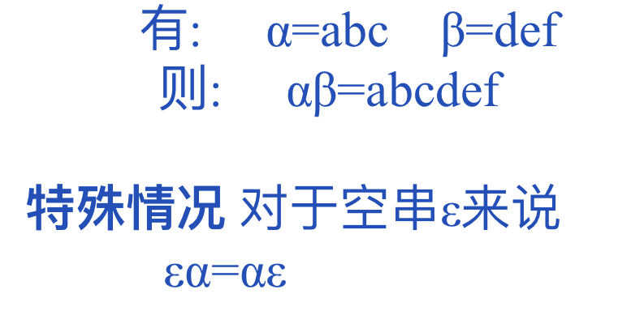
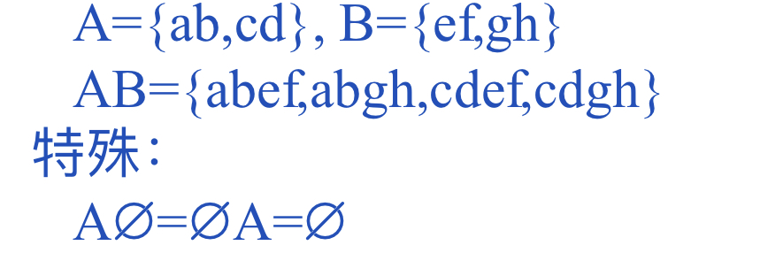
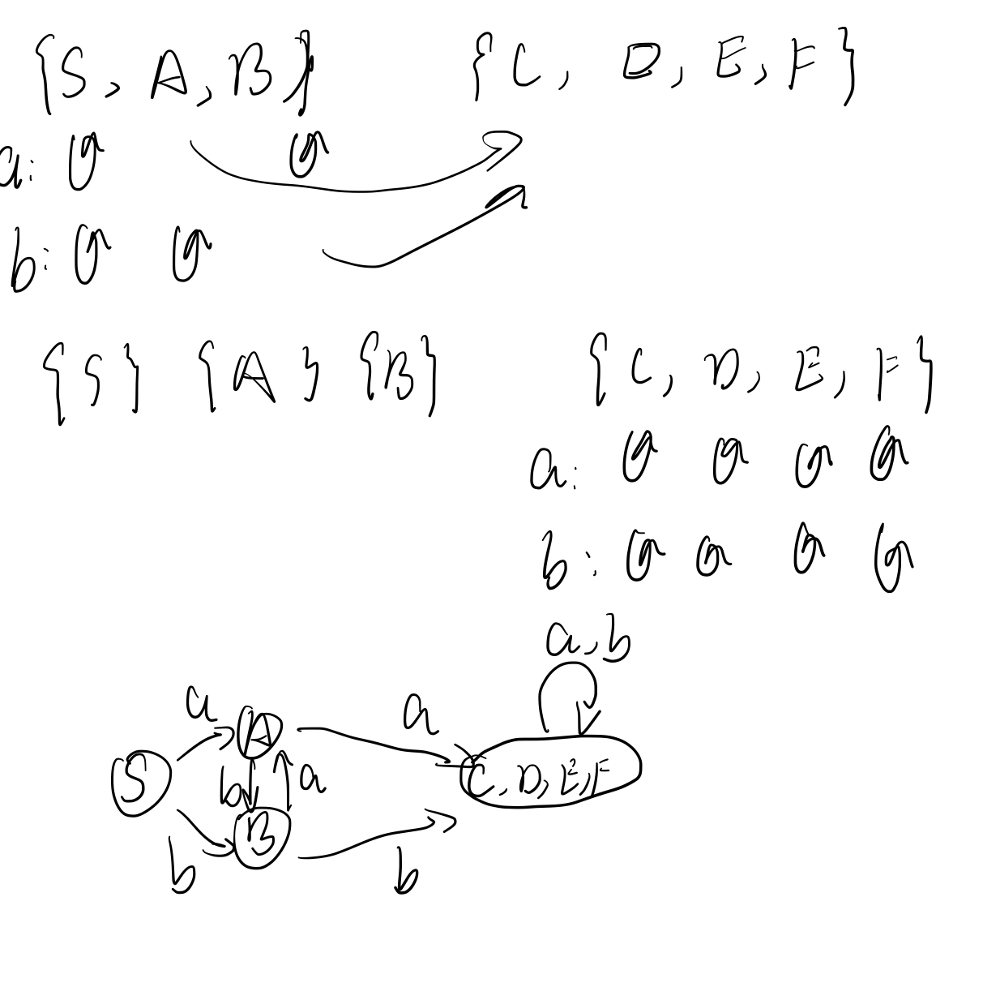

[toc]

### 第一章 绪论

**词法分析**：由字符组成的高级语言程序中的单词，并将其转化成一种内部表示（TOKEN）的形式，同时检查是否存在词法错误。

**语法分析**：语法规则来验证程序中是否存在语法错误。

**语义分析**：检查源程序有无语义错误。

**中间代码生成**：将源程序转换成一种称为中间代码的内部表示，便于优化和移植

**中间代码优化**：变换或改造中间代码，使生成的目标代码更为高效，即节省时间和空间。和程序算法的高效无关，更多的是针对于程序具体运行时的内部优化，尤其针对有特殊要求的编译器

**目标代码生成**：根据目标机的指令系统，生成相关联的目标代码。

> 贯穿始终的两部分工作：

**错误处理**：当编译阶段有错误出现时，由相应的错误处理模块给出解决方案，使得编译器能够继续进行下去。

**表格管理**：为了合理的管理（构造、查找、更新......）表格（符号表、类型信息表......），设立一些专门子程序称为表格管理程序


### 第二章 词法分析

#### 词法分析的基本功能

词法分析程序时编译程序的一部分，是整个编译过程的第一步工作

词法分析器：读取源程序的字符序列，逐个拼出单词并构造相应的内部表示。同时检查源程序中的词法错误。它的核心作用即为将字符序列转化为计算机内部表示

词法分析器的分类：


**单词**：语言中具有**独立含义**的最小的语义单位


#### 正则表达式

##### 字母表

字母表：$\sum$，元素的非空有穷集合

符号串：由字母表中的符号组成的任何有穷序列，或者如下定义：

1.空符号串$\epsilon$是$\sum$上的符号串

2.若$\alpha$是$\sum$上的符号串，x是$\sum$上的元素，则x$\alpha$是$\sum$上的符号串

3.$\beta$是$\sum$上的符号串，当且仅当它可以由1和2导出

符号串的连接：



符号串的方幂:


符号串集合的乘积:



符号串集合的方幂:


符号串集合的正闭包：$A^+=A^1 \or A^2 \or A^3... \or A^n$

符号串集合的星闭包: $A^+=A^0 \or A^1 \or A^2 \or A^3... \or A^n=A^0 \or A^+ $

##### 正则表达式

定义


正则集取值


正则表达式的性质


举例（词法描述）


局限性：缺乏对称性字符串的表达能力

例1：$A=\{a^nba^n|n>0\}$

例2:$n\in AE; (AE)\in AE;AE+AE\in AE$

#### DFA——确定有限自动机

定义：DFA为一个五元组$(\sum ,S,S_0,f,Z)$，其中：

$\sum$是一个有穷字母表，它的每一个元素称为一个输入字符；

$S$是状态的集合，他的每一个元素称为一个状态；

$S_0 \in S$，是确定有限自动机唯一的一个初始状态；

$f$是在$S*\sum ->S$上的转换函数

$Z \in S$，是一个终止状态集，又称为接受状态集

DFA的确定性：

1.初始状态唯一

2.状态转换函数是一个单值函数

两种表示方法：

1.状态转换矩阵：


右上角加上“+”表示开始状态；“*”或者“-”表示终止状态；

2.状态转换图：

陷阱状态/死状态：自身不是终止状态而且自动机在识别字符串的过程中一旦进入这个状态就再也无法离开。

进入陷阱状态的符号串是不被自动机接受的

状态转换图中使用陷阱状态主要是为了定义的完备性，使得每个状态遇到字母表中的每一个字母都有后继状态，后继状态**在画图时一般是省略的**


自动机在程序中的实现：

1.对于状态不多的自动机，可以采用时双层switch实现

2.如果状态较多，可以采用实现状态转换矩阵的方法

#### NFA——非确定有限自动机

非确定有限自动机M是一个五元组$M=(S,\sum,f,S_0,Z)$，其中，

$\sum$是一个有穷字母表，它的每一个元素称为一个输入字符；

$S$是状态的集合，他的每一个元素称为一个状态；

$S_0 \in S$，是非空初始状态集；

$f$是状态转换函数，是一个从$S*\sum\or\{\epsilon\} ->S$的子集的映射。注意这里的后继状态不是单一的一个状态，而是**状态集S的某个子集**

$Z \in S$，是一个终止状态集，又称为接受状态集


对于每一个NFA M，都存在一个DFA M‘，使得$L(M')=L(M)$

NFA向DFA的转换：


1.初始状态通过$\epsilon$到达的状态同样为初始状态放入集合中

2.从集合中取一个状态，通过非空输入到达的状态和这些状态通过$\epsilon$到达的状态合并为一个状态，新状态存入集合

3.重复2

DFA的化简：

通过对状态集的划分来实现

首先分为终止状态和非终止状态，然后检查输入后转换的状态，再进行分类

最后处于同一个集合的就可以合并为一个状态




### 第三章 词法分析器的实现

#### 3.1 词法分析器实现前的准备

1.明确词法分析器的接口

​	分析词法分析器与编译器其他部分的关联，在编译过程中，词法分析器与编译器关联最密切的部分是语法分析部分

​	遍（Pass）：所谓“遍”就是对源程序或源程序的中间表示形式从头到尾扫描一次，并作加工处理，生成新的中间结果或目标程序。

​	词法分析程序与语法分析程序接口的两种形式：

​		1.词法分析程序作为编译器的独立一遍

​				读入源程序字符序列，识别出每一个单词并将其转换成相应的内部表示，形成一个TOKEN序列，这个TOKEN序列将作为语法分析程序的输入

​		2.词法分析程序作为语法分析程序的一个子程序：

​				语法分析程序每调用一次词法分析程序，词法分析程序就从源程序的字符序列中拼出一个单词，并将其TOKEN值返回给语法分析程序


2.确定单词的token结构

在词法分析中，首先从源程序文件一个字符一个字符进行读取，并逐个分离出单词，然后构造他们的机内表示Token

关于Token的结构没有统一的规定，但至少包括两部分内容：

​	单词的类型（语法信息）

​	单词的内容（语义信息）


#### 3.2 词法分析器的具体实现

工作过程：


实现分为两部分：

​	单词的DFA描述及实现

​		


​	针对不同的单词生成对应的Token

​		标识符的Token生成

​			首先查找保留字、特殊符号表，判断这个字符串是否为保留字，若是则生成保留字对应Token，不是则继续查找标识符索引表，确定其在标识符索引表中的位置，生成该标识符对应的Token

​		常量的Token生成

​			查找常量索引表，确定其在常量索引表中的位置，生成该常量对应的Token

​		特殊符号的Token生成

​			查保留字、特殊符号表，确定这个特殊符号在表中的类型编码，生成该特殊符号对应的Token

#### 3.3 实现词法分析器的注意事项

1.保留字识别的两种方法：

​	a.设置保留字表：

​		事先构造好所谓的保留字表，在进行词法分析时，把保留字当作一般标识符来识别，然后查保留字表，若有，则当作保留字处理，若没有则按照一般标识符来处理

​	b.用自动机单独来识别：

​		在自动机中加入识别各保留字的状态，即把保留字和一般标识符分开来识别而不统一识别。

> 两种方法的优劣？？？？？？

2.复合单词的识别：

 

3.数的转换

​	词法分析程序应该把数字字符串转换成数

4.向前看若干个字符的处理

​	在有些语言中，为了识别出一个单词需要向前看好几个字符

5.控制字符的处理

​	控制字符包括空格、Tab和回车换行等，这些字符占用很大的空间，而且一般来说，他们只有词法意义而没有语法和语义上的意义

​	若控制字符仅仅用来分隔源程序中不同的单词，如Tab和空格符等，则在词法分析中可将他们直接删除

​	回车换行本身虽然没有实际意义，但是对于错误处理起着重要的作用

6.注释的处理

​	注释可以直接删除

总结：

​	一个核心：词法分析器设计

​	两个工具：正则表达式和自动机

​	三个转换算法：NFA到DFA，自动机极小化，正则表达式和自动机的相互转换


### 第四章 自顶向下的语法分析方法

#### 4.1 文法定义

文法G定义为四元组$G=(V_T,V_N,S,P)$，其中

​	$V_T$是有限的终极符集合

​	$V_N$是有限的非终极符集合

​	S是开始符，$S\in V_N$

​	P是产生式的集合，且具有下面的形式：

​		$\alpha -> \beta,其中\alpha , \beta\in (V_T \or V_N)^*$

文法分类：

​	0型文法

​		也称短语文法，其产生式具有形式：$\alpha -> \beta$，其中，$\beta\in (V_T \or V_N)^*$,且$\alpha$至少包含一个非终极符

​	1型文法

​		也称上下文相关文法，他是0型文法的特例，要求$|\alpha|\leq |\beta|（此处指长度）(S->\alpha例外，但S不得出现于产生式右部)$

​	2型文法

​		也称上下文无关文法，它是1型文法的特例，即要求产生式左部是一个非终极符：$A->\beta$

​	3型文法

​		也称正则文法，它是2型文法的特例，即产生式的右部至多两个符号，且具有下面形式之一：

​		$A->a,A->aB,其中A，B\in V_N, a\in V_T$

文法分析中主要使用2型文法：

**上下文无关文法**(CFG)定义为四元组$(V_T,V_N,S,P)$

​	P的形式：$A->X_1X_2...X_n$，其中，$A\in V_N,X_i\in (V_T\or V_N)$，右部可空

相关定义：

推导：如果$A->\beta$是一个产生式，则有$\alpha A \gamma=>\alpha\beta\gamma$，其中=>表示一步推导(用$A->\beta$)，这是称$\alpha\beta\gamma$是由$\alpha A \gamma$直接推导的。=>的含义是，使用一条规则，代替=>左边的某个符号，产生=>有段的符号串

$a=>^+\beta$：表示$\alpha$通过1步或多步可推导出$\beta$

$a=>^*\beta$：表示$\alpha$通过0步或多步可推导出$\beta$

句型：如果有$S=>^*\beta$，则称符号串$\beta$为CFG句型

句子：如果$\beta$只包含终极符，则称$\beta$为CFG句子

语言：$L(G)={u|S=>^+u,u\in V_T^*}$，文法G所定义的语言是其开始符所能推导的所有终极符号串(句子)的集合

最左（右）推导：

​	如果进行推导时选择的是句型中的最左（右）非终极符，则称这种推导为最左（右）推导，并用符号$=>_{lm}(=>_{rm})$表示最左（右）推导

左（右）句型：用最左推导方式推导出的句型，称为左句型，而用最右推导方式导出的句型，称为右句型（规范句型）

#### 4.2 文法等价变换

1.增加拓广产生式

​	定理：对任一文法G1都可以构造文法G2，使得L(G1)=L(G2)，且G2的开始符唯一且不出现于任何产生式的右部

 

例如：文法A->aA|b,可以构造与之等价的文法Z->A,A->aA|B

2.消除空产生式

​	定理：对任一文法G1，可构造文法G2，使得L(G1)=L(G2)，且G2中无空产生式


3.消除不可达产生式

​	定理：对任一文法G1都可以构造文法G2，使得L(G1)=L(G2)，且G2中每个非终极符必出现在它的某个句型中


4.消除特型产生式

​	定理：对任一文法G1，可以构造文法G2，使得L(G1)=L(G2)，且在G2中没有特型产生式


5.消除公共前缀

​	公共前缀：某个非终极符A有如下的两个产生式：$A->\alpha \beta,A->\alpha\gamma$（即有左公共前缀）

​	消除方法：

​		1.产生形如：$A->\alpha\beta_1|\alpha\beta_2|...|\alpha\beta_n|\gamma$，$\gamma$表示不以$\alpha$开头的字符串

​		2.引进非终极符A',将产生式替换为：

​			$A->\alpha A'|\gamma$

​			$A'->\beta_1|\beta_2|...|\beta_n$

6.消除左递归

​	左递归：一个文法含有下列形式的产生式时，

​						1.$A->Aa|b,\ A\in V_N,a,\beta\in(V_N \or V_T)^*$

​						2.$A->B\alpha|\beta,B->A\gamma|b,A,B\in V_N,\alpha,\beta,\gamma\in (V_N \or V_T)^*$

​					其中，1为直接递归，2为间接递归，因此文法中只要有$A=>^+A...$，则称文法是左递归的

​	消除方法：1.对于直接左递归形如$A->A\alpha|\beta$，改为$A->\beta A',A'->\alpha A'|\epsilon$

​						2.对于间接左递归形如：$A->B\alpha|\beta,B->A\gamma|b$，则先转化为直接左递归形式$A->A\gamma \alpha|b\alpha$或者$B->B\alpha\gamma|\beta\gamma|b$，按照直接左递归方式消除，并去掉多余的产生式

#### 4.3 语法分析的功能

按照语言的语法规则，识别并分解程序中的各种语法成分。语法分析要解决的问题是给定文法G和句子（程序），检查判定是否是G能识别的句子。


语法错误处理：

​	报告错误出现的位置

​	修复错误并继续检查后续部分

​	执行开销不应太大

4种处理策略：

​	1.紧急方式恢复：发现错误时，分析器每次抛弃一个输入符号，直到当前输入符号属于某个指定的同步记号集合为止。

​	2.短语级恢复：发现错误时，分析器对剩余输入做局部纠正，用可以使分析器继续分析的符号串代替剩余输入串的前缀。

​	3.增加出错产生式：扩充语言的文法，增加产生错误结构的产生式

​	4.全局纠正：使用这种策略的分析器在处理不正确的输入串时，作尽可能少的修改，即给定不正确的输入串x和文法G，获得串y的分析树，使把x变成y所需要的插入、删除和修改量最少

自顶向下分析基本思想

​	从文法开始符出发试图推导出所给的终极符串

​	例如：


**First集**：

定义：设$G=(V_T,V_N,S,P)$是上下无关文法，$\beta\in (V_T\or V_N)^*$，则：$First(\beta)=\{a\in V_T|\beta=>^*a...\}\or(if \beta=>^*\epsilon\   then \{\epsilon\}else \phi)$

> 即$\beta$经过0或多步推导，能推出以一个终极符开头的串，则将该终极符加入First集，若推出空串，则将空加入First集中

作用：可以根据当前的输入符号是属于哪个产生式右部的首符集而决定选择响应产生式进行推导


> 此时仅仅依靠First集不能完成推导

**Follow集**

定义：设$G=(V_T,V_N,S,P)$是上下文无关文法，$A\in V_N$，S是开始符号，则：$Follow(A)={a\in V_T|S=>^+...Aa}\or (if\ S=>^*...A\ then\ \{\#\}\ else\ \phi)$

> 初始符经过1或多步推导能推出A且后面跟随一个终极符，则将该终极符加入A的Follow集中，或者从开始符经过0或多步推导能推出以A结束的串，则将结束符#加入A的Follow集中

作用：当文法中存在产生式形如：$A->\epsilon$时，如果当前的字符属于Follow(A)，则用空取代A的出现


**Predict集**

定义：

 

作用：当文法中存在产生式形如：$A->\epsilon$时，如果当前的字符属于Follow(A)，则用空取代A的出现


自顶向下分析的条件：

产生式$A->\beta$被选择的条件是：当前的输入符属于$Predict(A-\beta)$

至多一个产生式被选择的条件是：$Predict(A->\beta_k)\and Predict(A->\beta_j)=\phi，当k\neq j$

自顶向下分析方法的条件：$Predict(A->\beta_k)\and Predict(A->\beta_j)=\phi,当k\neq j$

结论：具有公共前缀和左递归的文法一定不满足自顶向下分析的条件

#### 4.4 三个集合的求法

1.计算First(X)集

对任意文法符号X计算First(X)的方法如下：

​	若$X\in V_T,First(X)=\{X\};$

​	若$X\in V_N,则First(X)=\{a|X->a...\in PSet,a\in V_T\};$

​	若$X\in V_N$，且有产生式$X->\epsilon$，则$\epsilon\in First(X);$

​	若$X\in V_N$，有产生式$X->Y_1Y_2...Y_N$，且$Y_1Y_2...Y_N\in V_N$，则

​		1.当$Y_1Y_2...Y_{i-1}=>^*\epsilon$，则$First(Y_1)-{\epsilon},...,First(Y_{i-1})-{\epsilon},First(Y_i)都包含在First(X)$中；

​		2.当$Y_i=>^*\epsilon(i=1,2,...,n),$将$\{\epsilon\}并入First(X)$中

2.计算First($\alpha$)集

若符号串$\alpha=X_1X_2...X_n$,

​	当$X_1,X_2,...,X_{i-1}=>^*\epsilon$, $X_i$不能$=>^*\epsilon$，则$First(\alpha)=\or_1^{i-1}(First(X_j)-\{\epsilon\})\or First(X_i)$

​	若所有的$X_i$都能推导出空，则$First(\alpha)=\or_1^{n}First(X_j)$

3.计算Follow集

计算文法中所有非终极符的Follow集方法如下：

​	1.对所有$B\in V_N$,令$Follow(B):=\{\};$

​		对开始符S，令$Follow(B):=\{\#\};$

​	2.若有产生式$A->xBy$,

​		如果$\epsilon\notin First(y)$则：$Follow(B):=First(y)$,否则$Follow(B):=(First(y)-\{\epsilon\})\or Follow(A)$

​	3.重复步骤2，直到对所有$B\in V_N$,Follow(B)收敛为止

4.计算Predict集


#### 4.5 递归下降分析方法

​	对每个非终极符按其产生式结构产生相应语法分析子程序：

​		终极符：产生匹配命令

​		非终极符：产生调用命令

​	由于文法是递归的，所以相应的子程序也是递归的，所以称这种方法为递归子程序法或递归下降法

​	如，有文法Stm->while Exp do Stm

​			则对应产生式右部的语法分析程序部分如下：

​				`begin`

​					`Match($while)`

​					`Exp`

​					`Match($do)`

​					`Stm`	

​				`end`

​			

若产生式形如：

$A->\beta_1|\beta_2|...|\beta_n$则按下面的方法编写子程序A：

 

 

  


#### 4.6 LL(1)分析方法

​	LL(1)是LL(k)的特例，其中的k则表示向前看k个符号，语法分析将按自左至右的顺序扫描输入符号串，并在此过程中产生一个句子的最左推导

如文法A->aBc[1]  B->d[2]bB[3]，输入串：abbdc

设有如下格局(分析栈，输入流)，初始格局为（A，abbdc），则分析过程：


LL(1)分析的动作

​	假设X_1为分析栈栈顶元素，Y_1为输入流当前符号，则分析动作有：

​		替换：当$X_1\in V_N$时选相应候选式$\beta$去替换$X_1$

​		匹配：当$X_1\in V_T$时它与$Y_1$进行匹配，其结果可能成功，也可能失败，如果成功则去掉$X_1$和$Y_1$，否则报错

​		成功：当格局为（空，空）时报分析成功

​		报错：出错后，停止分析

LL(1)分析表的构造

​	$T:V_N*V_T->P\or \{Error\}$

​	表中第A行第t列判断t是否属于A推出alpha的Predict集：

​		$T(A,t)=A->\alpha，若t\in Predict(A->\alpha)$

​		$T(A,t)=Error，若t\notin Predict(A->\alpha)$

LL(1)分析的驱动器：

 

 

### 第五章


### 第六章 语法分析和符号表

#### 6.1 语义分析概述

语义：是指在为程序单元赋予一定含义时程序应该满足的性质

**静态语义分析**：在编译期间进行，主要实现程序结构相关的语义检查工作，如静态类型检查

**静态类型检查**：条件表达式的类型是否为布尔类型、赋值语句左右部是否相容、函数实参和形参的类型是否匹配、下标表达式的类型是否是允许的类型、函数声明中的函数类型和返回值的类型是否一致等

**一般性语义检查**：除类型检查外的其他语义检查，如下标变量V[E]中V是不是变量标识符，V的类型是不是数组类型、结构体域名变量V.id中V是不是变量标识符，V的类型是不是结构体类型，id是不是该结构体类型中的域名、表达式y+f(10,x)中的f是不是函数名？实参的个数和形参的个数是否一致等

**动态语义分析**：目标代码执行期间进行的语义分析，主要实现程序运行时的语义检查，如动态类型检查

语句：赋值语句、条件语句、函数调用语句、循环语句


C语言语法树：


#### 6.2 符号表概述

符号表：记录标识符语义信息的数据结构，一般定义成二维表格的形式


语义信息（属性）：名字、类型、存储类别、存储位置、符号的作用域等。有时还会有数组的维数、各维的上下界、结构体的成员信息、函数的形参信息等

符号表结构的设计：

​	方案1:将种类相同的标识符组织在一起，构造多个表：


​	同时对于每个表还要生成对应的查表填表函数等，但可以避免存储空间的浪费

方案2:将不同种类的标识符组织在同一张符号表中：


好处：简化了表的管理工作（一个填表函数和一个差表函数）

缺点：浪费存储空间

无序表：按标识符被扫描的先后顺序填入符号表中

有序表：每次将标识符填入符号表时，均按某个指定的关键字对其进行排序


#### 6.3 标识符的属性表示


 

Access：变量的访问方式：直接变量用dir表示（变量的地址空间中存放的是值），间接变量用indir表示（变量的地址空间中存放的是地址）

（Level，Offset）：变量的抽象地址（在语义分析中作用不是很大，主要用于目标代码生成）。Level确定了变量所在的内存块，Offset确定变量在这块内存块内的相对位置

​	Level：某些语言允许在函数中嵌套函数

​	约定主程序的层数为0，在主程序中声明的变量标识符和函数标识符的层数也为0；依次的，在n(n>0)层函数声明中被声明的变量标识符或函数标识符其层数为n+1

​	Offset:在每一层函数中，第1个被声明的变量标识符的偏移量为0；若第n(n>1)个被声明的变量标识符的偏移量为off，且该变量的类型所占空间大小为t，则第n+1个被声明的变量标识符的偏移量为off+t


> 类型标识符不占用存储空间


> f的符号表值在后面讲

#### 6.4 函数标识符的属性表示

函数的定义：函数头（定义形参列表、个数、返回值）和函数体

​	有实际的函数体的函数称为实在函数；没有函数体而作为其他函数的参数的函数称为形式函数

​	函数标识符的属性应包括函数的名字、返回值、类型、参数列表、实在/形式

 

Name：函数的名字

Kind：函数标识符

Type：函数返回值类型 

Class：用于区分实在（actual）/形式函数（formal）

Level：被声明的层数

Offset：当前函数是形参函数，为其分配的地址偏移；

Paramlist：表示形参列表

Code：指向函数对应的目标代码的起始地址

Size：目标代码的大小


#### 6.5 域名标识符的属性表示

域名标识符：形如S.x的标识符，其中S是结构体变量标识符，x是结构体中的域名

域名标识符在程序中可以想=像变量一样使用，但其作用域仅限于该域名所在的结构体，因此需要记录他的层数信息，其偏移量也是相对于分配给结构体变量的起始地址的偏移量

记录域名标识符的属性信息：

​	方法1：将域名登记到符号表中（会有同名冲突）

​	方法2：登记到结构体类型的内部表示中（查找时先找到结构体，再找到域名，常用本种方案

#### 6.6 基本类型的内部表示

标识符的类型决定了标识符可以参与的运算以及所占内存空间的大小

基本类型：整型、实型、字符型、布尔型

构造类型：结构体、数组、枚举、指针、联合（union，变体记录）

 

> 构造类型的相关属性需要从类型表达式中提取

 

#### 6.7 数组类型的内部表示

数组：变量的一个有序集合 所有变量具有同一数据类型称为数组的成分类型（可以是任意的简单类型或构造类型）

下标：C语言默认下标从0开始顺序递增，步长为1；有些语言允许用户自己定义数组下标的起止值

 

Kind：表明类型是数组类型 arrayTy

Low：下界

Up：上界

ElemTy：数组的成分类型

Size：数组大小：取决于每一个成分的大小以及成分的个数

$Size=sizeof(ElemTy)^*(Up-Low+1)$


#### 6.8 结构和联合类型的内部表示

结构类型：**一组变量的有序集合**，变量**可以有多种类型**，变量**所占空间大小可能不同**，运行时分配的**地址不固定**；需要记录每个成分变量的**类型信息**、相对于结构变量起始地址的**偏移量**


联合类型：一组变量的有序集合，变量只有一个有效；因此Size为所有域的类型的size的最大值，所有域的偏移相同


#### 6.9 枚举类型的内部表示

枚举类型：相互独立并且用于某方面信息的元素的集合


Size：枚举类型值的空间大小等同于整数的size部分

 

 

#### 6.10 指针类型的内部表示

 

 

#### 6.11 值的内部表示

只有简单类型有值的概念，构造类型没有

int和float的值通常由目标机直接提供，可以直接使用，但是布尔类型、char、枚举类型通常用对应的整数表示

#### 6.12 标识符的作用域

一般的，在没有**局部化单位**的嵌套时，标识符的作用域是从声明该标识符的位置开始到其所在的局部化单位的结束

局部化单位：程序中允许有声明的程序段（分程序、函数等）

局部化单位嵌套时：标识符的作用域遵守“最近嵌套原则”。且外层不可访问内层标识符。

 

#### 6.13 符号表的局部化

符号表的局部化：在构造符号表时，保证标识在其作用域内可以被访问到，而在其作用域之外，标识符是访问不到的

实现方式：

​	局部符号表：每个局部化单位一张符号表，用一个scope栈实现跨局部化单位的访问

 					

​	

全局符号表：整个程序一张符号表，在符号表表项处理时采用一定的措施，例如增加标记项使访问掠过失效表项、删除失效表项等实现符号表的局部化

​	1.删除法：整个程序一张表，当超出标识符的作用域范围时，删掉标识符对应的表项	

​		实现细节：

​			给每个局部化区赋予一个编号num；

​			给每个符号表项增加一个属性num，num对应该标识符所属的局部化区的编号

​			定义一个全局变量CurrentNum，初值为0，用于记录分析程序当前所在的局部化区编号

​			每当进入一个新的局部化区，CurrentNum++；

​			每当遇到标识符声明，则检查符号表中num=Current的那些表项，是否有同名标识符，若有则出现标识符的重复定义错误，否则将该标识符填入符号表中；

​			每当遇到标识符的使用，则检查符号表中num<=CurrentNum的那些表项（且递减的顺序查找），如果都没有，则出现标识符未定义错误，否则最先查到的表项为标识符对应的属性

​			每当退出一个局部化区，则删除所有那些num=CurrentNum的表项，CurrentNum--。

​		

​		

​		

2.驻留法：整个程序一张表，以某种方式避免访问不在作用域内的符号

​	实现细节：

​		总体思路同删除法；

​		当退出一个局部化区时，仍保留当前局部化区的表项，但向符号表中填入一个标记项，使得查表时越过那些无效项

​		

3.散列法：本质上也是删除法，只是在组织表项的时候以散列表的方式

​	实现细节：

​		定义适当的散列函数，以标识符的名字作为主键，计算标识符的符号表地址；

​		当出重名时，采用外拉链的方式缓解散列冲突；


​					

### 第七章 中间代码生成

#### 7.1 中间代码的意义

中间代码：是一种介于源程序语言和目标语言之间的一种语言

形式：后缀式、三元式、四元式、抽象语法树和无环有向图等等

编译器分类：

​	没有中间代码生成的编译器

​		没有中间代码到目标代码的额外开销，可避免重复性工作，从而减少编译器的体积

​	有中间代码生成的编译器

​		使得编译程序的结构在逻辑上更为简洁清晰

​		在中间代码一级进行优化容易实现

​		易于实现编译器的移植，便于编译器开发

 

> 如果把编译器的优化和移植性作为一个重要的考量因素的话，那么选择有中间代码生成的编译器，否则可以考虑由源代码直接生成目标代码的编译器

#### 7.2 后缀式中间代码

后缀式是最简单的一种中间代码

将运算对象写在前面，运算符写在后面

后缀式特点：

​	后缀式中的变量的次序与中缀式中的变量的次序完全一致

​	后缀式中无括号

​	后缀式中的运算符已按计算顺序排列

​	从左到右读取后缀式，如果遇到运算符，就从栈里弹出相应个数的运算对象进行操作，结果重新压入栈中

> 后缀式中用@表示取反运算，如-b+c*d的后缀式为b@cd\*+

后缀式的扩充：用来表示表达式以外的内容

例：

 


#### 7.3 三地址中间代码

三地址：指的是操作符的**两个运算分量**以及该操作的**运算结果**的抽象地址

最常见的三地址中间代码有三元式和四元式两种

三元式：

​	由三个元素组成：三元式编号（用以表示运算结果），算符op，ARG1，ARG2

​	例如：语句 a = b * c + b / d

​				1.(*,b,c)

​				2.(/,b,d)

​				3.(+,1,2)

​				4.(ASSIG,3,a)     //赋值，将三元式3中的结果赋值给变量a

四元式：

​	由四个元素组成：算符op，ARG1，ARG2，运算结果RESULT

​	例如：语句 a = b * c + b / d

​				1.(*,b,c,t1)

​				2.(/,b,d,t2)

​				3.(+,t1,t2,t3)   	//t1-t3均为临时变量

​				4.(ASSIG,t3,1,a)      //		此处假定为整型变量，长度为1

三元式和四元式的比较：

​	三元式：

​		表示简单

​		由于运算结果反映在三元式的位置编号上，使得中间代码移动或代码删除的优化工作变得复杂，所以三元式中间代码不利于优化

​	四元式

​		运算结果不依赖于位置，因此四元式结构的中间代码便于插入、删除和移动

一般的四元式操作符应包括以下几类：

​	1.算术、逻辑、关系运算符

​		ADDI，ADDF、SUBI、SUBF、MULTI、MULTF、DIVI、DIVF、MOD、AND、OR、EQ、NE、GT、GE、LT、LE

​	2.输入输出

​	3.类型转换

​		例如：(FLOAT,id1,-,id2)    //id2 = float(id1)

​	4.赋值

​		(ASSIG,id1,n,id2)

​	5.地址相加

​		(AADD,id1,id2,id3)     //id3:=addr(id1)+id2

​	6.标号

​	7.条件/无条件转移

​		(JMP,-,-mlabel)

​		(JMP0,id-,-label)    //若id=0，则转向label

​		(JMP1,id-,-label)    //若id=1，则转向label

​	8.过程调用和过程入口

​		(ENTRY,Label,Size,Level)    //子程序入口

​		(CALL,f,-,Result)      //过程或函数调用

​	9.参数传递

​		VARACT：传递变量参数

​		VALACT：传递值参数

#### 7.4 LL(1)语法制导翻译技术

语法制导翻译技术：在语法分析过程中，随着源程序结构的一步步识别，完成对应的**翻译处理**。把这种在语法分析的同时进行翻译处理的办法称为**语法制导方法**。

语法制导方法的种类：

​	自顶向下语法制导方法

​	自底向上语法制导方法


在LL(1)文法的基础上加入语义动作符来表示相应的语义子程序，语义动作符可以加在产生式右部的任何位置。在进行LL(1)语法分析的过程中每遇到语义动作符，则调用相应的语义子程序来完成相应的语义处理；遇到文法符号进行语法分析

例：

 

 

 

 

 


#### 7.5 LR(1)语法制导方法

在文法的基础上，在产生式的适当位置添加语义动作。此时，只能在产生式的最右部添加动作

每当按照LR(1)语法进行规约时，用到这个产生式那就调用这个产生式最后面那个动作去完成它所代表的语义子程序

 

 

 


#### 7.6 中间代码生成的几个问题

##### 7.6.1语义信息的获取和保存

​	标识符等语义信息在中间代码生成和目标代码生成阶段都要用到：

​		在中间代码生成阶段，用于类型检查和类型转换；

​		在目标代码生成阶段，当作对名字进行地址分配的依据

​	如果符号表一直保存到目标代码生成阶段，则在四元式中标识符的地址可用其在符号表中的地址表示

​	如果符号表**不保存**到目标代码生成阶段，则需要将标识符信息保存到中间代码中，这些信息包括：**标识符抽象地址（层数、偏移）以及直接/间接访问**等信息，具体地说这些信息应该放在四元式中的**操作分量**或**运算结果**的地址表示中

​	四元式中操作分量或运算结果的地址表示可以分为三大类：标号类、数值类和地址类

​	**标号类**的语义信息是相应的标号值，包括过程/函数体的入口标号；

​	**数值类**的语义信息就是该数据值

​	地址类的语义信息由三部分组成：**层数、偏移、访问方式（包含直接和间接两种）**

##### 7.6.2语义栈Sem及其操作

​	中间代码生成尤其是变量和表达式的处理过程中要用到**语义栈Sem**，该栈主要用于**存放运算分量和运算结果的类型和地址表示**。假设语义栈Sem**用数组实现**，具体定义如下：

​		`SemElem = record`

​			`typ:ElemType   //运算分量的类型`

​			`FORM:FORM_Record    //运算分量的地址(如果是常量则为常量本身)`

​		`end;`

​		`SemStack=array[1...Max] of SemElem;   `

​		`var`

​			`Sem:SemStack;`

​			`top:integer;`

常用的Sem操作：

push(x)：将x的类型、地址压入语义栈Sem

pop(n)

申请临时单元：

​	new_dir(t): 申请一个临时变量t，且t是直接寻址

​	new_indir(t): 申请一个临时变量t，且t是间接寻址

Generate($\omega$,left, right,result)：该子程序功能是将一条四元式中间代码存放到中间代码区中 。

GenCode($\omega$)：该子程序主要用于表达式中间代码的生成，其功能是产生一条中间代码。

> 参数只给出操作码$\omega$，当执行语义动作子程序GenCode时，四元式操作码的左、右运算分量的类型和FORM已经在语义栈Sem的次栈顶和栈顶
>
> 此处讨论的表达式涉及的操作码有加法ADDI，ADDF、减法SUBI，SUBF、乘法MULTI，MULTF、除法DIVI，DIVF和类型转换FLOAT，并且运算分量类型只考虑整形和实型的情况

GenCode($\omega$)的工作：

 

 

 

 

 


#### 7.7表达式的中间代码生成

表达式的中间代码就是正确计算表达式值的**四元式序列**

本节仅考虑简单算术表达式的中间代码生成的LL(1)语法制导方法

 

> 左侧文法不可直接使用，因为包含直接左递归
>
> C为常量，id为标识符，（E）为优先级高的表达式

 

 

 


#### 7.8 下标变量的中间代码

假设PASCAL数组类型的变量声明如下：

$A:array[L_1..U_1][L_2..U_2][L_3..U_3]...[L_n..U_n]\ \ of \ \  T;$

则：$A[E_1][E_2]...[E_K](1\le K \le n)$都是下标变量

下标变量可分为一维下标变量和多维下标变量

第k$(1\le k\le n)$维宽度：

假设PASCAL数组类型的变量声明如下：

$A:array[L_1..U_1][L_2..U_2][L_3..U_3]...[L_n..U_n]\ \ of \ \  T;\ \ \ \ (n\ge1)$

则定义第k$(1\le k\le n)$维宽度：

​	第1维宽度：$D_1=U_1-L_1+1$

​	第n维宽度：$D_n=U_n-L_n+1$

> 即宽度为每维中的数量

 

 

 

 

> 计算A[E_1]的首地址

 

> 计算A\[E_1][E_2]的首地址

 

#### 7.9 赋值语句的中间代码生成

赋值语句文法：

S->V:=E

赋值语句执行的次序：

​	先确定赋值号左侧变量的地址

​	接着计算赋值号右侧表达式的结果

​	把结果送到赋值号左侧，变量所对应的地址里，完成赋值语句

四元式结构：

​	V的中间代码    

> //若V是简单变量，则此处为空，如果是复杂变量，比如下标变量，那么就有一系列的计算这个下标变量的四元式

​	E的中间代码

> 可能会有强制类型转换(FLOAT/INTEGER,Right,-,t)

​	(ASSIGN,Right(t),n,Left)    ---n为被传递的值的宽度或长度	

赋值语句中间代码生成动作文法：

S->V:=E  #Assig#

Assig做如下处理：

​	1.从语义栈中取出赋值号左右分量的语义信息

> 如果是复杂变量，则将地址计算完后，压入语义栈
>
> 如果是简单变量，则直接将地址放到语义栈中 
>
> 然后处理右侧表达式，把它转换成中间代码后，它的结果也放在语义栈，包括结果的类型和结果的地址

​	2.判断类型是否相容，是否需要生成类型转换中间代码

​	3.生成赋值四元式：(ASSIGN,Right(t),n,Left)

 

 

#### 7.10 条件语句的中间代码生成

形式1:

if_then_else

\<S> -> if <E\> then \<S1> else \<S2>

中间代码结构：

`E的中间代码`

`(THEN,E.FORM,-,-)  //在生成目标代码时生成假跳转指令`

`S_1的中间代码`

`(ELSE,-,-,-)       //在生成目标代码时生成无条件跳转指令。同时确定假跳转指令的地址`

`S_2的中间代码`

`(ENDIF,-,-,-)     //确定无条件跳转指令的目标地址`

形式2:

if_then

\<S> -> if <E\> then \<S1>

中间代码结构：

`E的中间代码`

`(THEN,E.FORM,-,-)  //在生成目标代码时生成假跳转指令`

`S_1的中间代码`

`(ENDIF,-,-,-)     //确定假跳转指令的目标地址`

条件语句的LL(1)文法：

\<S> -> if <E\> then \<S> \<ElsePart>

<ElsePart\> -> else <S\>

<ElsePart\> -> $\epsilon$

动作文法：

\<S> -> if <E\> then #ThenIf# \<S> \<ElsePart> #EndIf#

<ElsePart\> -> else #ElseIf#  <S\>

<ElsePart\> -> $\epsilon$

**ThenIf**：当遇到关键字then时，该语句的条件表达式计算结果的语义信息已经在语义栈的栈顶，因此可以首先根据Sem[top].FORM的值，检查它的类型是否为boolean类型，如果是则产生中间代码：

$(THEN,Sem[top].FORM,-,-)$

**EndIf**: 遇到条件语句结束符时产生中间代码：

$(ENDIF,-,-,-)$

**ElseIf**：当遇到关键字else时，产生中间代码：

$(ELSE,-,-,-)$


#### 7.11 While语句的中间代码

语法结构：

while (E)

​		S;

中间代码结构：

`(WHILE,-,-,-)   //(LABEL,-,-,inL)  产生一个标号，记录循环入口处`

`E的中间代码`

`(DO,E.result,-,-)    //相当于假跳转四元式(JMP0,E.result,-,outL) 此时outL地址尚未确定`

`S的中间代码`

`(ENDWHILE,-,-,-)    //无条件跳转至循环入口处(JMP,-,-,inL，同时回填outL的地址`  

 


#### 7.12 goto语句和标号语句的中间代码

有些程序设计语言的标号是用说明语句来定义的，如Pascal（处理比较简单）

大多数语言中标号直接放在语句前面定义，如C

编译器根据不同的情况进行不同的处理，此处主要讨论无标号声明的情形（如C语言）

1.标号定义性出现： 

​	L_i: S

​	四元式：(LABEL,-,-,LL_i)    //LL_i是与L_i对应的一个内部标号

2.标号使用性出现：

​	goto L_i;

​	四元式：(JMP,-,-,LL_i)


标号处理原则：

​	处理整个函数之前，需要建立一个数组ArrayL来记录当前遇到的所有标号及其语义信息。

ArrayL结构：

​	`标号｜是否定义的标志｜地址	`

> 当标号尚未定义时，地址为一个四元式的地址，当标号被定义时，地址对应的是一个内部标号

 

 

 

 

当遇到标号定位语句 L_i : S时：

1.首先给L_i分配一个内部标号LL_i，产生四元式：

​	$(LABEL,-,-,LL_i)$

2.查ArrayL：

​	如果没查到标号L_i，则把L_i、已经定位的标记及其内部标号LL_i加入ArrayL中

​	如果查到标号L_i并标记为未定位，则往对应的所有四元式回填地址，修改ArrayL(L_i)的信息

​	如果查到标号L_i并标为定位，则该标号重复定义错误

> 上述过程没有考虑标号的作用域，结构内到结构外转出的情况，结构外到结构内转入的错误情况

#### 7.13 过程调用和函数调用的中间代码

以Pascal语言为例

过程调用和函数调用的文法：

​	<ProcFuncCall\> -> id(<ParamList\>)

​	<ParamList\> -> $\epsilon$|<ExpList\>

​	<ExpList\> -> E <NextList\>

​	<NextList\> -> $\epsilon$|,<Explist\>

过程调用和函数调用的一般格式：$id(E_1,E_2,......,E_n)$

过程调用和函数调用的计算过程：

​	计算各个实在表达式的值

​	传递给各个形式参数

​	转到过程和函数体执行

过程和函数调用的中间代码结构：

​	`E_1的中间代码`

​	`E_2的中间代码`

​	`... `

​	`E_n的中间代码`

`(VarACT/ValACT,t_1,Off_1,Size_1)`

`(VarACT/ValACT,t_2,Off_2,Size_2)`

`......`

`(VarACT/ValACT,t_n,Off_n,Size_n)`

`(CALL,f,true/false,[result])`

> true静态确定转向地址，false动态确定转向地址；在代码生成时保留符号表 ？？？？？？

动作文法：

​	<ProcFuncCall\> -> id#CallHead#(<ParamList\>)#CallTail#

​	<ParamList\> -> $\epsilon$|<ExpList\>

​	<ExpList\> -> E#ActParam# <NextList\>

​	<NextList\> -> $\epsilon$|,<Explist\>

CallHead：识别出过程/函数名时，将其符号表压入Sem栈中，同时将其参数计数器设置为0

ActParam：已识别每个参数E_i，产生它的中间代码，并将结果的类型和语义信息压入Sem栈，实参计数器加一

CallTail：

​	取出id的语义信息

​	检查形、实参个数是否一致，检查形、实参数类型是否相容		

​	产生送实参信息到形参信息的ValAct/VarAct的中间代码

​	根据f是实在过程（函数）名或形式过程（函数）名

​	产生相应的CALL代码

​	删除当亲啊过程/函数调用语句所占的语义栈单元

​	如果f是函数，则把返回值的类型和语义信息压入Sem栈

 

#### 7.14 过程函数声明的中间代码生成

过程/函数声明的文法：

ProcFunDec -> ProDec|FunDec    //或为过程定义，或为函数定义

ProcDec -> Procedure id (ParamList);

​					Declaration    //声明部分

​					ProgramBody  

FunDec -> Function id (ParamList) : Type;

​					Declaration

​					ProgramBody

过程/函数声明特有的四元式：

1.入口：$(ENTRY,Q,-,-)$    

> 假定代码生成时保存符号表

2.出口：

$(ENDPROC,-,-,-)或(ENDFUNC,-,-,-)$

过程声明的中间代码结构：

形式：

 

> LabelDec ConstDec TypeDec不需要中间代码 VarDec和ProFunDec需要

函数声明的中间代码结构：

形式：

 


动作文法：

ProcFunDec -> ProDec|FunDec   

ProcDec -> Procedure id**#Entry#** (ParamList);

​					Declaration    

​					ProgramBody**#EndProc#**

FunDec -> Function id **#Entry#**(ParamList) : Type;

​					Declaration

​					ProgramBody**#EndFunc#**

 

```pascal
procedure Q(x : real);
	var u : real;
	function f(k: real):real;   //f定义部分
	begin					            //f无声明部分
		f:=k+k                 
	end;
	begin                  //Q的过程体
		u:=f(50);
		y:=u*x;
	end;
```

 


### 第八章 中间代码优化

#### 8.1优化方法概述

中间代码优化是编译器的重要组成部分，是对前阶段生成的中间代码，在**不改变源程序语义**的情况下，来进行加工变换，以**提高程序的效率、缩短程序运行的时间、减少运行的空间**

优化的要求：

​	1.要保证程序的正确性

​	2.优化后要使程序的运行速度有数量级上的提高

​	3.优化要**适度**

优化对象：主要针对**循环内下标变量地址**的计算

中间代码优化的分类：

​	源程序阶段的优化：用户基于候选算法的时间复杂度和空间复杂度的比较而做出选择

​	编译阶段的优化：

​		1.编译器前端中间代码级的优化：

​			局部优化：基本块内的优化：

​				常量表达式优化：通过合并常数项实现

​				公共表达式优化：通过消除重复操作实现

​			非局部优化：涉及的范围更大：		

​				循环优化：循环不变式外提

​				全局优化：超越循环之后完成

​		2.编译器后端目标代码级的优化

​			需要有效而合理地使用机器资源

​			减少目标程序指令个数来提高执行效率

经典优化方法：

​	1.常量表达式优化：

​		对于取固定值的表达式，通过把表达式的值算出来后替换常量表达式


​	2.公共表达式优化：

​		某一个表达式是前面出现的表达式的重复计算，因此，可以用前面表达式的值来替换这个表达式


​	3.循环不变式外提

​		有一个表达式的值在循环中不会改变，就需要把它提到循环体外面，可以大大提高目标程序的运行效率


#### 8.2 基本块划分

基本块：程序的一组顺序执行的语句序列，其中只有一个入口和一个出口，执行时从入口进入，从出口退出

​	入口：基本块的第一条语句

​	出口：基本块的最后一条语句

基本块可以基于源代码、中间代码和目标代码

标号性中间代码：也称定位性四元式，起到一个定位的作用，不产生跳转指令


转移性中间代码：在生成目标代码时一定产生跳转指令的四元式


基于四元式中间代码基本块划分原则：

​	1.初始四元式作为第一个基本块的入口

​	2.遇到转移性中间代码时，结束当前基本块，并把该转移性中间代码作为当前基本块的出口，下一条代码作为新基本块的入口

​	3.遇到标号性代码结束当前基本块，代码本身作为新基本块的入口

​	4.遇到(ASSIG,A,-,X)时，如果X为引用型形参时结束当前块，并作为该块的出口。  ？？？？？？


#### 8.3 常量表达式优化

常量表达式：任何时候都取固定常数值的表达式，优化范围通常为基本块

处理思想：针对每个基本块，如果一个四元式的**两个分量已知**，则由编译器将其**值计算出来**，并用所求的值**替换**原来的运算结果变量，删除相应的中间代码


原理：常量定值表ConstDef：表元素为二元组（Var，Val）。如果在ConstDef中有元素（V，c），表示变量此时一定取常数c，在V被更改之前出现的V均可替换为c

基本块上常量表达式优化算法：

​	1.基本块入口置ConstDef为空

​	2.读当前四元式

​	3.对当前四元式的分量利用ConstDef表进行值代换得到新四元式newtuple

​	4.如果新四元式newtuple形如$(\omega,A,B,t)$：若A和B是常数，则计算$A\omega B$的值v，并将（t，v）填入ConstDef表，删除当前四元式

​	5.如果新四元式newtuple形如$(ASSIG,A,-,B)$：如果A 是常数，则把（B，A）填入ConstDef表，若已有B项，则修改其值；否则（即A不是常数）从ConstDef中删除B的登记项

​	6.重复2-5步直至基本块结束

 

 


#### 8.4 公共表达式优化

应用范围：基本块


四元式等价：设$(\omega_1,A_1,B_1,t_1)和(\omega_2,A_2,B_2,t_2)$是非赋值型运算类四元式，若$\omega_1=\omega_2$, 并且A1和A2，B1和B2的值彼此相等，则称这两个四元式等价。即若两个四元式的**操作码和两个运算分量**的值彼此相等，就说两个四元式等价

公共表达式（可节省的公共代码ECC）：如果在基本块中出现多个等价的四元式，则除了第一个外其他的等价的四元式称为第一个四元式的公共表达式或称为可节省的公共代码

公共表达式的值编码优化方法：值编码优化方法、逻辑尺优化方法、DAG优化方法

优化的关键是判断两个分量值是否相等

公共表达式的**值编码优化方法**：

​	$\mu(x)$表示任意运算分量x的值编码；

​	NewVN为新值编码产生器，首次产生1，以后每次递增1

​	把$(\mu(A),\mu(B),\mu(t))$叫做$(\omega,A,B,t)$的映像码，$(\omega,\mu(A),\mu(B),\mu(t))$为编码四元式

基于值编码的ECC优化用到三张表：

​	1.值编码表ValuNum：存放变量（或常数）及其值编码

​	2.可用表达式代码表UsableExpr

​	3.临时变量等价表PAIR：存放等价的临时变量偶对。$(t_i,t_j)$表示$t_i和t_j$是等价的，需用$t_i$替换$t_j$

 


#### 8.5 基于值编码的公共表达式优化算法

从基本块的第一条四元式开始

​	1.对临时变量表中等价名的替换，$(t_i,t_j)$用$t_i$替换$t_j$

​	2.对四元式$(\omega,A,B,t)$中运算分量A，B查值编码表进行替换，新出现的运算分量进行新值编码，生成编码四元式。

​	3.遇到运算型四元式，在可用表达式表UsableExpr中查与当前编码四元式运算符、运算分量都相同的，若有责说明当前四元式为ECC，删去当前四元式，把结果临时变量填入等价表PAIR

​	4.遇到赋值四元式$(:=,a,-,b)$，则将b的编码赋值给a编码


#### 8.6 循环不变式外提优化

在中间代码优化中最重要的优化对象：循环内下标变量地址的计算

循环不变式：一个表达式E在一个循环中不改变其值，则称它为该循环的不变表达式

 

循环不变式外提的关键：

​	识别循环结构（循环入口、循环体、循环出口）：

​		识别方法：基于程序文本（不需要开销），基于程序流图（开销大，但无论什么语句，只要程序图中出现环路，就可以识别循环）

​	检查循环体中哪些变量的值被改变过

​	根据这个结果来看哪些表达式是不变的表达式

​	建立变量定值表，将循环体中值被改变的变量都填到表里，若某运算型四元式中**两个运算分量都不出现在这个表里**，就说明其值不发生改变，可以进行外提

循环不变式外提的安全性考虑：

​	不能外提类：

​		1.除法表达式不能外提（除零溢出）

​			

> 若y=0，则外提后发生除0溢出

​		2.赋值表达式不能外提（即使赋值操作的左部和右部都是循环不变式）

​			该循环不一定被执行，如果循环体一次都不执行而外提赋值表达式，则赋值操作的左部有额外赋值，改变了源程序的语义

外提策略：

​	1.凡是循环不变式都外提

​	2.只外提一定被执行的循环不变式

> 在一些情况下第一种执行效率高，但当循环体一次都不执行且某些循环不变式的计算结果只在循环体内部进行引用时，循环不变式的外提就会成为多余的计算，会降低程序运行的效率，此时采用第二种策略效果更好


#### 8.7 循环不变式外提算法

对循环体四元式进行第一遍扫描，把**循环内被定义的变量**填到**变量信息表LoopDef**中

​	如运算型四元式$(\omega_1,A_1,B_1,t_1)$，把$t_1$填到表中

​	赋值型四元式$(=:,a,-,b)$，把b填入表中

循环不变式外提为第二遍扫描

​	每遇到一个运算型四元式$(\omega_1,A_1,B_1,t_1)$，若$A_1$、$B_1$都不子啊变量信息表中，则将其提到循环体外，同时在变量定值表中删去$t_1$，把$t_1$从本层LoopDef表移到外层LoopDef表，删除原代码$(\omega_1,A_1,B_1,t_1)$

 


下标计算外提：

 


### 第九章 运行时存储空间的组织和管理

#### 9.1程序运行时存储分配策略

解决的问题：

​	1.运行时空间是如何管理的

​	2.存储是如何访问的

目标程序占用的存储空间：

​	数据空间：

​		堆区空间：不是一个连续分配的模式，可以进行动态分配的空间管理，主要用于存放动态申请的数据对象

​		栈区空间：用于存放过程活动记录，该存储区被称为一个栈，一个元素是一个过程活动记录，调用函数时压栈，函数结束时退栈

> 堆区空间和栈区空间没有明显的界限，随着空间的使用彼此朝着对方的方向增长，当两者发生相交的时候即发生了空间溢出，如递归没有出口

​		静态区空间：有些数据对象所占用的空间也能在编译时确定，其地址可以编译进目标代码中。这些数据对象通常存放在静态区中，如静态变量和全程变量。

​								操作系统对内存空间进行划分->初始地址->静态区空间所对应变量的地址

​	代码空间：

​		目标代码空间：用以存放编译生成的目标程序

​		库代码空间：用于存放标准库函数的目标代码

​								如果用户程序中包含对函数的调用，需要把函数对应的目标代码存储进库代码

存储空间分配策略很大程度上是取决于我们编译的语言的特性：

​	1.语言是否允许函数、过程的递归调用：如果运行递归调用，则函数的形参、局部变量可能对应是一串存储单元，不能采用静态的存储分配方式；如果不允许递归，则一个函数最多只能分配一个活动记录大小的空间

​	2.当一个函数结束时，局部变量是否需要保存：一般来说在函数结束时局部变量不被保存，但有一些特殊如fortun语言中的save语句，允许函数中的某个局部变量进行保存，下一次再调用时这个局部变量是已经具有上一次语言的值

​	3.是否可以访问非局部的变量：外层的变量、其他的变量是否可以访问。不同的语言有不同的约定

​	4.函数参数的传递方式：常用的参数传递方式是值引用和地址引用；地址引用型的实参只能是一个变量而不能是一个常数；形参的值引用和地址引用的空间分配方式是不一样的

​	5.函数是否可以作为参数进行传递

​	6.函数的结果是否可以为函数

​	7.动态地申请存储块

​	8.是否显式地释放存储空间

存储管理模式的分类：

​	1.静态存储分配策略

​		在编译时为数据对象分配固定的存储空间，且存储对象的存储位置在程序的整个生命周期是固定的

​		运行效率高，操作速度快

> ​	 完全采用静态分配策略的语言必须满足以下约束条件：
>
> ​		1.不允许递归过程：如果出现递归，递归函数的局部变量可能一个变量要占用一串存储单元
>
> ​		2.不允许可变体积的数据
>
> ​		3.不允许动态建立的数据结构

​	2.动态存储分配策略

​		1.栈式：在有函数调用的时候动态分配存储空间

> ​		若程序运行过程中有动态进行申请和释放程序空间，则栈式没有办法静态地在活动记录里分配空间

​		2.栈堆混合式：活动记录的大小确定的存放在栈区；动态申请的空间在堆区中申请然后释放，同时增加一部分对堆区的管理程序

#### 9.2过程活动记录的申请和释放

过程活动记录的定义：为**管理过程、函数的一次活动所需要的信息**，目标程序要在栈区中给被调过程分配**一段连续的存储空间**，以便存放该过程的**局部变量值**、**控制信息**和**寄存器内容**等，称这段连续的存储空间为过程的活动记录，简称活动记录Activation Record，记为AR

 

动态链指针：指向前驱的过程活动记录

返回地址：过程/函数返回的目标代码的地址

返回值：函数调用四元式返回值对应的内存中的地址

过程层数

寄存器状态：目标机中寄存器的状态，函数调用时进行保存，调用结束后恢复

活动记录大小

变量访问环境

过程活动记录是栈式管理中最重要的内容

 

两个指针top和sp：

​	sp指向当前活动记录的起始位置

​	top指向第一个可用的存储单元

> 由于top和sp经常被使用，因此通常存放在目标机的寄存器中

过程活动记录的申请和释放：

​	遇到函数调用时申请地址，具体来看在遇到call四元式中间代码时，要生成相应的目标代码：

​		1.产生一个新的活动记录，即sp=top，top=top+size，这里的size指的是新生成的过程活动记录的大小

​		2.填写过程活动记录的管理信息，返回地址、寄存器内容、动态链指针等等

​	释放过程活动记录（遇到return、函数结束）：

​		1.恢复现场，将寄存器里的值恢复

​		2.释放当前活动记录即top=sp；sp=动态链指针

​		3.根据返回地址生成跳转指令

调用链：

​	是过程名的序列，序列的头是主程序名M

​	（M）是调用链

​	若（M，...，R）是调用链，并且R中有S的调用，则（M，...，R，S）也是调用链

​	对于任意过程/函数S，其调用链不是唯一的，每个调用链对应于一个动态的过程调用序列

​	用CallChain(S) = (M,...,R,S)表示S的调用链，表示当前正在执行的是S的过程体，而M,...,R则是已经开始执行但被中断了的过程

动态链：

​	如果当前正在执行的是S，并且CallChain(S) = (M,N,...,R,S)则栈的当前内容可表示为：

​	[AR(M),AR(N),...,AR(R),AR(S)]，则称它为对应调用链(M,N,...,R,S)的动态链，表示为DynamicChain(S) = [AR(M),AR(N),...,AR(R),AR(S)]

 

 

变量的地址映射：

​	并列式语言：

​		相对简单，只有0层和1层，可以用两个指针来解决，sp0指向全局量的首地址，sp指向当前活动记录的首地址，根据变量的层数来确定sp0+off还是sp+off

> const变量也存在于静态区

​	嵌套式语言：函数和过程的递归定义

​		对于一个变量抽象地址有两个部分：

​			层数：判断当前变量是否属于当前活动记录

​			偏移：针对这个过程活动记录所处在位置的偏移

​		若抽象地址是L,off，如果L等于当前层，则说明他对应的变量处于当前活动记录中，如果L不等于当前层，就要找到他所对应的活动记录的首地址，为此要构造一个Display表，把每一个活动记录活跃的静态外层的首地址都存起来，然后找到L所对应的那一层的首地址加上off就可以了

#### 9.3 变量访问环境

活跃活动记录LAR：一个过程S在动态链中可有多个AR，但其中只有最新AR(S)是可访问的，称此AR(S)为S的活跃活动记录，并记为LiveAR(S)，简写为LAR(S)

 

过程声明链DeclaChain：过程名序列(M)是过程声明链，M是主程序名；若(M,...,P)是过程声明链，且P中有过程Q的声明，则(M,...,P,Q)也是过程声明链；记为DeclaChain(Q)=(M,...,P,Q)

当前变量访问环境VarVisitEnv：若DeclaChain(Q)=[M,...,P,Q]则VarVisitEnv(LAR(Q)) = [LAR(M),...,LAR(P),LAR(Q)]

 

非局部变量访问的实现：

 

结论：对于每个AR，只要知道了它的变量访问环境VarVisitEnv(AR)，即可实现包括非局部变量在内的所有变量的访问

如何计算当前过程的变量访问环境：

​	定理：设$[AR(M),...,AR(P),AR(Q)]\in DynamicChain(Q)$,且Q的层数为N，则有$VarVisitEnv(AR(Q)) = VarVisitEnv(AR(P))_N+AR(Q)$

> 即从P的变量访问环境中截取前N项再加上Q的过程活动记录

结论：变量访问环境可由先行过程的变量访问环境求的

#### 9.4 变量访问环境的实现方法

Display表法：

​	局部Display表法：

​		对于每个AR求出其变量访问环境，并把它以地址表的形式(Display表)保存在AR中。因为每个AR都自带Display表，称这种方法为局部化Display表法。

​		如果层数为N的过程P的变量访问环境为：$VarVisitEnv(AR(P)) = [AR_0,...,AR_n]$,$ar_i$表示$AR_i$的起始地址，则$ar_0,...,ar_n]$是AR(P)的Display表

Display表的求法：新的过程活动记录的Display表=当前活动记录的Display表的前N项+新的过程活动记录的初始地址

 

局部Display表时变量的访问：

 


全局Display表法

静态链法：

 

 

把原有Display表变成一个静态单元？？？？

 

 

具体采用哪种方法取决于机器条件：如果寄存器较少，则使用Display表方法可能合适些；如果机器能提供较好的间接操作，则可选用静态链方法


### 第十章 目标代码生成

#### 10.1目标代码生成概述

目标代码的定义：能够在目标机直接运行的可执行代码

两种形式：

​	1.使用绝对地址的机器语言代码：能够立即执行的代码，代码中所有地址均已定位，编译后可直接执行

​	执行速度快，但是要整体编译，不能部分编译

​	2.可重定位的机器语言代码（浮动代码）：必须在运行时由装入程序来完成地址的重新定位，最终转换成可立即执行的机器语言代码

​	可以分别编译，最后使用链接程序进行连接生成一个整体。程序灵活。需要重新进行地址计算，一定程度上影响程序速度。

指令选择：

目标代码的质量与目标机的指令系统有关

> 指令系统丰富的目标机，对给定的操作可以提供多种实现方法，不同的实现方法之间的效率差别可能非常大
>
> 目标代码的质量常用目标指令的条数和执行速度来衡量。指令执行代价规定访存一次代价为1，执行一次操作代价为1

#### 10.2虚拟机

> 用于讲述目标代码生成

假定虚拟的目标机按字编址，拥有1个通用寄存器R，每个机器字存放一条指令。指令基本格式为：

`OP destination,source`

destination和source可以是立即数、寄存器、存储器地址（绝对地址或以及寻址方式表示的地址），但不能同时为存储器地址。

 

 

#### 10.3寄存器分配

作用：影响代码的执行效率以及目标代码的质量

指令执行的代价：

​	访存一次代价为1

​	执行一次规定操作代价为1

目的：代码的代价最小，质量尽可能高

单寄存器机器的寄存器分配：

​	尽可能地减小加载和存储操作数的次数（即访问内存的次数），使得指令的执行代价最小

多寄存器机器的寄存器分配：

涉及的问题：

​	1.在计算一个表达式时，如何使所需的寄存器个数最少？

 首先计算需要寄存器多的子表达式

​	2.某一时刻需要使用变量V的值，有n个可供使用的寄存器，如何使所需的存取指令的条数最少？

​	a.V的值在某一个寄存器中，则可以直接使用该变量的值

​	b.V的值不在任意寄存器中，可以将V的值加载到某一个空闲寄存器中

​	c.V的值不在任意寄存器中且无空闲寄存器，此时需要剥夺一个正在使用的寄存器，产生的代价为：暂存该寄存器中内容的代价和下次使用时取出该值的代价

#### 10.4四元式到目标代码的翻译

##### 表达式四元式的翻译

表达式四元式是指**算术运算四元式、关系运算四元式和逻辑运算四元式**，不考虑单目运算，在我们目标机的条件下，上述四元式的翻译算法完全一致

表达式$E_1 \omega E_2$的四元式一般形式为：$(\omega,t_1,t_2,new\_dir(t))$

$\omega$为任意运算符，变量$t_1$为表达式$E_1$的运算结果，变量$t_2$为表达式$E_2$的运算结果，根据$t_1$和$t_2$的性质不同，表达式四元式最终转换成的目标指令序列也是不同的

1.若$t_1$、$t_2$是直接变量，则生成目标指令序列如下（用$\omega^*$表示运算符$\omega$对应的目标指令）：

a+b：  $LD\  R,t_1$   $\omega^*\   R,t_2$    $ST\  t,R$

2.若$t_1$是直接变量，$t_2$是间接变量，则生成目标指令序列如下：

 

3.若$t_1$是间接变量，$t_2$是直接变量，则生成目标指令序列如下：

 

4.若$t_1$是间接变量，$t_2$是间接变量，则生成目标指令序列如下：

 

##### 赋值语句四元式的翻译

赋值语句四元式的一般形式为：(:=,right,n,left)

> 从right所给地址中取n个单元的内容送到left所给的地址中
>
> 假定数据类型都占用一个数据单元

n=1时（简单数据类型）：

​	其中左部变量有四种可能：

​		1.为一个实在简单类型变量或赋值形参简单变量（直接量）；

​		2.为一个实在或形参指针类型变量（间接量）；

​		3.为一个存放复合变量地址的临时变量（间接量）；

​		4.为一个函数名单元（直接量、间接量）

​	右部变量可能是直接量也可能是间接量

​	此时可能生成的目标代码有以下4种：

​		1.left、right都是直接变量的情形：

​			

​		2.left是直接变量，right是间接变量的情形：

​            

​		3.left是间接变量，right是直接变量的情形：

​			

​		4.left、right都是间接变量的情形：

​			

当n>1时（即构造型数据类型），赋值语句四元式可能生成的目标代码有四种：

​	1.left、right是直接变量：MOVEB right，left，n（块传送指令）

​	2.left是直接变量，right是间接变量：MOVEB *right，left，n

​	3.left是间接变量，right是直接变量：MOVEB right，*left，n

​	4.left、right是间接变量：MOVEB  \*right，*left，n

##### 输入输出语句四元式的翻译

输入语句四元式的一般形式为：（READ,\_,_A），表示将一个外部值读入到变量A中，则生成的代码如下：

IN R 

ST A，R

输出语句四元式的一般形式为：（WRITE,A,_,\_），表示将变量A的值输出，它生成的目标代码为：

LD R，A

OUT R

##### 条件语句四元式的翻译

一般来说，条件语句有如下两种形式：

`<S> -> if <E> then <S_1> else <S_2>`

`<S> -> if <E> then <S_1>`

if E then S_1 else S_2 中间代码结构：

 

`E的目标代码`

`LD R，t或*t`

`A_1 JUMP0 R,?(半条指令，跳转地址尚未计算出)`

`S_1的目标代码`

`A_2 JMP ??(依然不知道跳转的目标地址)，此时可以回填A_1中?处的地址 为A_2+1`

`S_2的目标代码，此时可以回填A_2中？？处的地址，设置为A`

四元式(THEN,t,\_,_)生成的目标代码为： LD R，t/*t

四元式(ELSE,\_,\_,_)生成的目标代码为：JMP ？？

JMP指令的功能是跳转到条件语句结束处，它的目的地址因为暂时还无法确定，所以只能空缺，等待以后回填

生成这半条指令的时候，THEN子句已经处理完，上面JUMP0指令的目的地址已经可以确定，所以这是我们应该回填这个地址

设 `JMP  ??`所在地址为A，则JUMP0的目的地址显然为A+1，从栈中弹出栈顶元素，按照其中的地址找到指令：“JUMP0 R，？”

将其修改为 JUMP0 R A+1


(ENDIF,\_,\_,_)不生成代码，为结束的标志，在此处回填JMP，？？的地址

if E then S_1 中间代码结构：

 


##### 循环语句四元式的翻译

 

WHILE、FOR、LOOP等循环语句处理方法类似

WHILE四元式标记了while语句的入口地址。需要保存以作为重新转入的目标地址。考虑到while语句可以嵌套使用，可以用一个栈S来保存这个入口地址

DO四元式负责条件判断，条件为真，执行循环体，假则跳出循环体，只能生成半条跳转指令“JUMP0 R，??”，其中空缺的地址部分等待处理完循环体后回填。和条件语句类似，为了保存待回填的指令所在地址，需要用一个栈Q

ENDWHILE四元式是结尾部分，此时整个while语句已经处理完，应该要回填DO四元式中的地址，同时根据语义产生一个转向while语句入口处的无条件跳转，因为这个入口地址已经保存在栈S中，所以这里可以直接生成完整的跳转指令，无需回填

目标代码生成过程：

WHILE语句：无需生成目标代码，将地址A压入栈

DO语句：生成目标代码如下：

LD  R，t

JUMP0  R，？ 将其压入栈Q

ENDWHILE语句：

​	1.产生跳转指 JMP A 即跳转至WHILE入口处

​	2.回填前面DO四元式所产生的、栈Q的栈顶元素的半条指令 “JUMP0 R ？”为“JUMP0 R B”（设置当前地址为B）

##### 标号语句四元式和goto语句四元式的翻译

标号声明语句的一般形式： Label L 不产生目标代码，只需给其分配存储空间


标号定位语句的一般形式：L：语句 对应的四元式为（LABEL，_,\_,LL_i）

生成目标代码时只需向分配的存储单于LL_i中写入定位的地址

goto语句的一般形式：goto L  （JMP，_,\_,LL_i）生成的目标代码为JMP *LL_i

##### 过程和函数说明语句四元式的翻译

​	有些指令既可以放到入口处又可以放到调用处进行，本节默认放到调用处，有些时候放到入口处执行效率更高

​	有些指令放到入口处还是放到调用处依据是否保留符号表而定

 

过程及函数的说明语句包含入口语句和出口语句：

​	1.入口语句：

​		对应的四元式为：（ENTRY，Q，_，\_）其中Q为过程名或函数名的符号表地址

​		对此四元式可以不产生任何代码，只需将当前指令地址A填入Q的语义信息的code项中，即A->sem(Q).code

​	2.出口语句：

​		过程语句对应的四元式为：（ENDPROC，_,、\_）

​		函数说明语句对应的四元式为：（ENDFUNC，_,、\_）

​		两者的处理过程基本相同：

​			1.恢复保存的机器状态

​				对应一组读指令

​			2.删除本层活动，使动态外层的活动记录称为当前活动记录

​		 		假定top指向当前活动记录的顶部，sp指向当前活动记录的底部

​					ST top，sp

​					LD sp，0（top）  //作废当前活动记录

​			3.按照1（top）中记载的返回地址返回

​					JMP  *1（top）

##### 过程和函数调用语句四元式的翻译

过程和函数调用语句四元式的结构：

​		 

 


传参四元式的翻译：

> 过程/函数参数的处理较复杂，因此只讨论值参和变参两种情形

​	1.t对应的形式参数为值参时的传参四元式的结构：（ValACT，t，Offset，size）

​	2.t对应的形式参数为变参时的传参四元式的结构：（VarACT，t，Offset，size）

其中Offset为该参数相对于活动记录首址的偏移量，size为该参数所占存储空间大小

值参四元式（ValACT，t，Offset，size）的翻译：

> 传递的是值，因此类似于赋值语句

 


 

3.

变参四元式（VarACT，t，Offset，size）的翻译：

 

 

过/函调用四元式的翻译

（CALL，f，true，[Result]）

 

 

 

4.填写动态链指针

5.填写返回地址：

过函调用结束后，应返回过函调用点的下一条指令，继续执行后两条固定工作

 

 

 

