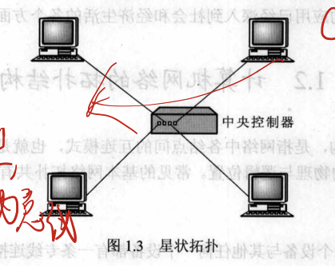
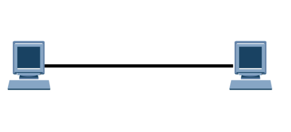
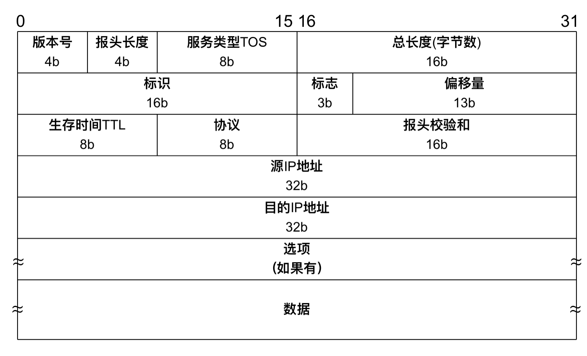
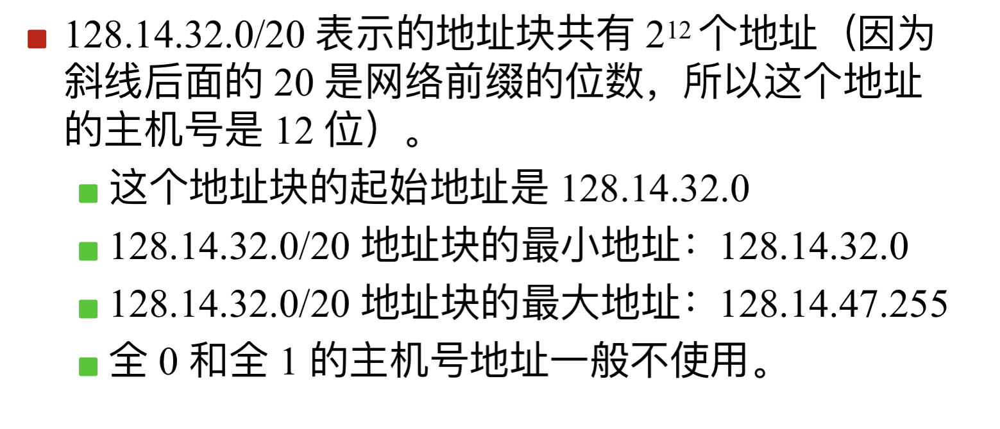
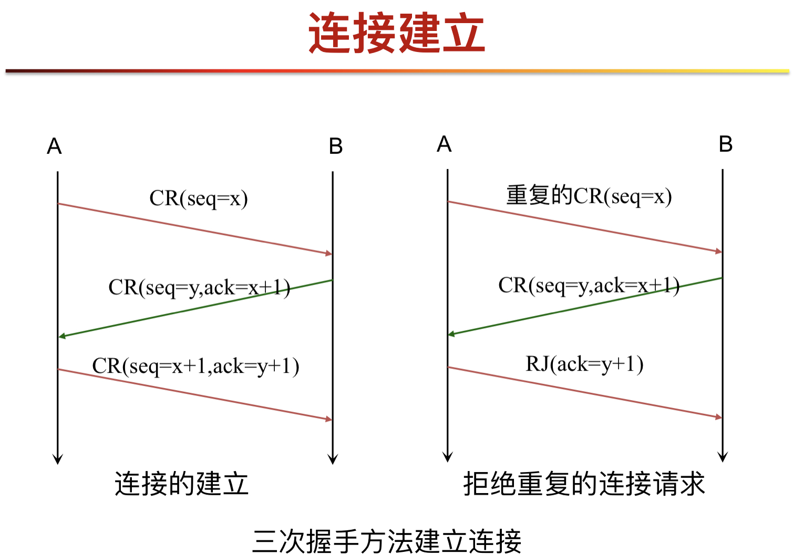
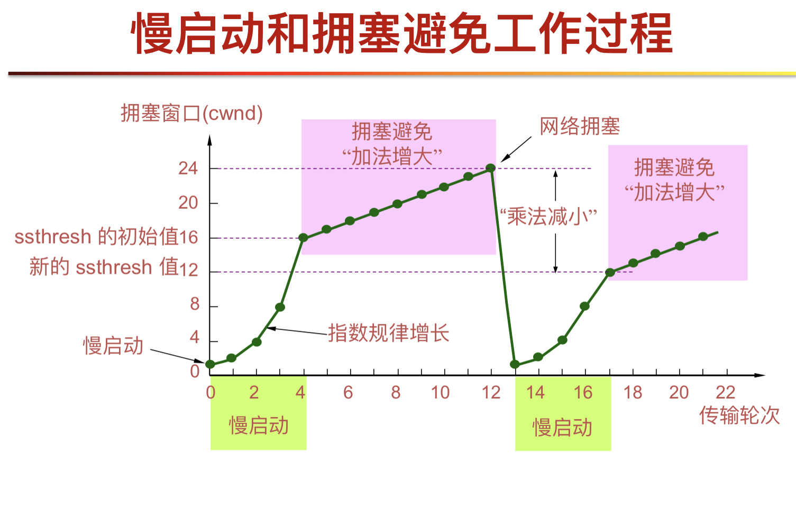

[toc]

### 第一章 概论

#### 1.1计算机网络发展、功能和组成

计算机网络是计算机技术和通信技术相结合的产物，是多个独立自治、相互连接的计算机集合

计算机网络的演变

1.有通信功能的联机系统：终端——线路——计算机

2.有通信功能的分时系统：终端——集中器——计算机

3.计算机网络：独立的计算机互联

4.国际标准化网络：开放式标准计算机网络

计算机网络的功能：

数据通信：网络系统中相连的计算机能够相互传送数据信息

资源共享：网络中的软件和硬件资源，如外设、文件系统和数据等可为多个用户所共享

并行和分布式处理

提高可靠性：控制、数据、软件和硬件的分散性，以及资源冗余及结构上的可动态重组，都提高了可靠性

好的可扩充性：随着用户需求的增长（包括性能和功能方面的增长），只需增加新的计算机节点，而不必替换整个系统

三网：电信网络、计算机网络、有线电视网络

计算机网络的组成

网络由若干节点和连接这些节点的链路组成，连接在网络上的计算机称为主机

计算机网络从逻辑功能上可分为两个子网：资源子网和通信子网

资源子网：

​		由计算机系统、网络终端、外部设备（如打印机等）、各种软件资源与数据资源组成。负责全网的数据处理业务，向网络用户提供各种网络资源与网络服务。

通信子网：

​		由网络通信控制处理机（如存储转发处理机、集中器、网络协议变换器、报文分组装配/拆卸设备等）和通信线路及其他通信设备组成。通信子网完成数据传输和转发等通信工作。

#### 1.2计算机网络的拓扑结构

1.网状拓扑

网状拓扑下，每一个设备与其他任何一个设备都有一条专线连接

优点：

​	1.设备之间的数据负载由专门的连接承担，**避免**了共享链路中的**拥塞**问题

​	2.具有很好的**健壮性**，当一条链路不可用时，不会使整个网络瘫痪

​	3.具有**私有性和安全性**。当每个消息都经由专用线路传输时，只有预期的接收者	才能收到信息

​	4.点到点的连接使故障检测和故障隔离十分容易。

缺点：

​		所需要的电缆数量和设备上的输入/输出端口的数量过大，所以费用昂贵而且安装和重新配置十分困难。一个具有N个结点的网状网络就会有$N(N-1)/2$条物理信道，网络中每个设备必须要有$N-1$个输入/输出端口

2.星状拓扑

每个设备只与中心控制器连接，如果一个设备要向另一设备发送数据，它先将数据发送到中央控制器，再由中央控制器把数据转发给对应的设备。

优点：

​		拓扑**结构简单**：每个设备只需要一条电缆和一个输入/输出端口就可以与任意数量的其他设备建立连接

​		具有较好的**健壮性**：如果一条链路失效，只有连到该链路的设备受到影响，其他设备不受影响。

​		便于**管理**，故障检测和隔离变得容易

缺点：**中央控制器**是整个网络**可靠性和性能的瓶颈**

3.树状拓扑

可以看作是星状拓扑的扩展；绝大多数设备是首先连接到一个次级控制器上，再由次级控制器连接到中央控制器

优缺点与星状拓扑类似，但次级控制器的引入带来了另外两个优势：

​	1.允许更多的设备相连并增加了信号在设备间的传输距离

​	2.允许网络隔离不同计算机的通信，以及为不同计算机设置通信的优先级

4.总线型拓扑

总线型拓扑网络是由一条长电缆组成的主干和连接在上面的网络设备组成。网络结点通过引出线和分接头连接到总线电缆上。

优点：

​		1.信息传输不存在路由和转发的问题

​		2.易安装性，主干电缆可以铺设在最有效的路径上，然后将网络结点通过各种长度的引出线连接到主干上

缺点：

​		1.故障隔离和重新配置困难，加入新设备可能需要改动或更新主干，总线的故障会终止所有的传输

​		2.由于信号衰减，总线的长度和连接的设备数要受到限制

5.环状拓扑

环状拓扑结构是网络中各设备通过一条首尾相连的通信链路连接起来的一个闭合环形结构网。每个设备只与其两侧的两个设备之间有专有的链路连接，信号在环中从一个设备到另一个设备单向传输，直到到达目的地为止。

优点：

​		1.相对比较容易安装和重新配置，加入和删除一个设备只需改动两条连接线

​		2.故障隔离比较简单

缺点：

​		1.如果网络规模较大，会有较大的传输延迟，所以对环的最大长度和设备的数量有一定的限制

​		2.在一个简单环中，由于是单向传输，因此整个环中的一个故障就能使整个网络瘫痪

6.混合型拓扑

通常一个网络会将几个不同拓扑结构的子网连接在一起，组成一个更大的网络。整个网络连接成一个混合型的拓扑结构。

> 以太网在物理上是星状拓扑，逻辑上是总线型，其中中央控制器为总线。

#### 1.3网络分层体系结构

网络协议是通信双方必须遵守的、事先约定好的规则、标准或约定。

网络协议的组成要素：

1.语法：数据与控制信息的结构或格式，如数据格式和电平信号等规定

2.语义：即需要发出何种控制信息、完成何种动作以及做出何种相应，包括用于调整和进行差错处理的控制信息

3.时序（同步）：即事件实现顺序的详细说明，包括速度匹配和顺序

分层的好处：

1.**各层之间相互独立**：通过接口服务

2.**灵活性好**

3.**结构上可分隔开**，各层可以采用最合适的技术来实现

4.**易于实现和维护**

5.**有利于标准化工作**

分层的原则：

1.当需要有一个不同等级的抽象时，就应当有一个相应的层次

2.各层功能明确

3.应适当选择层与层的边界，使通过这些边界的信息量尽量少

4.层次的数量应适当

现代计算机网络是围绕着分层协议或者分层功能的概念设计的，这些技术的发展是为了实现如下目标：

1.把一个复杂的网络合乎逻辑地**分为若干较小的、比较容易理解的部分（层）**

2.在各个网络功能之间**提供标准接口**

3.网络中各节点执行功能的**对称性**，网络中各节点的**相同层执行相同的功能**

4.为预测和控制网络逻辑（软件或微码）的**修改提供手段**

5.为网络设计者、开发者在讨论网络功能时**提供一种标准的语言**

##### ISO OSI参考模型

1.物理层

功能：规定了机械的、电气的、功能的、规程的4个特性，负责如何将计算机连接到通信媒体上

机械特性：定义连接头、机械尺寸、通信媒体等

电气特性：信号电平、编码、数据传输率

功能特性：信号之间的关系、数据线、控制线等

规程特性：数据交换的控制步骤

物理层数据传输的单位是比特（Bit）

2.数据链路层

帧同步：传输的信息单位是帧（Frame）

差错控制：为上层提供可靠链路

流量控制：处理输入数据的速率

链路管理：链路的建立、维持、拆除

> 数据链路层处理相邻节点的数据传输，数据传输的单元是Frame

3.网络层

交换

路由

拥塞控制

网际互联

> 网络层传送的信息单位是分组或包
>
> 上述三层组成所谓的通信子网，用户计算机连接到通信子网上，通信子网负责把一个计算机上的数据可靠地传送到另一台计算机，但并未实现两台主机上进程之间的通信。通信子网的主要功能是面向通信的

4.传输层

实现了“端对端”通信，数据可靠地从一方的用户进程或程序送到另一方的用户进程或程序。

通常由通信两端的计算机完成，中间节点一般不提供盖层的服务

传输层传送的信息单位是报文（message）

是网络体系结构中最关键的一层

> 传输层是既不处理资源，也不参与通信，是 上三层与下三层沟通的桥梁，完成进程与进程之间的通信

5.会话层

会话层允许两台计算机上的用户进程建立会话连接。双方相互确认身份，协商对话连接的细节

> 传输层和会话层为两台计算机上的用户进程或程序之间提供了正确传送数据的手段

6.表示层

主要解决用户信息的语法表示问题、数据加密、解密、信息压缩

表示层对传送的用户数据进行翻译或结束、编码和变换，使得不同类型的机器对数据信息的不同表示方法可以相互理解

7.应用层

应用层确定进程之间通信的性质，以满足用户的需要。

负责用户信息的语义表示，并在两个通信者之间进行语义匹配

应用层处理用户的数据和信息，由用户程序（应用程序）组成，完成用户所希望的实际任务。

这一层包括最终用户普遍需要的协议，如虚拟终端协议、文件传输协议、电子邮件协议等

##### 层间通信与对等层间通信

下层实体需要**向上层提供服务**，上层实体需要**调用下层实体所提供的服务完成自己的功能**

层间通信：同一网络结点上相邻层次中实体之间的通信

对等层：把网络中不同主机内相对应的层次称为对等层

对等层实体：对等层之间两个通信的实体称为对等层实体

对等层间通信：不同的网络节点上对等层实体间的通信称为对等层间通信

虚通信：除物理层外，对等层之间的通信叫做虚通信

实通信：层间通信以及物理层之间的通信叫做实通信

三种地址：

1.MAC地址：物理网卡地址，应用于数据链路层

2.IP地址：逻辑地址，用来标识主机，应用于网络层

3.端口号：传输层使用的逻辑地址，标识进程

> message首部包含源、目的端口号

协议水平：对等层之间的通信

服务垂直：下层为上层提供服务

##### 服务和数据单元

ISO OSI/RM的每层为其上层提供专门的通信服务。每层完成的服务是其上层完成工作的基础

服务访问点SAP：层间接口处提供服务的地方

> 每个服务访问点都有一个唯一的地址标识。以传输层为例，一个传输层的服务访问点TSAP可以表示为<网络号><主机号><端口号>

服务数据单元SDU：相邻层在提供服务的过程中要传输的信息

在N+1和N层之间传递的数据单元，记为（N）SDU

协议数据单元PDU：对等层间交换的数据单元，N层的PDU由该层的SDU加上该层的协议控制信息

协议控制信息PCI

##### 面向连接和无连接的服务

面向连接：

1.建立连接

2.数据交换

3.释放连接

面向无连接：

三种数据类型：

数据报：IP传输的就是无连接数据报

证实交付

请求回答

#### 1.4TCP/IP网络体系结构

IP协议 不可靠，无连接

可以运行在不同的物理网络上（可以使用ARP解析物理地址）

不能保证不丢失、顺序、不出错

IP地址：

1.单播地址

2.多播地址（组播）

3.广播地址

ICMP控制报文协议、IGMP Internet组管理协议封装于IP数据帧中（？）

ARP地址解析协议：进行IP地址与MAC地址之间的翻译，用于IP协议与以太网协议的沟通

数据链路层：以太网协议，封装数据帧

传输层协议：

TCP：面向连接

建立连接：经过三次握手

数据传输

断开链接：四次握手

可靠传输，数据提供给应用层

UDP 不可靠 无连接

传输层的地址就是传输服务点的地址，在TCP/IP中，一个传输服务访问点TSAP称为一个socket，一个socket地址包括<IP地址，端口号>

发送数据：

1.应用进程数据先传送到应用层，加上应用层首部，成为应用层PDU

2.应用层PDU再传送到运输层，加上运输层首部，成为运输层报文

3.运输层报文再传送到网络层，加上网络层首部，成为IP数据报（或分组）

4.IP数据报再传送到数据链路层，加上链路层首部和尾部，成为数据链路帧

5.数据链路层帧再传送到物理层，最下面的物理层把比特流传送到物理媒体

电信号（或光信号）在物理媒体中传播，从发送端物理层传送到接收端物理层

网络互联：扩大网络规模

中继器：工作在物理层，用于信号补偿，广播型设备

> 信号再生，而不是放大，即将信号恢复为原来的状态，与放大器不同，放大器将信号和噪声同时放大
>
> 集线器：一个多口的中继器

网桥：工作在物理层、数据链路层。是一种存储转发设备，可以隔离通信，识别数据链路帧，根据MAC地址实现有目的的存储或转发。

> 如果两个网段的协议不同，网桥还应实现协议的转换

路由器：工作在物理层、数据链路层、网络层，能够进行路由选择，可以连接多个网络，从一个连接的网络中接收包，再传送到另一个网络中，将不同的网络连接起来

网关：工作在物理层到应用层，实质上是一个运行在出口路由器上的软件，是一个协议转换器，可以连接不同的网络，可以识别应用层协议，起到过滤的作用

补充：计算机网络性能指标

1.速率：即数据率或比特率，单位bit/s(bps, b/s)，kb/s($10^3b/s$), Mb/s, Gb/s, Tb/s

2.带宽：在传送模拟信号的系统中指信道允许通过的频带宽度，单位是赫或千赫、兆赫、吉赫等

计算机网络中的带宽指数字信道所能传送的“最高数据率”的同义语，单位是比特每秒，即bps（b/s，bit/s）

3.信道利用率：除去全部控制信息后的数据率与信道吞吐量之比 或者 发送数据的时间与信道被占用时间之比

> 例：吞吐量100M，其中2M的控制信息，则信道利用率为98%

4.延迟时间：信息包从源节点节点产生到成功被目的点接收所经历的时间，包括：

​		1.排队时延：等待网卡、网络空闲

​		2.处理时延：数据处理

​		3.发送时延：按位将数据发送的时间，两个相关因素：数据的长度和接口发送速度 $发送时延=\frac{数据块长度（比特）}{信道带宽（比特/秒）}$

​		4.传输时延：数据在信道中传输需要一定的时间，与传输距离和传输介质有关 $传输时延=\frac{信道长度（米）}{信号在信道上的传播速率（米/秒）}$

5.往返时间（RTT）：发送到接收应答的时间，包括中间节点的处理时延、排队和转发时延

6.延迟宽带积：=传输时延*带宽，以比特为单位的链路长度

### 第二章 数据通信基础

#### 2.1数据通信系统

组成：

1.信源：产生要发送数据的设备

2.发送设备：对数据进行编码的设备

3.传输系统：传输线路或网络

4.接收设备：将接收的信号变成数据

5.信宿：目的系统

示例：公共电话

数据通信系统要解决的问题：

1.提高传输系统的利用率

2.接口、编码、同步

3.交换管理

4.差错控制

5.流量控制：双方速率不同时对发送方流量的控制

6.寻址和路由

7.恢复

8.报文格式

传输

模拟传输：指模拟数据的传输，不关心所传输信号的内容，只关心尽量减小信号的衰减和噪声；长距离传输时，采用信号放大器，同时放大了噪声

数字传输：指数字数据的传输，关心信号的内容。可以是数字信号的传输，也可以是模拟信号的传输

主要技术指标：

1.码元速率B：每秒传送的码元数，单位是波特（Baud），一个码元中含有一个或多个二进制位，若码元宽度为T秒，则码元速率为B=1/T

> 在数字通信中，一个数字脉冲称为一个码元，码元携带的信息量由码元的离散值个数决定
>
> 

2.数据传输率C：每秒传送的信息量，单位是比特/秒

3.误码率：错误接收的报文码元数在总码元中占的比例

4:误比特率：指误接收的比特数在总比特数中占的比例

#### 2.2信号和数据编码

模拟信号：简单模拟信号、复杂模拟信号（任何一个复杂的模拟信号可以分解为若干个简单模拟信号的叠加）

数字信号：离散的、值的变化是瞬时发生的信号

比特间隙：发送1比特所用的时间

有效带宽：数字信号是由多个频率信号的叠加而成，如果只传输有重要振幅分量的频率信号，而输出端能够以合理的精度恢复信号，则这个上限频率就是有效带宽。 

介质带宽：传输介质只能传输某些频率范围内的信号

带宽可以用最大频率-最小频率求出

信道容量：传输介质可以传输的最大比特率，依赖于编码技术和信噪比

奈氏准则：有限带宽无噪声信道（**理论状态**）的最大码元速率B与信道带宽W的关系：B=2*W

码元速率与数据速率的关系：$R=2*W*log_2N=B*log_2N$

R表示数据传输速率，单位为bps

N为一个脉冲信号所表示的有效状态个数

$log_2N$指的是一个码元所带的二进制位数

码间串扰：所谓码间串扰是由于系统传输总特性不理想，导致前后码元的波形畸变、展宽，并使前面波形出现很长的拖尾，蔓延到当前码元的抽样时刻上，从而对当前码元的判决造成干扰。

香农定理：有限带宽有随机热噪声信道的最大数据传输率（信道容量）Rmax与信道带宽W和信号噪声功率比S/N之间的关系：$Rmax=W*log_2(1+S/N)$  单位bps

Rmax：信道容量

S：平均信号功率

N：平均噪声功率

S/N：信噪比

通常用分贝(dB)表示信噪比：$分贝数=10*log_{10}(S/N)$

编码：将信息用信号来表示的方法

信息有模拟信息和数字信息

信号有模拟信号和数字信号

##### 数字（信息）->数字（信号）编码

1.单极性编码：

电压是单极性，即只有一级

通常：正电压表示1、零电压或线路空闲表示0

存在的问题：

​		1.**直流分量的问题**。由于单极性编码信号的**平均振幅不等于零**，所以存在一个直流分量。某些传输介质没有处理直流分量的能力，如微波。

​		2.**同步的问题**。当一个信号不发生改变时，接收端就**无法准确知道每个比特的开始和结束**。

2.极化编码

极化编码采用两个电压：一个正电压，一个负电压，减轻了单极性编码中的直流分量问题

三种方式：

​		1.非归零编码（NRZ）：

​				1.非归零电平编码（NRZ-L）：高电平为1，低电平为0

​				

​				2.非归零反向编码（NRZ-I）：通过跳变来表示1/0，电平翻转表示1，未翻转表示0

​					未解决同步问题

​					4B/5B编码：每4个比特先编码为5个比特，然后采用NRZ-I编码成信号，编码后序列中至多出现连续的3个0

​					应用：光纤分布式数据接口

​		2.归零编码（RZ）：

​				三个电平：正电平、负电平、零

​		3.双相位编码：

​				1.曼彻斯特编码：在每个比特间隙中间引入跳变来表示不同的比特和同步信息。一般来说负到正为1，正到负为0

​				**数据传输速率是码元传输速率的1/2**

​				自同步

​				2.差分曼彻斯特编码：比特间隙开始时发生跳变代表0，不跳变代表1

3.双极性编码

使用3个电平值：正、负、零

​	1.信号交替反转码AMI

​	2.8零替换码（B8ZS）

​	3.高密度双极性3零编码（HDB3）

##### 数字（信息）->模拟（信号）编码

利用模拟信号表示数字信息的技术

使用的是调制技术，用模拟信号的幅值、频率、相位来代替数字1和0

载波信号：发送设备产生一个高频信号作为基波来承载信息信号。这个基波就称为载波信号。这个过程叫调制

调制信号：带有信息的载波信号称为调制信号

常用的调制方法：

​	1.幅移键控法ASK

​		用载波的不同幅度代替数字1，0；例如，高幅表示0，低幅表示1

​		抗干扰能力差

​		

​	2.频移键控法FSK

​		用载波的不同频率表示1和0；例如高频表示0，低频表示1

​		抗干扰能力比ASK好

​		

​	3.相移键控法PSK

​		调制载波的相位：不同的相位表示1和0；例如相位0表示0，相位180表示1

​		

​		可以用更多的状态表示二进制位，是调制主要应用的技术

​		例如，用0相位表示00，用90相位表示01，用180表示10，用270表示11；这样每种相位的正弦信号可以表示两位二进制信息

​		

4.正交调幅法QAM

将ASK和PSK结合起来的编码方法

ASK受噪声影响大，不同信号间需要更大的传输距离

PSK受到设备检测相位微小变化能力的限制，因此限制了比特率的提高

#### 2.3线路配置和传输方式

##### 线路配置：

线路配置指两个或两个以上的设备连接到线路的方式

1.点到点

2.多点连接

##### 传输模式

传输模式指比特流从一个设备传到另一个设备的方式

输出模式包括两种：

1.单工、半双工、全双工通信

2.串行传输和并行传输：

串行传输的两种模式：

1.同步传输：

​	用于高速传输，字符或比特流组合成数据帧成块传输，对收发双方的时钟要求很高

​	同步分为两级：

​		1.位同步：附加同步线路或内同步编码（用于一个帧内部的同步）

​		2.帧同步：增加帧起始和结束标志（用于收发双方的同步）

2.异步传输：

​	用于低速设备，一次传输一个字节，一个字节一同步。

​	比特流分成多个小组独立传送，可在任何时刻发送比特

	

​	空闲时线路为表示1的信号

​	开始位使信号变成0

​	停止位使信号重新变为1，该信号一直保持到下一个开始位到达

接收方如何知道何时数据到达和结束：在字节头和尾加开始位和停止位

#### 2.4多路复用技术

多路复用技术：利用一条链路同时传输多路信号的技术

可以最大限度地利用系统所具有的传输能力

复用器：将信号复合

解复用器：将信号分开

复用技术：

①频分多路复用技术(FDM)

​	通过分割带宽（此处指频率）来实现，适用于模拟信号

​	多用于电话网等

​	用户在分配到一定的频带后，在通信过程中自始至终都占用这个频带。

​	频分复用的所有用户**在同样的时间占用不同的带宽资源**。

​	

警戒频带：便于解复用器将信号分离开

②时分多路复用技术(TDM)

​	通过分割时间片来划分信道，每个时间片由一个复用信号占用，适用于数字信号

​	一个时间片即一帧，一帧包含多个时隙，每个时隙分给固定的用户

​	

​	每一个用户所占用的时隙是周期性地出现（其周期就是 TDM 帧的长度）。

​	时分复用的所有用户是**在不同的时间占用同样的频带宽度**。

​	同步时分多路复用

​		

​		 

​		当不是所有用户均有大量数据需要发送时，可能会造成浪费

​	异步时分多路复用（统计时分复用）

​		

​		对每一个用户信息加上一个地址信息，如A为1，B为2等

​	两者的比较：

​		同步时分多路复用的帧是固定大小的，控制简单，实时性好。信道效率差。

​		异步时分多路复用能提高系统的利用率，异步时分多路复用需要一些额外的代价：

​	 		 ①信息单元需附带地址信息

​			  ②复用器必须有一定的存储容量

​			  ③节点必须有管理队列的能力

③波分多路复用技术(WDM)

​	光的分频复用

​	利用多个激光器在单条光纤上同时发送多束不同波长激光的技术

​	它在一定的带宽上将输入的光信号调制到特定的频率上，然后将调制后的信号复用到一根光纤上。

​	EDFA：光的信号放大器，用于信号的补偿，每两个EDFA的最大距离是120Km

④码分多路复用技术(CDM)

​	码分多路复用是**根据码型结构的不同**来实现信号分割的多路复用**。**

​	应用于无线通信

​	在CDMA系统中，各个用户不是靠频率或时隙来区分，而是码型来区分。用户使用同一频率，占用相同的带宽。

​	码片：每个比特时间被再**细分成m个更短的时间间隔**，更短的时间间隔称之为码片

​	码片序列：每个站点**分配一个m位码片序列**

​		–例：站点A (0 0 0 1 1 0 1 1)

​		–发送比特1，站点就发送其码片序列（00011011）

​		–发送比特0，站点就发送其码片序列的反码（11100100）

​	双极型表示：0->-1，1->+1，0->无信号

​		–A的码片序列为(-1 -1 -1 +1 +1 -1 +1 +1)

​		–其反码为(+1 +1 +1 -1 -1 +1 -1 -1)

	每个站点都有自己唯一的码片序列。这里用符号S来表示站点S的m维码片矢量，-S为它的反。所有的码片序列都是两两正交的，也就是说任意两个不同的码片序列S和T的内标积（写为S·T）均为0 

​	示例：

​		

> 第一个比特间隙S1，只有C发送了一个比特1
>
> 第二个比特间隙S2，B和C发送信息，将B和C码片序列相加，得到要发送的信息；之后以此类推
>
> 以C为例，如何接收信号，将C的码片序列与收到的信号做内标积，得到发送的信号

#### 2.5数据交换技术

当存在多个通信设备时，如何使每两个设备之间能够通信问题。

交换技术指使得没有物理链路直接连接的两个或多个设备之间能够通信的技术。

传统的交换方式：

​	1.电路交换

​		电路交换是在两个设备之间**创建一条临时的物理连接**。所以我们可以把**电路交换机看作是一个多路开关**。

​		

​		电路交换的特点是在通信开始之前，要在两个通信设备之间建立起一条完全被通信双方所占用的物理通路。

​		电路交换使用**面向连接的服务**

​		其过程包括以下三个步骤：

  		 ①电路建立

  		 ②数据传输

 	  	③电路拆除

​		举例：

​	2.报文交换

​		报文交换又称为存储转发或消息交换**。**

​		基本原理：是在报文的传输过程中，由网络的中间节点将报文暂时存储起来，检查它的正确性和完整性，然后再发往下一个节点。

​		引入了存储转发，共享性更好

​		缺点：在报文交换中，整个报文是作为一个整体来处理，由于报文较长，**报文传输的延迟很大**。

​		报文交换技术已被淘汰。

​	3.分组交换

​		较长的报文被分为较短的数据单元，然后每个数据单元被加上一些通信控制信息等内容，形成一个信息包(packet)。

​		通信时**以包为单位**发送、存储和转发

​		**长度短**，可以在中间站点的主存队列中存储

​		信息**包到达后就可以转发**，不必等待很长的报文全部到达，缩短了延迟时间

​	分组交换与电路交换的比较：

​		①**共享传输链路**，提高使用效率

​		②信息**可在中途存储**，不要求接收端做好准备

​		③有流量和拥塞控制，**不会发生阻塞**

​		④**可工作于广播和多播**的方式

​		⑤具有**提供多种通信设备互连的灵活性**

分组交换的两种类型：

​	1.数据报：

​		在传输中每个包都将独立于其他包进行处理。

​		一次传输的数据报**可能不是次序地**到达目的地。

​		一条链路可同时为多个设备服务

​		不一定按次序到达

​		应用：IP协议，因此IP传输是不可靠的传输

​	2.虚电路：

​		属于同一次通信的所有包之间的关系得以维持

​		在数据传输的**开始之前选定路径**

​		和电路交换的区别是：虚电路可以**同时为多个设备提供通信服务**，而电路交换是独占的

​		虚呼叫：发送一个特殊格式的包到主机，要求进行通信，同时寻找合适的路由（即建立连接、虚电路）

​		两种虚电路：

​			1.交换虚电路SVC：每条虚电路在需要的时候被创建，而且仅仅在这次通信交换的过程中存在。

​			2.永久虚电路PVC：类似于租用线路，在这种方法中，两个用户之间存在一条相同的虚电路，该电路是专门提供给特定用户的，这条虚电路总是建立好的。

​		虚电路交换优点：

​			采用虚电路的情况下，仅在建立虚电路时需要目的在地址，而进行数据传送时， 每个包不需要携带完整的目的地址,而仅需要一个虚电路的号码标志。这就减少了包的控制信息，从而减少了额外开销。

#### 2.6错误检测和控制

检错码：给发送信息加上冗余位，使其具备检错功能。常用的检错码有**奇偶校验码**、**循环冗余校验码**和**检查和**

​	奇偶校验码：计算数据单元中1的个数

​		偶校验：令1的个数为偶数

​		奇校验：令1的个数为奇数

​		发送数据时，连同校验位r一起发送。接收方根据结果，判断是否发生差错。

​		实际的数据传输中奇偶校验码可分为三种**：**

​			1.垂直（纵向）奇偶校验

​			2.水平（横向）奇偶校验

​			3.水平垂直奇偶校验

​		垂直校验：对每一个数据单元去计算一位校验码，只能检测该单元奇数个错误

​		水平校验：对所有数据单元的某一位计算一位校验码，只能检测多单元某一位奇数个错误

​		纵横校验：除了数据块中偶数个数据单元中偶数个相同位发生错误外，其他错误均可检测

​	循环校验码CRC：

​		通信双方约定一个生成多项式$G(x)$，最高阶为m，例如：$G(x)=x^4+x^3+1=11001$（每一位代表x的次方，从0开始），即m=4

​		待发送的信息为$U(x)$；例：1101011

​		用$U(x)x^4$除以$G(x)$得4位余数$R(x)$；即在$U(x)$后面添m个0后除以$G(x)$。除法的规则是：类似异或规则，不论加减，相同为0，不同为1；没有借、进位

​		将$R(x)$放在$U(x)$之后获得循环校验码

​		余数不够4位，向前用0补齐

接收方用收到的数据除以生成多项式G(x)，如果结果为0，传输没有错误，否则，说明传输产生错误。

> 原理：由于进行除法运算，所以在末尾加上余数和减去余数是一样的，因此结果可以整除G(x)

​	检查和：

​		

> 反码加法的规则：与正常加法的唯一区别是最高位的进位与数据相加

​		

> 接收方将n+1组数据反码相加，得到校验和的反码

纠错码：能纠正错误的冗余码。常用的纠错码是**海明码**

编码效率：数据信息在整个发送信息的比重

三种错误类型：

​	1.单比特错误

​	2.多比特错误

​	3.突发错误

### 第三章 物理层

#### 3.1物理层功能

​	1.是OSI的第一层，是整个开放系统的基础，为数据传输提供可靠的环境

​	2.物理层的主要功能是为数据端设备提供传送数据的通路，数据通路可以是一个物理媒体，也可以是多个物理媒体连接而成

​	3.定义了物理连接的机械特性、电气特性、功能特性和规程特性，包括把两个节点连接在网络上的电缆、物理接口和信号等

​	物理层数据传输的单位是比特bit

#### 3.2物理接口

数据通信中涉及到四个基本功能单元：

 两端各有一个**数据终端设备**(DTE)和一个**数据电路终接设备**(DCE)

物理层协议的四个特性：

​	①**机械特性**：说明接口的插头尺寸、插头各管脚的位置等。

​	②**电气特性**：说明传输线上出现的电压应在什么范围

​	③**功能特性**：说明某根传输线上出现的某一电平代表何种意义

​	④**规程特性**：说明对于不同的功能各种可能事件出现的先后顺序

##### 3.2.1RJ45接口标准

​	RJ45 型网线插头又称水晶头，共有八芯，广泛应用于局域网和 ADSL 宽带上网用户的网络设备间网线(称作五类线或双绞线)的连接。最	大距离100米

​	RJ45接口，也称之为8P8C（8个位置，8个触点），是以太网使用双绞线连接时常用的连接器插头，支持10兆和100兆自适应的网络连	接速度。

​	在百兆以太网中，仅使用1、2、3、6四根线

​	差分信号传输方式，减少电磁干扰，其中**1、2为TX(发送)**，**3、6为RX(接收)**。

​	在千兆以太网或者以太网供电中，全部的四对都被使用。

​	两种线序：

​		1.568A标准：

​			绿白—１ 绿—２ 橙白—３ 蓝—４ 

​			蓝白—５ 橙—６ 棕白—７ 棕—８

​		2.568B标准：

​			橙白—１ 橙—２ 绿白—３ 蓝—４ 

​			蓝白—**５ **绿—６ 棕白—７ 棕—８

​	

​	直通线就是两端相同，同为T568A或者同为T568B

​	交叉线就是一端使用T568A，另一端使用T568B的连接方法。

​	直通线：用于连接网络中不同类型的设备

​	交叉线：用于连接网络中相同类型的设备

​	差分信号：

​		一条线发送本身，另一条线发送信号的反，在接收端进行做差，得到2倍的信号，同时使得噪音信号被减掉

##### 3.2.3EIA-232接口标准

EIA-232接口标准是由电子工业协会（EIA）1969年制定的，早期称为RS-232

机械特性：

​	DB25连接器

​	数据-4，控制-11.定时-3，其他-7

​	电缆长度不能超过25米

​	

电气特性：

功能特性：

规程特性：

#### 3.3传输介质

物理层传输介质：有线介质和无线介质

有线介质：双绞线、同轴电缆、光纤等

无线介质：卫星、微波、红外线

在有线介质中电磁波沿着固体媒体传播，而无线介质就是指自由空间，在无线介质中电磁波的传输常常称为无线传输。

双绞线：

1.UTP非屏蔽双绞线

​	由塑料外皮包起来的一对或多对双绞线组成

​	EIA按照电气性能划分为：1类、2类、3类、4类、5类、超5类、6类、超6类，共8种非屏蔽双绞线类型

​	类型数字越大，版本越新、技术越先进、带宽也越宽

​	双绞线连接器的类型**:**

​		①4P4C（四线位结构）

​		②6P6C**（**六线位结构**）** 

​		③8P8C（八线位结构，常用） 

​	8P8C最常用，也称为RJ45

2.STP屏蔽双绞线：抗干扰能力强，价格更高

​	每一对双绞线外都有一层金属箔膜或是金属网格包装，使电磁噪声不能穿越进来，能消除大多数的串线干扰

​	使用和UTP一样的连接器，但是屏蔽层必须接地

同轴电缆：

用于总线型网络拓扑结构

1.细缆：用于10（mbps）Base（基带）2（185m）

2.粗缆：用于10（mbps）Base（基带）5（500m）

适合高速传输

局域网发展初期广泛使用同轴电缆

后局域网基本都用双绞线作为传输介质

目前同轴电缆主要用于有线电视网的居民小区

##### 3.3.3光缆

光缆的核心是光导纤维，光纤由三层构成：纤芯（芯材和填充材料）、包层、保护层

两种传播模式：

1.多模传播

​	多束光线在芯材中通过不同路径传播。这样的光纤称为多模光纤

​	阶跃模式

​	渐变模式

​	

多模光纤：

①纤芯中心密度大，向外逐渐变小，到边界最小

②光脉冲在多模光纤中传输时会逐渐展宽，造成失真。因此只适合于近距离传输。

③光源可以使用较便宜的发光二极管。

2.单模传播

​	若光纤的直径减小到只有一个光的波长，就可以使光线一直向前传播，不会产生多次反射。

​	

单模光纤:

①纤芯很细，直径只有几微米，制造成本较高。

②光源要用昂贵的半导体激光器，不能用较便宜的发光二极管。

③损耗较小，适合于长距离传输。

光纤收发器的光源可以是一个发光二极管或注入型激光二极管

设备必须与光纤匹配

光纤的特点：

​	优点：

​		①通信容量非常大；

​		②抗雷电和电磁干扰性能好；

​		③无串音干扰，保密性好；		

​		④传输速率高、距离长

​		⑤体积小，重量轻

​	规格**：**单模**，**多模

 

FX 光纤

BX 单模光纤

SX 多模光纤

T 双绞线

数字 同轴电缆

##### 3.3.4无线传输介质

无线传播的信号主要有：

​	①地面微波（直线传播，频率范围：2-40GHz,高频不适应长途传输，蓝牙、Wi-Fi是高频微波应用**)**

​	②卫星微波(有线电视信号传播，长途电话）

​	③红外线(近距离笔记本电脑互相传数据）

无线传播有两种方法**：**

​	①定向

​	②全向

#### 3.4物理层互联设备

网络互连设备称为**中继系统**，与其他系统共享第n层协议，但不共享第n+1层协议，称为第n层中继系统

网络互连设备被划分为四个大类：中继器，网桥，路由器和网关

物理层的网络设备：中继器、集线器、无线AP

##### 3.4.1中继器

中继器作用于信号的**电气部分**，不放大信号，而是**重新生成信号**，可以扩展局域网所覆盖的地理范围

对网络的要求：所连接的局域网**具有相同的物理层和媒体访问控制协议**

广播域：由中继器连接的网段在同一个广播域中，一个节点发送的信息，同一广播域的其他节点均可见，存在广播风暴的问题（多个节点同时发出信息）

使用中继器的问题：

性能：有更多的站点访问媒体，会导致更多的流量，从而导致局域网性能的下降

安全性：更多的站点访问同一媒体，安全保障更加困难

##### 3.4.2集线器（HUB）

属于数据通信系统中的基础设备，工作在物理层，采用CSMA/CD访问方式

相当于多口的中继器，采用**广播**方式发送数据，所以集线器又叫**多口中继器**。

##### 3.4.3无线AP（Wireless AcceccPoint）

是组建小型无线局域网时最常用的设备，相当于传统有线网络中的HUB

连接有线网和无线网的桥梁，其主要作用是将各个无线网络客户端连接到一起，然后将无线网络接入以太网

AP的室内覆盖范围一般是30m~100m

### 第四章数据链路层

数据链路层处理相邻节点的数据传输

数据链路层将不可靠的物理链路变为可靠的数据链路

数据链路层的主要工作：

​	①线路规程：解决了“现在谁该发送”的问题。

​	②差错控制：通常采用“校验-确认-重发”的模式来纠正错误。

​	③流量控制：防止因发送端的发送速度超过接收端的处理速速造成数据丢失和信道拥挤，调整某段时间内可发送的数据量。

​	④链路管理：数据链路的建立、维持和释放。链路是**一个节点到相邻节点**的物理线路；数据链路=链路+规程（协议）的硬件和软件。

数据链路层传输的数据单元是帧（Frame）

#### 4.1线路规程

线路规程是监视链路的建立，以及在给定时刻分配一个具体设备进行数据传送的权利

线路规程可以有两种实现：

①询问/应答（ENQ/ACK）

②轮询(Poll)/选择(Select)

##### 4.1.1询问/应答模式

使用场合：

两个设备之间存在一条专用链路时，即**点对点方式**

只要一条链路两头的设备级别相同，任意一个设备都可以启动一个会话过程。

工作方式：

n启动方首先发送一个询问帧（ENQ）询问接收方是否可以接收数据。

①接收方如果已经准备好接收，回答一个确认帧（ACK**）**

②如果没有准备好接收，回答一个否认帧（NAK）

##### 4.1.2轮询/选择模式

使用场合：多点连接系统

不仅仅要确定设备是否就绪，还要确定哪一个站点有权使用信道

主设备控制链路，主设备发命令，从设备响应。

轮询：如果主设备希望接收数据

​		主设备希望接收数据，诸葛询问设备是否有数据发送

​		如果没有数据发送，则回答否定回答帧，如果有，直接用数据帧应答

选择：如果主设备希望发送数据

地址问题：在链路上的每个设备都有一个地址来标识自己

两种终止信息交互的方法：

​	从设备将所有的数据发送完毕，并以一个传输结束帧(EOT)结束传输

​	主设备发出“时间到”消息

> 没有主从关系时，节点之间自由/随机竞争-->以太网 采用CSMA/CD

#### 4.2流量控制与差错控制

流量控制是一组过程，这组过程是用来告诉发送方在等待接收方的确认信号之前最多可以传送多少数据

流量控制的两个要点：

​	①数据流不能使接收方过载

​	②接收方对数据进行确认

差错控制

差错控制主要指错误检测和重传方法

自动重复请求（ARQ）：数据帧在传输中出现错误，接收方就返回一个否定应答帧(NAK)，出错的帧就会被发送方重新传送。这个过程叫ARQ。

> TCP中无否定应答，依靠在一定时间内仍未收到肯定应答的方法来要求重传

数据被重传的三种情况：

​	①帧破坏

​	②帧丢失

​	③应答帧丢失

流量控制和差错控制是结合在一起实现

有两种实现流量控制和差错控制的技术：

​	停止等待协议 

​	滑动窗口协议

要求：

​	1.发送站要保留数据帧的备份

​	2.除确认帧外，接收方可以发送否认帧，告诉发送方重新发送一个损坏的帧

​	3.定时器，判断数据帧在传输中丢失

##### 4.2.1停止等待协议

​	①发送方**每发送一帧后就等待应答**。只有收到一个应答(ACK)后，才发送下一个帧。直到发送方发送一个传输结束帧。

​	②优点：协议简单。

​	①缺点：效率低，在线路上只有一帧。如果设备之间的距离很长，在每帧之间等待ACK帧所花费的时间很长。

 

 

信道利用率：信道被占用的时间和总时间之比

有效数据传输率：单位时间内传输的有效数据位数（一个数据帧中去除控制字段后的数据位数）

无差错情况的发送信道利用率P：$P = t_I/t_W$

> $t_I$：发送数据的时间

无差错情况的有效数据传输率$S = N/t_W$

> $N$：有效数据位数
>
> $t_W$：发送一帧的时间

例：

 

解：

 

有差错时正确传送一帧的平均时间：

​	无差错情况下，发送一帧的最小时间间隔为$t_W$

​	当出错率为$p$时，正确发送一帧的平均时间间隔$t_V$为（根据概率统计学）：$t_V = t_W/(1-p)$

> p:出错率

> $t_V$：发送一帧的平均时间

停止等待协议的定量分析（有差错）

系统最大吞吐量$\lambda max$（每秒成功发送的帧数） $\lambda _{max}=1/t_V=(1-p)/t_W$

极限吞吐量$M=1/t_I$（$t_I$：发送数据的时间）

系统传输效率：最大吞吐量/极限吞吐量 $\rho=\lambda_{max}/M = (1-p)/(t_W/t_I)$

令$a=t_W/t_I$，则：$\rho=(1-p)/a$

> $\rho$与a成反比，a越小效率越高。忽略$t_{proc}$和$t_S$，$WT\approx t_I+2t_P$，故传播延迟越小，使用停止等待协议的系统效率越高

ARQ：Auto Repeat reQuest

 

> 帧破坏：发现帧错误后，发送否定应答，A进行重传，直至得到肯定应答
>
> 帧丢失：帧丢失后，B无法向A发送应答，在经过一段时间后判定超时，A自动重传
>
> 应答帧丢失：应答帧丢失，A未收到应答帧，按帧丢失处理，进行重传，B再次收到该数据帧后，判定为与上一帧相同，丢弃上一帧，再次发送应答帧

差错控制的要求：

​	1.发送站要保留数据帧的备份

​	2.数据帧和应答帧必须交替标识为0和1

​	3.否定应答帧，通知发送方重新发送最近的一帧

​	4.定时器，判断数据帧在传输中丢失

##### 4.2.2滑动窗口协议

滑动窗口协议中的**流量控制**：发送方在收到应答消息前可以发送若干帧。接收方使用一个ACK帧来对多个数据帧的接收进行确认。具体可以接受多少帧视窗口大小而定。

滑动窗口协议中的**差错控制**：

​	两种实现自动重复请求（ARQ）技术：

​		1.回退N自动重复请求(Go-back-N)

​		2.选择拒绝自动重复请求(Select-Rej)

帧编号：

​	数据帧以模n方式编号，也就是说，编号从0到n-1，一般$N = 2^M$

​	窗口的大小是n-1

​	接收方发送的应答帧编号是接收方希望收到的下一帧的编号

窗口：发送方和接收方存放数据帧的缓冲区：

​	1.发送方窗口用于存放已经发送但未收到应答的数据帧和在收到应答帧之前可以发送的数据帧。

​	2.接收方窗口用于存放已经被接收但未给应答的数据帧。

​	3.在接收方，只要窗口未填满就可以在未发送应答帧的情况下继续接收数据帧。

 

 

滑动窗口协议中的差错控制

​	回退N自动重复请求(Go-back-N)：回退最近被应答的帧，之后的全部重传

​		帧破坏：

​			

> 第3帧出错，丢弃之后的所有帧，重新接收

​		数据帧丢失：

 

> 第2帧丢失，丢弃之后的所有帧，重新接收

​		确认帧丢失：

 

> 超时重传
>
> 当发送窗口满或没有数据要发送时，启动定时器

​		窗口的大小与编号范围的关系：

​			在回退N协议中，如果帧的编号范围是0-n-1，则窗口的尺寸为n-1

​			窗口尺寸的四种可能情况：

​				1.大于n

​				2.等于n

​				3.等于n-1

​				4.小于n-1

​	选择拒绝自动重复请求(Select-Rej)：选择出错的那一帧进行重传

​		在选择拒绝自动重复请求协议中，只有特定的丢失或损坏帧被重发。

​		接收方收到的数据帧**可以是不按顺序到达**的。

​	选择拒绝与回退n自动重复请求有4个不同点：

​		接收设备必须具有排序功能。接收方在发送了NAK帧之后，必须存储收到的所有帧，直到损坏的帧重新收到为止

​		发送设备必须具有查找机制，以便发现和选择需要重传的帧

​		所有重传帧被排序和所有重复帧被辨别出来并删除之前，所收到的帧都必须保存

​		ACK帧的编号指的是被正确接收的帧编号，不是指期望接收的帧编号，而NAK帧的编号指的是错误或丢失的帧

​	帧破坏：

 

​	数据帧丢失：

​		 

确认帧丢失：

​	当发送窗口满时，或传输完毕时，启动定时时钟。

​	如果在预定时间段内没有应答到来，发送方将尚未应答的所有帧都重传一遍。

​	这和回退n协议是一样的。

窗口的大小与编号范围的关系：

​	如果帧的编号范围是0到n-1(即模n编号),则发送窗口尺寸和接收窗口尺寸之和应小于或等于n**。**

​	如果要求发送窗口和接收窗口大小相等，则窗口尺寸应该小于或等于n/2。

窗口大小的选择：

​	窗口选得太大，会要求有足够大的缓存空间

​	如果选得太小，由于传播和发送延迟，第一个应答帧返回到发送方之前，发送方发送窗口中的帧已经全部发送出去，但是没有得到应答，发送方必须等待，从而影响了传输速度和传输效率。

假设一个帧的发送时间为$t_I$，传播时间为$t_P$,则窗口的大小n应该满足如下条件：$nt_I>2(t_I+t_P)$或$nt_I>t_I+2t_P+t_S$

 

滑动窗口协议回退N的效率

不考虑帧的丢失，正确传送一帧所需的平均时间为$t_V=t_I+pt_W/(1-p)$    p为差错率

系统最大吞吐量$\lambda_{max}=1/t_V=(1-p)/(t_I(1+p(a-1)))$

系统的传输效率：最大吞吐量/极限吞吐量

$\rho=(1-p)/(1+p(a-1))$, 其中$a=t_W/t_I$

3中协议方法总结

​	停止等待协议：发送窗口=1，接收窗口=1

​	滑动窗口中的回退N：发送窗口>1，接收窗口=1

​	滑动窗口中的选择拒绝：发送窗口>1，接收窗口>1

##### 补充：成帧的方法

帧的组成必须保证能识别一个完整的帧，并保证一旦出现传输错误导致前一个帧丢失，也必须能识别下一个帧（帧同步）

4种方法：

​	字符计数法

​	含字节填充的分界符法

​	含位填充的分界标志法

​	物理层编码违例法

封装成帧就是在一段数据的前后分别添加首部和尾部，然后就构成了一个帧，确定帧的界限

首部和尾部的一个重要作用就是进行帧定界

 

1.字节计数法：

帧的长度用一个字节表示，作为帧的头部的一个域

 

问题：一旦帧长度计数有误，将无法再同步

2.字节填充分界符法

用特殊字符作为帧头尾

传输的数据中不可以出现标志字符，如果出现，需要插入转义字符

主要用于面向字符的串行通信

不适用于二进制传输

示例：FLAG用ASCII字符7EH定义，转义字符1BH

 

3.位填充分界标志法

在面向二进制位的串行通信中常使用带位填充的首尾标志格式，如HDLC

以特殊位模式01111110作为帧标志

当数据中出现连续的五个1时，采用位插入法，在第五个1后插入一个0，接收一方将自动删除第五个1后的0

 

4.物理层编码违例法

例如在双相位编码中（以太网物理层使用曼彻斯特编码）。0用低高电平对，1用高低电平对

连续高电平或连续低电平可用做帧边界

#### 4.3HDLC通信协议

面向字符型数据链路协议：

​	兼容性差

​	数据帧与控制帧格式不统一，控制复杂

​	传输透明性不好，字符填充

​	传输效率低

##### 面向比特型协议

​	以比特作为传输控制信息的基本单元

​	数据帧与控制帧格式相同

​	传输透明性好，比特填充

​	连续发送，传输效率高

​	帧被看作一系列比特

​	 

##### 4.3.1站点类型、链路配置和通信方式

HDLC定义了多点连接与点对点连接，其中多点连接只定义了非平衡型

站点类型： HDLC协议中站点有三种类型

​	主站点：具有控制权的一方，主站发出命令

​	从站点：接受命令，发出响应，配合主站工作

​	复合站点：由传输的属性、方向决定工作方式

​		•复合站同时具有主站与从站的功能

​		•每个复合站都可以发出命令与响应

链路配置：两个设备之间的关系 （2种方式）

​	非平衡式（相当于半双工）

​		•点—点方式（对称式）

​		•多点方式（非平衡式）

​	平衡式（相当于全双工）

 

通信方式：在一次交互中两个设备谁来控制电路

HDLC支持3种不同的工作方式：

​	正常应答方式(NRM)

​	异步应答方式(ARM)

​	异步平衡方式(ABM)

非平衡式采用正常应答方式和异步应答方式

​	正常应答方式

​	异步应答方式

平衡式：采用异步平衡方式

##### 4.3.2HDLC帧格式

信息帧（I-帧）：数据及与数据有关的控制信息

监控帧（S-帧）：流量和错误控制信息

无编号帧（U-帧）：链路管理服务

 

地址：通常表示从站的地址，或以从站方式运行的复合站地址（主站发送时表明目的从站，从站发送时表明自己是哪个）

​	根据网络的规模，地址字段可以有1个或几个字节的长度，如果地址字段只有一个字节，该字节最后一比特总是1。如果地址字段有多个字节，除最后一个字节外其他所有字节都要以0结尾，最后一个字节要以1结尾。

数据信息：携带的数据

帧校验序列：采用CRC循环冗余校验码，常用CRC-CCITT：$X^{16}+X^{12}+X^5+1$

控制：携带控制信息

 

控制字段第一位是0，表示为I帧，前两位10为S帧，前两位11是U帧

N(R)：确认编号，对对方发送的信息的确认（捎带确认，发送信息的同时传输接收的确认信息），回退N协议中，表示下一帧的编号，选择拒绝中表示出错帧

当不能在一个I-帧上捎带确认信息时，例如它没有数据信息可发时，用S-帧来对收到的数据帧进行应答。N(R)就是期望收到的帧的编号，它是一个应答域。

如果最近一帧是正确的，N(R)域将是序列中下一帧的序号；如果最近一帧是错误的，N(R)域是这个损坏帧的序号。

N(S)：表示本帧的编号

 

接收就绪（RR）帧：

​	有四种使用方式：

​		**应答(ACK)**：接收站本身没有数据信息发送时，用一个接收就绪帧作为应答帧来对所接收的数据帧进行应答。

​		**查询(POLL)** ：当主站点询问从站点是否有数据发送时，它向从站点发送一个P/F位置1的RR帧。

​		**对查询的否定应答(POLL.NAK)** ：从站点用**一个P/F位置1的RR帧**回答主站点的查询，通知主站点它**没有数据发送**。如果从站点有数据发送，从站点用I-帧来响应查询。

​		**对选择的肯定应答(SEL.ACK)** ：如果从站点收到了主站点的选择帧，并且从站点准备好从主站接收数据，它用一个P/F位置1的RR帧回答主站点的选择。

接收未就绪（RNR）帧

​	有三种使用方式

​		**应答(ACK)**：接收方向发送方返回的RNR帧有两个意思。

​			①应答，表示接收方收到了编号在N(R)以前的所有帧

​			②要求发送方暂停发送，直到发送方收到一个RR帧为止

​		**选择(SEL)** ：当主站点想要向某个从站点发送数据时，它通过发送一个P/F位置1的RNR帧来通知从站点。

​		**对选择的否定应答(SEL.NAK)** ：当选择的从设备不能接收数据时，它回答一个P/F置1的RNR帧。

拒绝（REJ）帧和选择拒绝（SREJ）帧

​	REJ：在回退N自动重传请求中，当接收方没有要发送的数据用来捎带应答信息时，返回的一个否定应答帧。N(R)域指明了损坏帧的序号，损坏帧及其以后所有帧必须重发。

SREJ：在选择拒绝自动重传请求中，接收方收到一个损坏帧时，用一个选择拒绝帧告诉发送方哪一帧被损坏。N(R)指明了被损坏帧的编号。被损坏的帧需要重发。

P/F：轮询终止位，表示是否还有要发送的帧，为0表示还有，为1表示发送结束

SS类别码：表示不同的S帧或U帧

标志字段：一个字节（8位），比特模式为01111110；表示一个帧的开始和结束，并且接收方提供同步手段

位填充法：当数据中出现连续的五个1时，采用位插入法，在第五个1后插入一个0，接收一方将自动删除第五个1后的0

信息字段：

​	S-帧中没有信息字段。

​	I-帧的信息字段是用户数据信息。

​	U-帧中的信息字段是链路管理信息。

把发送信息和与应答相关的控制信息结合到一帧中的技术称为捎带确认。

#### 4.4IEEE局域网通信协议

局域网(LAN) 是在有限的地理范围内连接许多独立设备，使它们相互之间直接进行通信的系统。

局域网的特点：网络为一个单位所拥有，且地理范围和站点数目均有限；多采用广播方式传输数据。

局域网与广域网相比：局域网具有较高的数据传输速率、较低的时延和较小的误码率。

局域网中的通信只需要物理层和数据链路层（局域网中的节点都是相邻的）

 

数据链路层包含两个子层：

1.逻辑链路控制（LLC）子层：

2.媒体访问控制（MAC）子层

 

 

#### 4.5以太网

IEEE 802.3定义的两个类别：

基带类使用数字信号传输数据

宽带类使用模拟信号传输数据

以太网采用曼彻斯特编码

五个基带标准：10Base5、10Base2、10Base-T、1Base5、100Base-T

开头数字指明了数据传输速率；最后的数字或字母(5，2，T)指明了最大电缆长度或电缆的类别；base指明的是基带传输。

##### 4.5.1以太网访问模式

冲突：在LAN中，多个用户在没有任何控制的情况下同时访问一条线路时，会存在由于不同信号叠加而相互破坏的情况。

为了使冲突发生的可能性最小，需要有一种机制来协调通信

静态分配：频分、时分、波分   在局域网中不适用

动态分配：受控介入、随机介入（CSMA/CD）

以太网的媒体访问控制机制——带有冲突检测的载波侦听多路访问（CSMA/CD-Carrier Sense Multiple Access with Collision Detection）

任何想发送数据的站点必须首先监听链路上已经存在的通信情况

如果没有检测到电压，就认为是空闲的（存在传输延时）

CSMA减少了冲突的可能，但是没有完全消失

CS 先听后说

CD边听边说，在发送的过程中检测是否有冲突

CSMA算法：

​	1.非坚持CSMA的算法

​		如果链路是空闲的，则可以发送

​		如果是忙的，则延迟一段时间。重发延迟时间在一个时间范围内是随机的

​	2.坚持CSMA的算法

​		如果链路是空闲的，则可以发送

​		如果链路是忙的，则继续侦听，直到检测到链路空闲，立即发送。

​		如果有冲突则等待一个随机的时间。		

​	3.P-坚持CSMA的算法

​		如果链路是空闲的，则以P的概率发送，而以(1-P)的概率延迟一个时间单位。

​		如果链路是忙的，继续侦听直至链路空闲。

CSMA/CD算法描述：

​	如果链路是空闲的，则可以发送并同时检测冲突。

​	如果链路是忙的，则继续侦听，直到检测到链路空闲。

​	如果在发送过程中检测到冲突，则停止当前帧的发送，发阻塞信号，等待一段选定的时间(由退避算法决定)。

试比较CSMA/CD与TDM：

全双工通信网络中不存在冲突，冲突是半双工通信的副产品。半双工意味着一台设备传输数据时，其他设备只能处于接收状态

如果检测到链路上的信号超过本身发送信号的幅度，就判断出冲突

冲突检测所需的时间称为冲突检测窗口（争用期）

冲突检测窗口等于任意两个站点之间最大的传播延迟的两倍（去和回，两段）

最短帧长：争用期内传输的比特数

最短帧长的计算公式$L_{min}=2T*R;T=D/V$

$L_{min}$ 最短数据帧长

R：数据传输数率

D：任意两站点间的最大距离

V：电子传播速度

发送的数据帧要大于最短帧长，以便可以检测所有的冲突

过了2T后，就不会再有冲突

对于10Mbps以太网，冲突窗口为$51.2\mu s$，两个站点最多可以经过4个中继器，2500m

CSMA/CD退避算法

算法思想：

​	冲突发生后，发送站将等待一段时间（即退避）后重传发生冲突的帧

​	对于同一帧，每冲突一次，发送站退避的平均时间间隔加倍

​	冲突次数越多，退避时间间隔越长

​	退避算法提供了一个处理重负载局域网冲突问题的方法

算法过程：

​	对每一个帧，当第一次发生冲突时，设置参数L=2

​	退避间隔取1到L个时间片中的一个随机数。

​	一个时间片等于链路上最大传输延迟的2倍(2T)

​	当帧重复发生一次冲突时，则将参数L加倍。L的最大值为1024。即当L增加到1024时，L不再增加

​	帧的最大重传次数为16，超过这个次数，则该帧不再重传，并报告出错

 

##### 4.5.2以太网MAC帧格式

 

Pre 前导码，7个字节的10101010

SFD 帧起始定界符 一个字节，10101011

> 以太网帧不包括Pre和SFD

DA 目的地址

SA 源地址

Type/len 类型长度字段：现一般指类型，两个字节，0-1500保留为长度域值，1536-65535保留为类型

LLC-PDU 数据，上层协议数据单元，字节数46-1500B 

​	PAD填充：0-46字节，当帧长度小于64字节时，必须进行填充（至46字节）

​	数据字段最大长度1500字节

CRC 4字节，校验范围DA-数据字段

以太网地址长度6个字节

前三个字节标识厂商，由IEEE RA负责分配

后三个字节为系列号，由厂商分配

标准10Mbps以太网运行参数：

 

帧长太长也会降低传输效率

##### 4.5.3以太网种类

 

10Base5:

 

10Base2:

 

10BaseT：双绞线以太网

 

100Base-T：快速以太网

与10Base-T相同点：

​	1.均为星型拓扑

​	2.相同的MAC协议和帧格式

​	3.保持最短帧长不变、最大帧长不变

不同点：

​	1.编码系统改为4B/5B-NRZI编码组合方式、MLT-3编码

​	2.冲突窗口从原来的$51.2\mu s$改为$5.12\mu s$

​	3.帧间时间间隔从原来的$9，6\mu s$改为$0.96\mu s$

​	4.网段的最大长度变为100米

​	5.允许在100Mbps下以全、半双工两种模式工作，与10Base-T技术向后兼容

#### 4.6无线局域网

无线局域网（WLAN）是指以无线信道作为传输介质的计算机局域网

#### 4.7数链路层层网络互联

用集线器-物理层扩展以太网：用集线器组成更大的局域网都在一个冲突域中

 

用交换机-数据链路层扩展以太网：交换机使各网段成为隔开的冲突域

 

互联设备：网桥、二层交换机（以太网交换机、交换式集线器）

网桥是常用于局域网的网络互联设备

从网络互联的结构看，网桥属于DCE级的端到端的链接；从协议层次上看，网桥同时作用在OSI的物理层和数据链路层

网桥在数据链路层上进行数据帧的存贮和转发（用软件）

网桥具有隔离通信、错误检测、帧格式转换、帧路由等数据链路层功能

 

 

 

##### 4.7.2网桥路由算法

三种路由策略：固定路由策略、路由学习策略、源路由策略

三种网桥：固定路由网桥、透明网桥、源路由网桥

一、固定路由网桥

​	每个网桥中都有一张表，这张表中记录了到某个特定站点的帧应该转发到那个哪个局域网中去的信息，这个表称为路由表。

​	在固定路由网桥中，路由表的生成是由手工配置的，一旦配置完成，路由表不会变动。

二、透明网桥

​	能够根据网络信息自动生成和修改它们自己的路由表的网桥称为透明网桥

​	这种自动修改和生成路由表的能力称为路由学习或地址学习

​	路由表的自动修改：当网桥接收到一个帧时，检查帧的源地址。确定发送该帧的站点可以通过这个帧刚到达的局域网来访问。之后修改路由表中关于这个站点的信息

​	路由表的初始化：网桥中的每一表项有一个有效期。网桥使用扩散算法：网桥向它连接的所有局域网发送这个帧，而帧已经到达的那个局域网除外

​	扩散算法的两个目的：1.保证该帧到达目的地。2.让更多的网桥看到这一帧，保证路由信息最新

​	帧循环问题：为增加网络的可靠性，使用冗余链路，会导致回路，就可能会产生帧的循环传递问题，持续下去将导致帧的爆炸，最终会阻塞整个系统，使通信停止。

​	对带有回路的互联局域网，必须停用某些网桥来淘汰循环，即不改变网络拓扑，从逻辑上切断某些链路。不允许某些网桥转发帧，把他们当作别的网桥失效时的备份。采用**生成树算法**

​		算法规则：

​			1.先确定根网桥

​				根网桥是具有最低地址（或标识ID）的那个网桥，根网桥是生成树的根节点

​					在网络中的具体实现：根网桥的选择是通过发送网桥协议数据单元（BPDU）这样的特殊帧来完成的。每个网桥协议数据单元包含一个网桥的ID，当一个网桥收到一个BPDU时，他将源网桥的ID和自己的ID比较，若自己的ID大，自己就不是根网桥。他记录下源网桥的ID和源网桥到达自己这儿的路径费用，将路径费用加上接收端口的费用，然后通过所有的其他端口转发这个BPDU。同时它将停止发送自己的BPDU，因为自己不是网桥。若自己的ID比接收到的BPDU中的ID小，它就不转发该帧，因为发送该BPDU的网桥不是根网桥

​			2.确定每个网桥的根端口：这个端口对应于到根网桥的最小费用路径

​			3.为每个局域网决定一个指定网桥：来自这个局域网中的帧只用这个网桥来转发。网桥从某一局域网中收到一个BPDU时，将这个BPDU的费用和自己到根网桥的费用进行比较，如果自己费用大，就不会成为该局域网的指定网桥。当每个局域网选定了指定网桥后，生成树算法就完成了。

​			4.确定路径，确定生成树

 

 

 

 

### 第五章 网络层

功能：为了实现端到端的传递，网络层提供了两种主要功能：交换和路由

在OSI模型中，通信子网由物理层、数据链路层和网络层组成

网络层是通信子网的最高层，也是主机和通信子网的借口

网络层数据传输的单位是Packet：数据包/分组

#### 5.1网络层的功能和服务

交换和路由的要求：在原始数据包上附加源和目的地址（信源和信宿）

这些地址和数据链路层的上、下节点地址不同

网络层的功能：

​	信源到信宿的传输：将多条物理链路连接成一条传输路径

​	逻辑寻址：为了完成从信源到信宿的传输，在数据包的头部加入源地址和目的地址

​	路由：选择信源到信宿发送数据包的最佳路径

​	地址转换：网络层地址和物理地址的翻译

​	复用：同一条物理线路同时传输多个设备间的数据

​	流量和拥塞控制：调节发送流量和反馈机制

​	网络互连：解决网络互连的有关问题

两种服务类型：面向连接的服务CONS和面向无连接的服务CLNS

CONS：面向连接的网络服务为数据传输建立一条虚电路；该电路在整个数据传输过程中都是有效的；一次数据传输过程的所有包都将按顺序沿着已建立的虚电路传输

传输过程：

​	1.发送者发送一个连接请求包

​	2.接收者使用一个连接确认包进行确认

​	3.发送者传输数据

​	4.发送者发送一个连接终止请求包

​	5.接收者使用一个连接终止包进行确认

优点：

​	1.允许一个协议包含全面的顺序、差错和流量控制

​	2.允许在流量控制上使用滑动窗口

​	3.数据包中使用了较少的协议控制信息，减少了额外开销

缺点：

​	1.连接建立后，丧失路由的灵活性。如果一条链路发生阻塞或出现其他问题，后续的包不能使用其他的路径来替代

​	2.比面向非连接的网络服务速度低，因为包必须被检查，或者被确认、或者被重传

CLNS：面向无连接的网络服务，一次多包传输中，每个包被当作一个独立的单元；无连接协议不提供逻辑连接；发送者仅仅发送数据，不需要提醒接收者有通信即将到来；中间节点根据路由信息和报头地址选择路径

优点：

​	1.如果可靠性和排序可由上层协议来处理，CLNS具有速度和开销方面的优势

​	2.如果某一条路径发生阻塞或中断，包可以选择另一条路径

​	3.单个传输的各个片断可以通过不同的路径传输，从而达到最大的效率

缺点：

​	1.CLNS不可靠，无法保证数据包顺利送达

​	2.每个包所需的开销较大，每个包必须携带完整的地址信息

#### 5.2网络层互联

网路层互联设备主要是路由器

##### 5.2.1路由器

路由器工作在网络层

在多个互联设备之间中继包：从一个网络接口接收，从另一个网络接口发送

路由器对来自某个网络的包确定传输路径，发送到互联网络中任何可能的目的网络中

路由器通常由硬件和软件两部分构成

 

交换机连接不同 网段，路由器连接不同网络

##### 5.2.2第三层交换机

转发基于第三层地址的业务流

完全交换功能

完成特殊任务，如报文过滤等

有路由功能

##### 5.2.3网关

网关是一个协议转换器

通常是安装在路由器内部的软件

可以工作在OSI的7层

#### 5.3路由选择原理

路由选择就是网络中各个节点为到来的数据包选择一条输出链路

如果网络内部使用数据报，那么就必须为每个到来的包作一次路由选择

如果网络内部使用虚电路，则仅在建立一个虚电路时作为一次路由选择，以后各种数据包都按建立的路由传送

路由选择的基本要求：

​	1.正确性

​	2.简单性：算法在计算上应该简单

​	3.坚定性：长时间运行不会出现系统故障

​	4.稳定性：算法是收敛的

​	5.公平性：通信节点利用信道的机会均等

​	6.最佳性：按一定的标准获得最好的效果

分布式路由选择策略：

每个节点有一个路由表，并周期性地从周围相邻的节点获得网络状态信息，同时，也将本节点做出的路由周期性的通知相邻的各节点

整个网络的路由选择经常处于动态变化中

路由表通常根据各节点间的距离进行调整，距离可以是：链路数目、延迟时间、通信费用等

典型的协议有：RIP协议、OSPF协议

集中式路由选择策略

网络控制中心NCC负责全网状态信息的收集、路由计算、以及路由选择的实现

每个节点定期向网络控制中心报告一些状态信息

优点：

​	1.各个节点不需要路由选择计算

​	2.对网内的某种流量可调控

​	3.易消除网络环路

缺点：

​	1.中心较近的地方通信量大

​	2.可靠性差

​	3.网络的规模受到限制

基本的路由算法

距离最短的路径是最佳路径

距离最短的标准可以是费用最小、传输延迟最小、数据传输速率最大、以及这些因素的一种组合

有两种最常用的计算最短路径的方法：

**距离向量路由算法**

在距离向量路由中，每个路由器周期性的将自己关于整个网络的信息发送给他的邻居：

​	每个路由器保存关于整个网络的信息

​	仅仅和邻居交换网络信息

​	信息的交换是通过有规律的时间间隔来进行（如每隔30s发一次），无论网络状态是否发生变化

每个路由器依据路由表来转发数据包，其路由表中的每一项一般具有如下格式：

NetID（目的网络）：Distance（网络距离）：Nexthop（下一跳）

 

 

 

> 边传播边计算

优点：

​	1.简单，开销较小

​	2.适用于小规模网络

缺点：

​	1.网络规模的延伸性差

​	2.对链路状态的变化影响慢（坏消息传播慢）

​	3.路由报文尺寸大

​	4.轮数与路由器的个数成正比

**链路状态路由算法**

在链路状态路由中，每个路由器和互联网络中的所有其他路由器共享关于它邻居的信息：

​	共享关于邻居的信息

​	共享的信息发给所有的路由器（flooding扩散算法）

​	共享信息在有规律的时间间隔内进行（一般30分钟）

在链路状态路由中，每个路由器和互联网络中的所有其他路由器共享关于它邻居的信息

完成步骤

​	1.**共享链路状态信息**，即每个路由器将它自己和它的所有邻居之间的链路状态信息发送给互联网络中的所有其他路由器

​		路由器传输包的费用：在链路状态路由中，费用是许多因素的加权值。这些因素包括安全级别、流量和链路的传输速率等等

​		费用计算：仅计算路由器到网络的部分，网络到路由器的费用不计

​		链路状态包：路由器通过向整个互联网络中的所有路由器发送链路状态包LSP，在网络中扩散关于自己邻居的信息

​		一个LSP通常包含4个信息域：广告者的ID、所影响的目的网络ID、费用、邻居路由器的ID

​		获得关于邻居路由器的信息：每个路由器都周期性地发送一个简短的问候包来获取关于它们邻居的信息，根据是否得到应答做出不同的反应

​		初始化：每个路由器在启动时向它的所有邻居发送一个问候包来获取每条链路的状态信息。然后它基于这些问候的结果准备一个LSP，并将它扩散到整个网络

​		链路状态数据库：每个路由器接收每个其他路由器发送来的LSP，并将他们的信息存放到一个链路状态数据库中

​		由于每个路由器接收相同的链路状态数据包，所以各路由器的链路状态数据库相同

​	2.每个路由器根据自己所掌握的关于整个网络的链路状态信息计算到每个网络的路由

​		Dijkstra算法：

​			1.选择自己作为树的根，并将根标记为永久性节点，算法接着从根出发连接它所有邻居节点，这种连接是临时性的

​			2.算法比较所有的临时连接，找出费用最小的路径，这个路径上的所有弧和节点被标记为最短路径树上的永久部分

​			3.算法考察链路状态数据库，找出从这个选定的最短路径向外延伸所能连接的所有非永久性节点，将这些节点临时性的加到最短路径树上

​			4.如果所有节点已经成为最短路径树上的永久部分，则算法结束，去掉非永久性的弧。否则，转步骤2继续执行

#### 5.4拥塞控制和流量控制

拥塞控制：防止整个网络或网络的一部分出现过多的数据包

流量控制：保证发送方发送的信息量不会超过接收方的接收能力

拥塞控制的通用的原则：

​	开环控制：

​		通过良好的设计，避免问题的出现，确保问题在一开始就不会出现，不需要中途做修正

​		方法：

​			什么时候接受新的数据流

​			什么时候开始丢弃数据报，丢弃哪些数据报

​			指定网络中各个节点的调度策略

​		以上方法的共同点：做出决定的时候不考虑网络的当前状态

​	闭环控制: 

​		建立在反馈环路的基础上，由三部分组成：

​			监视系统，检测何时、何地发生了拥塞：检测的指标可以是丢包率、平均队列长度、由于超时引起的包重发、数据包延迟抖动等

​			将检测收集的拥塞信息传递到能够采取行动的地方：直接发包给相关节点、利用包头中的某一位将拥塞通知邻居节点、每个节点周期性地发出探测包，检查拥塞状况

​			调整系统的运行，以改正问题

​		显式反馈：拥塞点发警告

​		隐式反馈：源端主动判断

##### 5.4.1拥塞控制

拥塞：网络或其一部分出现过多的包，导致网络性能下降的现象

产生的原因：

​		1.节点的处理速度——影响输入队列

​		2.输出链路的传输速度——影响输出队列

对系统的影响：

​	系统吞吐量下降

​	传输延迟增大

对策：增加资源，或者较低负载

方法：预分配缓冲区、丢弃包、限制网内包的数量、流量控制、阻塞包

##### 5.4.2流量控制

流量控制是一种端到端的控制

流量控制可以在多个层次上进行：

​	主机——主机间

​	源节点——目的节点间

​	主机——源节点间

​	相邻节点间

通信子网两种工作方式

通信子网向端系统提供两种网络服务：虚电路、数据报

通信子网内部的工作也有着虚电路和数据报方式

提供虚电路服务的通信子网内部的操作可以是虚电路方式，也可以是数据报方式

对于使用数据报方式提供虚电路服务的通信子网，尽管通信子网的数据报交换是不可靠的，但两端的网络节点可以进行诸如排序、重发等工作

#### 5.5 IP协议

IP协议是TCP/IP协议族中的核心协议。所有的TCP、UDP、ICMP、IGMP数据都是以IP数据报格式传输

IP协议为高层提供不可靠、无连接的数据报通信

##### 5.5.1 IP地址

网络中的每个独立主机的每个接口必须有唯一的Internet地址，也称为IP地址

IP地址长度为32位。表示地址空间是2^ ^2，或4294967296（超过40亿个）

IP地址的表示方法：三种常用的表示方法：

​	1.二进制表示方法

​	2.点分十进制表示方法

​	3.十六进制表示方法

两级结构：网络号+主机号

网络号：表示主机所属的物理网络，一个网络号在整个互联网范围内是唯一的

主机号：用来区分物理网络内的主机或路由器，在所属网络范围内是唯一的

IP地址的基本分类：

 

各类IP地址的范围：

 

特殊的IP地址：

​	1.网络地址：主机号全为0的地址：网络IP地址不分配给任何主机，而是作为网络本身的标识，供路由器查找路由表用

​	2.32位全0的地址：0.0.0.0表示的是一个集合：所有不清楚的主机和目的网络。这里的“不清楚”是指在本机的路由表里没有特定条目指明如何到达

​	对本机来说，它就是一个“收容所”，所有不认识的“三无”人员，一律送进去。

​	还没有分配到IP地址的主机在发送IP报文时用作源IP地址，例如DHCP

​	3.广播地址：

​		a.直接广播地址：主机地址为全“1”的IP地址不分配给任何主机，用作广播地址

​		b.有限广播地址：32位全1的IP地址称为有限广播地址：255.255.255.255

​	两者的区别：有限广播仅限于本网广播，路由器不转发该类数据包；直接光笔可以跨网广播，可以通过路由器

​	4.环回地址：第一个字节等于127的IP地址称为环回地址，用作主机或路由器的环回接口：大多数主机系统把127.0.0.1分配给环回接口，常用于本机上软件测试和本机上网络应用程序之间的通信地址

​	5.私有地址

##### 5.5.2 IPv4报文格式

 

版本号：目前IP协议版本号为4；正逐渐被IPv6所替代

报头长度：报头占32位的数量（一般是20字节，即该字段的值为5），报头最长60B

服务类型：旧标准称为服务类型，但一直未使用

​					RFC2474重新定义为区分服务。3比特指名优先顺序，3比特指名标志位D（Delay）/T（Throughput）/R（Reliability），2比特未用

总长度：该字段以字节为单位定义IP数据报的总长度（首部加上数据）。最大长度可达65636字节；分段后，该字段指的是分段后的长度

标识：唯一地标识主机发送的每一个数据报，通常每发送一个报文，值自动加1:

​					字段不是序号

​					如果数据包被分段以适应小型数据包的网络，那么每一个分片中都设置相同的标识号码

标志：目前只有2位有意义：第一位没有使用；第二位为DF位，1表示不分段；第三位为MF位，1表示分段后还有分段，最后一个分段的MF=0

偏移量：分段偏移说明该分段在当前数据报的什么位置

> 分段偏移以8字节为单位，这样的偏移量对应字节号8，偏移量2对应字节号16，以此类推
>
> 数据报进行分段的主机或路由器必须选择每一个分段的长度能够被8除尽

 

生存时间TTL（8B）：设置数据报可以经过的最多路由器的数量。经过一个路由器，值减一，为0时被丢弃，通常设置为32、64、128等

协议字段：IP数据报的上层携带的协议

报头检查和（16B）：根据IP报头计算的检查和，不对报头后面的数据进行计算：

​	检验和采用16位反码求和的算法

​	只检验首部的优点：分组转发快

​	只检验首部的缺点：数据部分差错不能及早发现

​	出错后丢弃而非重传

源IP地址（32位）和目的IP地址（32）：每个数据报都含32位的源IP地址和目的IP地址

选项字段：IP首部的选项字段用来支持排错、测量以及安全等措施

早期IP地址的设计不合理：

​	IP地址空间的利用率有时很低

​	给每一个物理网络分配一个网络号会使路由表变得太大因而使网络性能变坏

​	两级的IP地址不够灵活

子网编址

 

子网掩码：是一个32比特的数值，其中值为1的比特用于网络号和子网号，为0的比特留给主机号

子网掩码是一个网络或者子网的忠重要属性

路由器在和相邻路由器交换路由信息时，必须把自己所在网络或子网的子网掩码告诉相邻路由

路由表中的每一个项目，除了要给出网络地址外，还必须同时给出该网络的子网掩码

若一个路由器连接在两个子网上就拥有两个网络地址和两个子网掩码

知道IP地址和子网掩码后可以算出：

​	网络地址、广播地址、地址范围、本网有几台主机

 

无分类编址CIDR：

消除了传统的A类、B类和C类地址以及划分子网的概念，因此可以更加高效地分配IPv4的地址空间

CIDR将32位的IP地址划分为网络前缀（指明网络，代替分类地址中的网络号和子网号），和“网络后缀”，指明主机

CIDR的记法：IP地址::={<网络前缀>,<主机号>}；IP地址/网络前缀的位数

CIDR把网络前缀都相同的连续的IP地址组成一个CIDR地址块

 

其他记法：

 

超网：前缀长度不超过23位的CIDR地址块都包含了多个C类地址，这些地址合起来构成超网

##### 5.5.4 IP路由选择

如果目的主机和源主机在一个共享网络上，那么IP数据报就直接送到目的主机上，否则，主机把数据报发往一个默认的路由器上，由该路由器负责转发该数据报

对于网络中的路由器，IP路由选择是基于下一跳的路由

IP交付：可以用两种不同的方法把一个分组交付到它最后的终点：直接交付、间接交付

 

IP转发：把分组放到终点的路由上，进行转发就要求主机或路由器装有路由表

路由器的主要功能是转发数据报，内存中维持一个路由表。当收到一个数据报并进行转发时，它都要对该路由表搜索一次，从一个接口转发到另一接口

路由表的内容：目的IP地址、子网掩码（划分子网的情况下）、下一跳路由器的IP地址、为数据报的传输指定一个网络接口

 

IPv6基础

IPv6的特性：

​	保留了IPv4的成功设计特性：无连接、最大条数

​	修改的部分：

​		地址空间：32bits->128bits

​		头部格式：完全改变

​		扩展头部：IPv6数据报由基本头部+0/n个扩张头部+数据构成

​		支持实时业务：具有一种机制，能使发送和接收放通过底层网络建立一条高质量的通路，并将数据报与这条通路联系起来

​		可扩充的协议：使用扩展头部

 

地址记法：冒号分十六进制 十六位一组，共8组

相邻0位合并使用双冒号  `::`双冒号在一个地址中只能出现一次

IPv4地址向IPv6地址的映射：前面32位为0，可用双冒号表示

IPv6地址类型：

​	单播地址：对应于单台计算机。送往该地址的数据报将沿最短路径送达

​	组播地址：对应于一组计算机。组内成员在任何时刻都能改变，可能在不同地点。IPv6协议不再定义广播地址，其功能可由组播地址替代

​	任播地址：对应于共享相同地址前缀的一组计算机（通常数据不同的节点）。送往这种地址的数据报只会传递给他们中的一台，通常是距离最近的一台

IPv6扩展报头：将原来IPv4报头中选项的功能都放在扩展报头中，并将扩展报头留给路径两端的源站和目的站的主机来处理，而数据报途中经过的路由器都不处理这些扩展报头（逐跳选项扩展报头除外），这样就大大提高了路由器的处理效率

DHCP协议（动态主机配置协议）

通过采用DHCP，可以使用DHCP服务器为网络上启动了DHCP的客户端管理动态IP地址分配和其它相关配置细节：

​	IP地址、子网掩码、默认网关IP地址、DNS服务器IP地址

DHCP工作原理：

​	DHCP使用客户/服务器模型，指定的DHCP服务器负责分配IP地址，并将配置参数传送为DHCP客户

​	DHCP使用UDP协议，服务器端使用67号端口，客户端使用UDP的68号端口

​	DHCP支持3种IP地址分配机制：

​		自动分配——DHCP服务器为DHCP客户分配一个永久的IP地址

​		动态分配——DHCP服务器为DHCP客户分配一个有租赁期的临时IP地址

​		人工分配——DHCP客户的IP地址由管理员分配好，DHCP只负责传达

 

DHCP工作过程：

​	1.请求IP地址：

​		发现阶段

​		提供阶段

​		选择阶段

​		确认阶段

​	2.续租IP地址：

​		DHCP服务器分配给DHCP客户的IP地址的临时的，DHCP客户只能在一段有限的时间内使用这个分配到的IP地址。这段时间称为租用期

​	3.释放IP地址

 

 

 

 

#### 5.6 ARP：地址解析协议

将主机IP地址映射为硬件地址

在局域网中，网络中实际传输的单元是“数据帧”，数据帧的首部有目的主机的MAC地址

在以太网中，一个主机要和另一个主机进行直接通信，必须通过地址解析协议获得目的主机的MAC地址

ARP协议的基本功能就是通过目的设备的IP地址，查询目标设备的MAC地址，以保证通信的顺利进行

ARP协议的请求包是以**广播方式**发送的

网段中的所有主机都会接收到这个包，如果一个主机的IP地址和ARP请求中的目的IP地址相同，该主机会对这个请求数据包做出ARP应答，将其MAC地址发送给源端

 

ARP高速缓存：存放最近Internet地址到硬件地址之间的映射

通过使用ARP高速缓存，可以在高速缓存中发现IP地址和硬件地址之间的映射，从而可以避免远程访问的开销，提高效率

 

发送方主机，发送到本网另一台主机，ARP：找目的主机的硬件地址

发送方主机，发送到另一个网络的主机，ARP：找本网一个路由器的硬件地址

发送方路由器，到本网一台主机，ARP：找目的主机的硬件地址

发送方路由器，发送到另一个网络的主机，ARP：找本网一个路由器的硬件地址

#### 5.7 ICMP：Internet控制报文协议

IP协议是一种不可靠无连接的包传输。当数据包经过多个网络传输过程中，可能出现错误、目的主机不响应、包拥塞和包丢失等。为了处理这个问题，在IP层引入了子协议ICMP

ICMP数据报封装在IP数据报里传输；ICMP报文可以被IP协议层、传输层协议（TCP或UDP）和用户进程使用

 

报文类型：查询报文、差错报文

对错误的ICMP差错报文不会产生另一个ICMP差错报文

#### 5.9 Internet路由问题

互联网中提供两级路由协议：

​	内部网关协议IGP

​	外部网关协议EGP

互联网络的路由问题：

网络互联可能需要多协议路由器，多协议路由器可以处理多种通信协议

自洽系统AS：一个自洽系统就是处于一个管理机构控制之下的路由器和网络群组

一个自洽系统中的所有路由器需要相互连接，运行相同的路由协议

外部网关互联会涉及更多的问题

### 第六章 传输层

功能：端到端的通信，把数据可靠地从一端用户进程送到另一端用户进程

端到端的流量控制

端到端的差错控制

传输的信息单元是报文Message

 

#### 6.1 传输层服务

在OSI参考模型中，传输层位于通信子网和资源子网之间，是整个协议层次中最核心的一层

传输层为源主机上的进程和目的主机上的进程之间提供可靠的透明数据传送，使高层用户在相互通信时不必关心通信子网实现的细节

##### 6.6.1传输层功能与服务概述

 

  

传输层的功能：

​	端到端的报文传递

​	服务点的寻址

​	拆分和组装

​	连接控制

传输层为上层提供两种服务类型

##### 6.1.2传输层地址

由一台计算机上的应用程序所产生的数据不仅必须被另一台计算机所接收，而且必须被这台计算机上正确的应用程序所接收

一个应用程序同一个远程应用程序通信时，它必须知道两个地址：

​	TSAP地址（传输访问服务点，称为端口号）、NSAP地址（网络服务访问点）

##### 6.1.3传输层复用

提高效率：向上复用、向下复用

 

##### 6.1.4可靠传输

可靠传输包括以下4个方面：

差错控制：一般使用检查和算法，软件实现

次序控制：分段和连接、序列编号

丢失控制：丢失重传

重复控制：通过序列编号完成

> TCP无否定确认（即回退）  ？？？？

##### 6.1.5 传输层流量控制

传输层的流量控制作用在端到端上，而不是作用在单条链路上

传输层流量控制也适用滑动窗口协议，但是传输层中的窗口在大小上是可以变化的，以适应可使用的缓冲区的变化情况

使用三个指针识别缓冲区

 

##### 6.1.6 传输连接

传输层完成端到端的传送可以采用两种模式来完成：

​	面向连接

​	面向无连接

面向连接传输由三个步骤：建立连接，数据传输和连接终止

 

 

#### 6.2 用户数据报协议UDP

UDP采用非连接的方式提供网络应用层的事务处理

UDP不提供可靠性：即不提供端到端的确认和重传功能，它不保证数据报一定能到达目的地，因此称为不可靠协议

不可靠：丢失、重复、延迟、乱序和损坏

UDP必须运行在IP上，它的下层协议是以IP作为前提的

UDP的特征：端到端、无连接、面向报文、尽力而为、任意交互、操作系统无关

通讯方式：使用协议端口号标识端点 在每台计算机内提供端口号与操作系统所用的程序标识符之间的映射关系

##### 6.2.1 UDP报头格式

UDP协议直接利用IP协议进行UDP数据报的传输 UDP数据报封装在IP数据报中

 

16位源端口号：作为接收进程返回数据时的目的端口（可选，不用时值为0）

16位目的端口号：作为接收主机内与特定应用进程相关联的地址

端口号：

众所周知的端口0-1023: 由IANA分配和控制；可能时，相同端口号分配给TCP和UDP的同一给定服务

注册的端口1024-49151: 这些端口不受IANA控制。但由于IANA登记并提供他们的使用情况和清单。可能时，相同端口号分配给TCP和UDP的同一给定服务

49152-65535是动态的或私有的。IANA不管理，即临时端口

长度：指的是UDP首部和UDP数据的字节长度。UDP数据报长度是IP全长减去IP首部的长度，最小值是8

UDP检验和：可选字段，用来检验传输过程中是否出现了错误。UDP检验和覆盖伪首部（12字节，包含IP报头的某些域，目的是让UDP检测数据确已经到达正确的目的端，可以检测出不能被数据链路层检测出的错误）、UDP首部和UDP数据

 

UDP应用

适用于：

​	1.需要简单的请求——响应通信，而较少考虑流量控制和差错控制。对于需要传送成块数据的进程，如FTP，通常不使用UDP

​	2.具有内部流量控制和差错控制机制的进程

​	3.对多播和广播来说，UDP是个适合的运输协议。多播和广播能力已经嵌入在UDP软件中，但没有嵌入在TCP软件中

​	4.可用于管理进程，如SNMP

​	5.可用于某些路由选择更新协议，如路由信息协议（RIP协议）

#### 6.3 传输控制协议TCP

TCP提供了一种**可靠**的**面向连接**的字节流传输层服务，TCP提供端到端的流量控制，并计算和验证一个强制性的端到端检查和

TCP的主要特点：

​	面向连接、点对点、完全的可靠性、全双工通信、流接口、可靠的连接建立、友好的连接关闭

##### 6.3.1 TCP提供的服务

TCP在IP数据报中封装

尽管TCP和UDP都使用相同的网络层IP，TCP却向应用层提供与UDP完全不同的服务。TCP提供一种面向连接、可靠的字节流服务

TCP协议可以表述为一个**没有选择确认或否认的滑动窗口协议**，它的**窗口大小可变**。

##### 6.3.2 TCP的报文格式

 

源端口和目的端口字段各占2字节。端口是传输层与应用层的服务接口。传输层的复用和分用功能都要通过端口才能实现

序列号段：占4字节。TCP连接中传送的数据流中的每一个字节都编上一个序号。序号字段的值则指的是本报文段所发送的数据的**第一个字节的序号**

确认号字段：占4字节，是期望收到对方的下一个报文段的数据的第一个字节的序号

首部长度：占4位，它指出TCP报文段的数据起始处距离TCP报文段的起始处有多远。“数据偏移”的单位是32位字（以4字节为计算单位）

保留字段——占6位，保留为今后使用，但目前应为0

紧急URG：URG=1时，表示此报文中有紧急数据，系统应尽快传送（相当于高优先级的数据）

确认ACK：只有当ACK=1时确认号字段才有效

推送PSH：接收TCP收到PSH=1的报文段，就尽快地交付接收应用进程，而不再等待整个缓存都填满了再向上交付

复位RST：RST=1时，表明TCP连接中出现严重差错（如由于主机崩溃或其他原因）必须释放连接，然后再重新建立运输连接

同步SYN：SYN=1表示这是一个连接请求或连接接受报文

终止FIN：用来释放一个连接。FIN=1表明此报文段的发送端的数据已发送完毕，并要求释放运输连接

16位窗口大小：两个字节，用来让对方设置发送窗口的依据，单位为字节

检验和：占2个字节。检验和字段检验的范围包括首部和数据这两部分。在计算检验和时，要在TCP报文段的前面加上12字节的伪首部

紧急指针字段：2字节，是一个正的偏移量，指出在本报文段中紧急数据共有多少字节（紧急数据放在本报文段数据的最前面），和序号字段中的值相加表示紧急数据最后一个字节的序号

选项字段：长度可变。TCP最初只规定了一种选项，即最大报文段长度MSS。

TCP特性：

1.TCP连接中每个传输的字节都被计数，确认序号包含发送确认的一端所期望收到的下一个序号。因此，确认序号应当是上次已经成功收到数据字节序号加1.只有ACK标志为1，确认序号字段才有效

发送ACK无需任何代价，因为32bit的确认序号字段和ACK标志一样，总是TCP首部的一部分。因此。一旦一个TCP连接建立起来，ACK标志总被设置为1（捎带确认）

 

2.TCP可以描述为一个没有选择确认或否定的滑动窗口协议。TCP缺少选择确认是因为TCP首部中的确认序号表示发送方已成功收到字节，但还不包含确认序号所指定的字节。当前还无法对数据流中选定的部分进行确认

TCP所采用的技术：

​	对付分组重复和乱序传递的排序技术：发送端为每个分组附加一个序号

​	对付分组丢失的重传技术：

​		使用带重传的正向确认机制

​		TCP每发送一个报文段，就对这个报文段设置一次计时器。只要计时器设置的重传时间到但还没有收到确认，就要重传这一报文段

​	防止数据过荷的流量控制技术

##### 6.3.3 TCP连接的建立和释放

TCP是一个面向连接的协议，通信双方在发送数据之前必须建立一个TCP连接

TCP连接的建立过程称为三次握手

建立连接的三次握手过程的一个关键是涉及序号的选择问题

第一次握手：建立连接时，源主机发送SYN包（本次连接的seq=x）到目的主机，并进入SYN——SEND状态，等待目的主机的确认

第二次握手：目的主机收到SYN请求包后，如果同意连接，则发送SYN的确认（ack=x+1）给源主机，同时也发送一个自己的SYN包（seq=y），即SYN+ACK包，此时的目的主机进入SYN_RECV状态

第三次握手：源主机收到目的主机的SYN+ACK包后，向目的主机发送确认包ACK（ack=y+1），此包发完后，源端和目的端进入ESTABLISHED状态，完成三次握手

  

MSL：最长报文寿命

A断开连接时必须等待2MSL的时间：

​	1.为了保证A发送的最后一个ACK报文段能够到达B

​	2.防止“已失效的连接请求报文段”出现在本连接中。A在发送完最后一个ACK报文段后，再经过时间2MSL，就可以使本连接持续时间内所产生的所有报文段都从网络中消失。这样就可以使下一个新的连接中不会出现这种旧的连接请求报文段

##### 6.3.4 传输层拥塞控制

术语：拥塞窗口cwnd、接收端窗口rwnd、发送端最大数据段尺寸SMSS、慢启动阀值ssthresh

TCP拥塞控制的4种算法：

1.慢启动：

​	慢启动期间，发送方将初始的cwnd设置为1个SMSS字节；在第一个超时周期内没有丢失报文的情况下，cwnd设置为2个SMSS字节；在第二个超时周期内没有丢失报文的情况下，cwnd设置为4个SMSS字节；在第3个超时周期内没有丢失报文的情况下，cwnd设置为8个SMSS字节；以此方式，cwnd按指数方式增长，直到cwnd超过ssthresh

2.拥塞避免：

​	1.当cwnd超过ssthresh或者cwnd大小达到ssthresh的大小，进入拥塞避免期间

​	2.在拥塞避免期间，在没有丢失报文的情况下，cwnd按线性方式增长，即每收到一个ACK，cwnd的大小增加一个SMSS字节

​	3.当检测到数据段丢失时，则将ssthresh设置为当前cwnd的一半，并重新开始慢启动算法

 

乘法减小：不论在慢开始阶段还是拥塞避免阶段，只要出现一次超时，即将ssthresh设置为当前拥塞窗口的1/2；当网络频繁出现拥塞时，ssthresh下降很快，以大大减少注入网络中的分组数

加法增大：执行拥塞避免算法后，在收到对所有报文段的确认后，就把拥塞窗口cwnd增加一个MSS大小，使得拥塞窗口缓慢增大，防止网络过早出现拥塞

3.快速重传：

​	1.快速重传要求接收方每收到一个失序的报文段就立即发重复确认。这样做可以让发送方及早知道有报文段没有到达接收方

​	2.发送方只要一连收到三个重复确认就应当立即重传对方尚未收到的报文段

​	3.快速重传并非取消重传计时器，而是在某些情况下可更早地重传丢失的报文段

 

4.快速恢复

当发送端收到连续三个重复的确认时，就执行乘法减小算法，之后将拥塞窗口设置为ssthresh的一半，然后卡斯执行加法增大

 

发送窗口max = min{rwnd，cwnd}

rwnd<cwnd时，接收方的接收能力限制发送窗口最大值

rwnd>cwnd时，网络的拥塞限制发送窗口最大值

### 第七章 应用层

Internet基本通信模式：

1.流模式：面向连接的、一对一通信、一个个字节的序列、任意长度传输、被大多数应用使用、构建在TCP之上

2.报文模式：无连接的、多对多通信、一个个报文的序列、每个报文限制最多64KB、用于多媒体应用、构建在UDP之上

应用层协议的特点：

​	应用层协议是为解决某一类应用问题，问题的解决往往是通过位于不同主机的多个应用进程之间的通信和协同工作来完成的

​	基于客户/服务器方式：描述进程之间的服务与被服务关系

​	客户client和服务器server都是指通信中涉及的两个应用进程。客户是服务请求方，服务器是服务提供方

#### 7.1 客户/服务器模型

服务器应用进程：

**首先**运行、**不需要知道**和哪个客户连接、**被动等待**来自客户的**连接请求**，且等待时间任意长、通过发送和接收数据来与客户进行通信、在实现对一个客户的服务后，**维持运行并等待**另一个请求

客户应用进程：

**随后**运行、**必须知道**想要连接的服务器、在需要通信的时候**发起连接请求**、通过发送和接收数据来与服务器进行通信、在完成与服务器的交互后**可以终止运行**

浏览器/服务器模型：即B/S结构，是随着Web发展而兴起的一种新模型：

​	客户端采用浏览器实现，以简化客户端系统的开发、维护和使用

> 从本质上讲，浏览器/服务器模型也是客户/服务器模型

​	点对点的架构：在这种模型中每一个通信实体兼具客户端与服务器的角色，并且具有对等的责任

#### 7.2 域名服务

DNS（域名系统、域名服务、域名服务器）：一种能够完成从主机名字到IP地址或从IP地址到主机名字的映射

> 域名具有文字表达的意义，比IP更容易记忆

域名系统是一个分布式的数据库，每个子域负责维护整个数据库的一个分段

DNS采用客户/服务器工作模式

域名空间：

域名全称是一个从该域到根的标签序列，以“ . ”分离

域名既可以是叶结点也可是子树的根结点名称

命名规则：最高层域名由网络信息中心指定、第2层域名小于12个字符且独立、第三层域名通常表示组织部门或分支

代理技术：数据存储分散化、管理权分散化

域名服务器：

​	存储有关域名空间信息的程序称为域名服务器，他是一个在后台的守候程序，监听来自客户机的请求

解释过程：

​	1.域名解析器首先查询本地主机的缓冲区，查看主机是否一起解析过主机名

​	2.如果主机缓冲区中没有与其IP地址的映射关系，解析器将向本地域名服务器发出请求

​	3.本地域名服务器首先检查域名与其IP地址的映射关系是否存储在它的数据库中，如果是，本地服务器将该映射关系传递给请求者

解释方法：

1.重复解释：名字服务器返回查询到的结果或者其他更靠近被搜索数据的名字服务器的名字和地址

2.递归解释：名字服务器返回查询到的结果或者数据类型不存在或域名不存在等错误信息，若未查找到，则该名字服务器向其他名字服务器发送递归查询或重复查询

DNS与ARP的比较：

DNS是**应用层地址**与**网络层地址**之间映射关系的翻译

ARP是**网络层地址**与**数据链路层地址**之间映射关系的翻译

网络体系结构层次的独立性决定两者存在的必要性

#### 7.3 电子邮件服务

电子邮件系统的组成：

​	用户代理：用户与电子邮件系统的接口，是用户机上运行的程序

​	邮件服务器：收发邮件，运行邮件服务程序

​	电子邮件协议：SMTP、POP3

> 电子邮件不是一种“终端到终端”的服务，而是一种“***存贮转发式***”服务

 

简单邮件传输协议SMTP：使用客户/服务器模式

邮件读取协议：

​	POP接受邮件协议，脱机程序。POP使用客户服务器模式，接收邮件的计算机运行POP客户程序，其ISP的邮件服务器中运行POP程序

​	IMAP接收邮件协议，联机协议

 

#### 7.4 文件传输协议FTP

FTP是基于TCP的文件传输协议，用于在两台异构的主机之间传输文件，可靠性由TCP保障

主要功能：减少或消除不同操作系统下处理文件的不兼容性

两种类型：匿名、非匿名

工作原理：

FTP是客户/服务器系统：

​	1.用户通过一个支持FTP协议的客户机程序，连接到在远程主机上的FTP服务器程序

​	2.用户通过客户机程序向服务器程序发出命令，服务器程序执行用户发出的命令，并将执行的结果返回到客户机

​	3.当FTP客户端与服务器建立FTP连接时，将与服务器上的两个端口建立联系：	

​		端口21用于控制连接，如用户标识、操作命令

​		端口20用于数据连接（在PORT（主动）模式中）

​	4.在一次会话过程中，控制始终保持，数据连接随文件的传输会不断地打开和关闭

​	5.FTP的控制信息是带外传送的

FTP的工作方式：

1.主动（PORT）模式：

FTP的默认工作模式。此模式下，FTP用两个并行的TCP连接来传输文件，一个称为控制连接（端口21），一个称为数据连接（端口20）

2.被动（PASV）模式：

创建一个临时端口进行数据连接。控制连接用来在两个主机之间传送控制信息

 

 

##### 7.4.3 简单文件传输协议TFTP

使用UDP协议（服务端口号69）

优点：简单、代码所占内存小

​			因使用UDP协议，可用于分发程序或文件

缺点：只支持文件传输，不支持交互

7.5 万维网服务

万维网（World Wide Web）是一个分布式超文本系统，使Internet中不同的计算机文件相互连接

WEB服务器是指服务器及运行在服务器上运行的软件

HTML超文本标记语言，万维网文档发布和浏览的基本文件格式

​	特点：

​		1.独立于平台的格式

​		2.超文本：允许文档之间漫游，不是顺序关系，而是链接关系

​		3.结构化设计

URL统一资源定位器，对各种资源统一定位

​	标识网络傻姑娘资源位置而设计的一种编址方式，一般由三部分组成：

传输协议://主机地址/路径文件名

HTTP超文本传输协议：协议以普通文本、超文本、音频、视频等格式传输数据

HTTP在公认端口80上使用TCP服务

HTTP是典型的客户/服务器模式。**客户是浏览器，服务器是WWW服务器**

HTTP协议定义了这些报文的结构和交换的规范

HTTP协议是无状态协议：不保留客户状态

HTTP协议有**持续连接**和**非持续连接**

4中主要的HTTP请求类型：

​	GET：请求一个文档

> 服务器响应：发送状态信息，紧接着发送该文档的一个副本

​	HEAD：请求状态信息

> 服务器响应：发送状态信息，不发送文档副本

​	POST：发送数据给服务器

> 服务器将该数据添加到指定的项上

​	PUT：发送数据给服务器

> 服务器用该数据完全替代指定项

##### 7.5.3 浏览器结构

 

